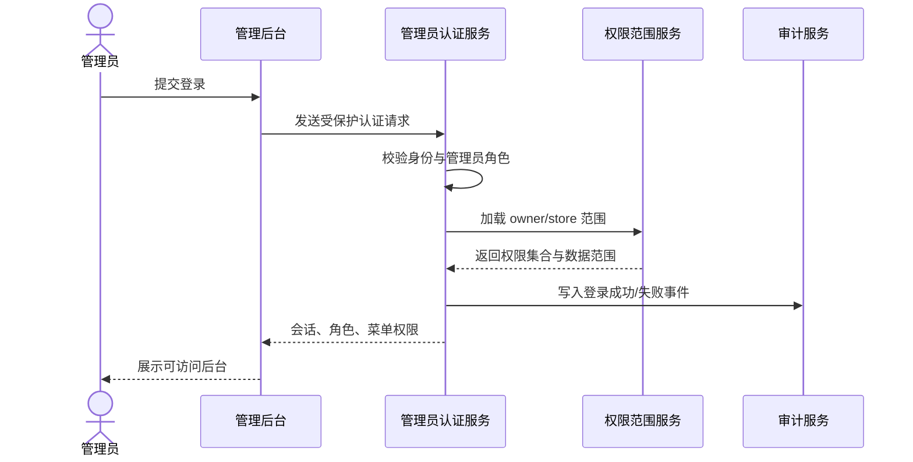
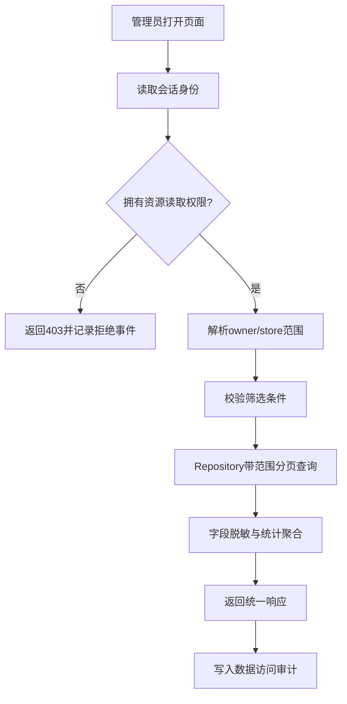
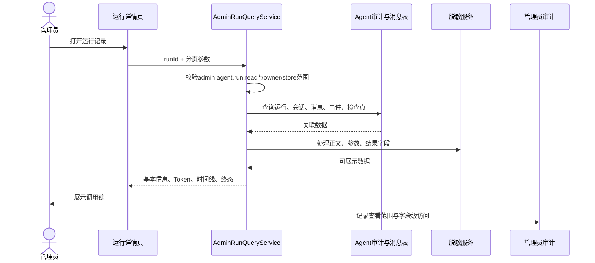
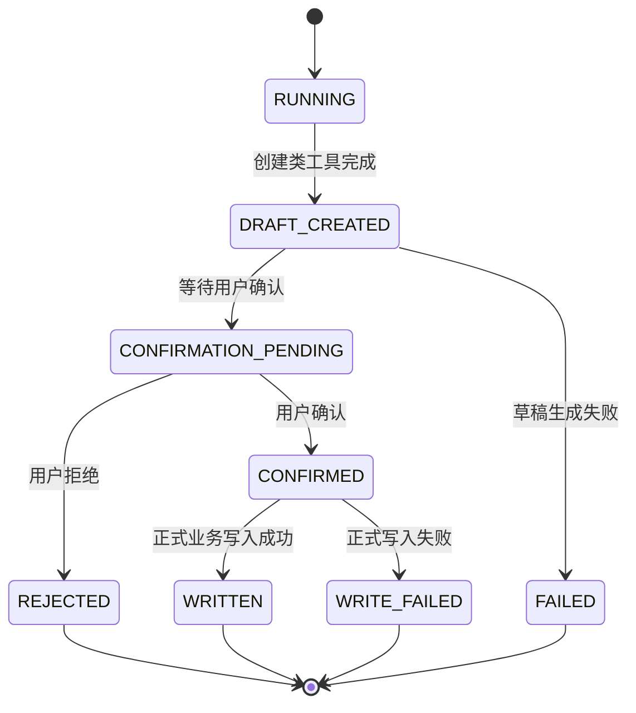
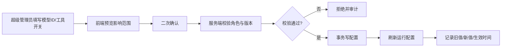

# 管理员后台业务流程

## 文档信息

| 字段 | 内容 |
|---|---|
| 文档类型 | 业务流程 |
| 当前状态 | 规划中 |
| 适用端 | 管理员 Web 后台与后端服务 |
| 角色 | 超级管理员、审计观察员、平台后端、Agent 运行服务 |
| 最后核对 | 2026-08-28 |

## 一、管理员登录流程

验收重点：认证失败不透露账号细节；登录事件含管理员 ID、时间、来源 IP、客户端摘要和结果；前端不能自行声明 `SUPER_ADMIN`。

## 二、数据查看流程

页面筛选条件是查询意图，不是授权条件。服务端必须先得到管理员可见范围，再把筛选条件与范围合并后查询。

## 三、Agent 运行观测流程

页面应把以下顺序明确呈现：请求收到 → 安全判断 → 上下文准备 → 模型计划 → 工具开始 → 工具进度/完成或失败 → 结果判断 → 正式回答 → 运行终态。缺失事件要显示缺失，而不是补写一个看似完整的链路。

## 四、创建类 Agent 任务状态流程

管理员后台只读显示状态及证据：草稿内容摘要、确认人、确认时间、正式业务 ID、失败原因和清理结果。它不能通过打开详情、刷新页面或导出操作改变状态。

## 五、高风险配置变更流程

模型 ID 是可管理配置。Provider 密钥及其他认证信息只从受保护配置中读取，后台永不返回。

## 六、审计查询流程

审计观察员查阅审计记录时，会产生新的“查看审计”事件；超级管理员查看、导出或变更配置也会产生相应事件。审计查询结果必须区分：

- 操作成功：目标动作完成。
- 操作失败：服务端拒绝、校验失败或下游错误。
- 访问拒绝：身份存在但没有资源权限。
- 资源不可见：目标不在范围内，不泄露资源存在性。

## 对应实现

- Agent 运行链路参考：`Code/backend/src/main/java/com/zhihuiji/backend/application/service/v2/V2AgentAiService.java`
- SSE 事件参考：`Code/backend/src/main/java/com/zhihuiji/backend/application/service/v2/agent/component/SseStreamEmitter.java`
- 当前原型调用日志：`Temp/grok-style-admin-preview/src/App.jsx` 中 `activity` 数据

## 对应接口

认证、查询、配置和审计接口按 `03_系统设计/接口设计/管理员后台接口契约设计.md` 实现。

## 对应测试

每条流程都需要覆盖成功、参数错误、未登录、权限不足、跨 owner/store、空数据、下游失败、重复请求和审计写入失败等分支。测试只使用脱敏测试数据，不记录真实凭据。

## 当前限制

当前临时原型只展示静态流程的视觉表达，没有运行真实登录、SSE、数据库查询或配置变更。
