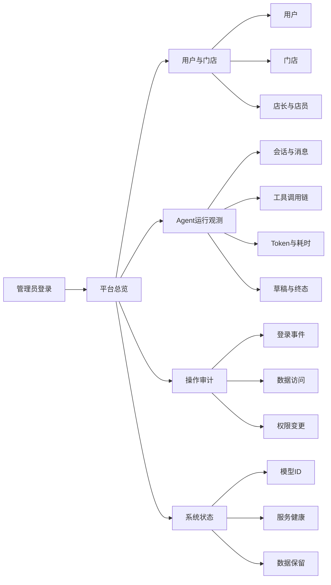

# 管理员后台业务目标与范围

## 文档信息

| 字段 | 内容 |
|---|---|
| 文档类型 | 业务需求 |
| 当前状态 | 规划中 |
| 适用端 | 管理员 Web 后台 |
| 依据正式项目 | `Code/backend/`、`Code/frontend/web/`、Flyway V1–V33 |
| 依据原型 | `Temp/grok-style-admin-preview/src/App.jsx` |
| 依据参考源码 | `/tmp/grok2api-reference/frontend/src/`，版本 `62d2775` |
| 最后核对 | 2026-08-28 |

## 一、业务目标

管理员后台为仓库管理工具提供一个受控的运营与审计入口。它把分散在用户、门店、业务单据和 Agent 运行链路中的管理信息集中起来，使授权管理员能够回答以下问题：

1. 当前系统有多少用户、门店、店长和店员，哪些账号处于活跃、停用或异常状态。
2. 每个用户属于哪些 owner/store 范围，店长与店员的管理关系是什么。
3. Agent 为谁、在哪个门店、执行了什么任务，实际选择了哪些工具，工具是否完成，最终回答是否生成。
4. 一次对话消耗了多少输入、输出和总 Token，耗时、首字延迟、轮次和上下文压缩情况如何。
5. 谁在什么时间、从哪个 IP、通过哪个客户端查看或改变了什么管理信息。
6. 模型 ID、工具启用状态和系统健康状态是否符合当前运营策略。

后台的业务价值是提高问题定位、权限审查、运行质量观察和日常运营效率。它不承担普通门店业务录入，也不绕过 Agent 的草稿确认规则。

## 二、业务范围

| 范围 | 包含内容 | 业务结果 |
|---|---|---|
| 平台概览 | 用户数、门店数、活跃运行数、Token、成功率、延迟 | 管理员快速判断系统状态 |
| 组织管理 | 用户、店长、店员、门店、成员关系、状态 | 明确人员与数据归属 |
| Agent 观测 | 会话、消息、运行、工具、SSE 事件、上下文预算、终态 | 还原一次 Agent 调用链 |
| 使用量分析 | 输入/输出/总 Token、耗时、首字延迟、轮次、模型 ID | 分析成本和性能 |
| 审计 | 登录、IP、页面访问、数据查看、权限变更、配置变更 | 形成可追溯记录 |
| 系统管理 | 模型 ID、工具开关、服务状态、保留策略 | 控制可用能力和运行边界 |

## 三、暂不纳入范围

| 事项 | 处理方式 | 原因 |
|---|---|---|
| 普通用户的销售、采购、库存录入 | 继续由现有多端业务页面处理 | 管理后台只负责管理与观察 |
| 直接修改业务单据 | 不提供通用后台直改入口 | 避免绕过业务校验和确认链 |
| 展示 Provider 密钥或会话凭据 | 永不展示、永不写入前端日志 | 属于认证和基础设施敏感信息 |
| 展示模型隐藏推理内容 | 不提供该能力 | 仅展示计划摘要、工具事实和正式回答 |
| PostgreSQL 管理工具 | 不在浏览器中提供 SQL 控制台 | 防止越权读取和破坏性操作 |
| 生产部署、迁移和发布 | 另立运维流程 | 本文档只覆盖产品后台 |

## 四、业务成功条件

| 编号 | 成功条件 | 可验收证据 |
|---|---|---|
| BR-ADM-01 | 两类管理员的菜单与数据范围明确隔开 | 权限矩阵、接口拒绝测试、页面可见性测试 |
| BR-ADM-02 | 可从运行记录追到会话、消息、工具和终态 | 运行详情关联 ID 与审计事件 |
| BR-ADM-03 | Token、耗时、模型 ID 和工具序列可按用户/门店/时间筛选 | 分页查询结果与统计口径说明 |
| BR-ADM-04 | 每次管理员登录与敏感查看都可追溯到时间、IP、账号和结果 | 管理员审计记录 |
| BR-ADM-05 | 创建类 Agent 任务的草稿和正式写入状态清晰区分 | 草稿状态、确认事件和业务表断言 |
| BR-ADM-06 | 参考源码的浅色简约信息层级在本地原型中可核对 | 原型截图、构建结果、设计 QA |

## 五、业务数据全景

正式项目当前使用一套共享数据源，Flyway 迁移覆盖用户、门店、业务单据、Agent、审计、同步、媒体与积分等逻辑表。管理员后台使用带权限过滤的服务接口读取这些数据，不创建“用户数据库”或“Agent 数据库”的浏览器直连概念。

| 数据域 | 主要对象 | 管理员可观察内容 |
|---|---|---|
| 身份与组织 | `users`、`sessions`、`stores`、`store_memberships` | 用户状态、门店、成员关系、登录事件关联信息 |
| Agent 会话 | `agent_conversations`、`agent_messages`、`agent_tasks`、`agent_notifications` | 会话标题、消息角色、运行关联、任务状态、通知状态 |
| Agent 运行 | `agent_run_audits`、`agent_run_audit_events`、`agent_context_checkpoints` | 运行耗时、Token、工具事件、终态、上下文预算与压缩事件 |
| Agent 草稿与记忆 | `agent_drafts`、`agent_memories` | 草稿状态、确认结果、记忆范围、删除与保留状态 |
| 商品与库存 | `products`、`product_categories`、`product_units`、`inventory_ledger`、`inventory_snapshots`、`inventory_monthly_stats` | 商品数量、库存趋势、低库存任务和门店范围 |
| 往来单位 | `customers`、`suppliers`、`partner_contacts`、`partner_groups` | 客户/供应商数量、状态、关联门店 |
| 单据与资金 | 销售、采购、付款、收款、财务与账户相关表 | 单据数量、状态、金额汇总和关联运行 |
| 媒体与同步 | `media_assets`、`media_bindings`、`sync_*`、`import_jobs` | 同步状态、导入任务、媒体元数据和失败原因 |
| 生成与额度 | `poster_generations`、`user_credits`、`credit_transactions` | 生成任务状态、额度变化和失败记录 |

## 对应实现

- 原型总览和运行观测：`Temp/grok-style-admin-preview/src/App.jsx`
- 正式 Agent 服务：`Code/backend/src/main/java/com/zhihuiji/backend/application/service/v2/V2AgentAiService.java`
- Agent 实体：`Code/backend/src/main/java/com/zhihuiji/backend/domain/entity/`
- 正式 Web 页面：`Code/frontend/web/src/pages/agent/AgentPage.vue`、`src/pages/dashboard/`

## 对应接口

目标接口统一归入受保护的管理员接口空间，具体契约见 `02_业务系统需求/管理员后台接口与数据需求.md` 与 `03_系统设计/接口设计/管理员后台接口契约设计.md`。最终实现必须继续使用现有统一响应、异常处理、owner/store 条件和分页规范。

## 对应测试

- 原型构建与静态交互：`Temp/grok-style-admin-preview/design-qa.md`
- 正式后台规划测试：`02_业务系统需求/管理员后台安全与审计需求.md`、`管理员后台性能与可观测性需求.md`
- Agent 运行链路：正式项目 `testing/Agent/` 下现有分类计划

## 当前限制

- 管理员后台业务功能尚未接入正式登录和真实 API。
- 当前原型的数字、用户、门店、模型和日志内容都是脱敏演示数据。
- 真实的后台管理员账号、角色授予和管理员审计表需要在正式实现阶段确定。
