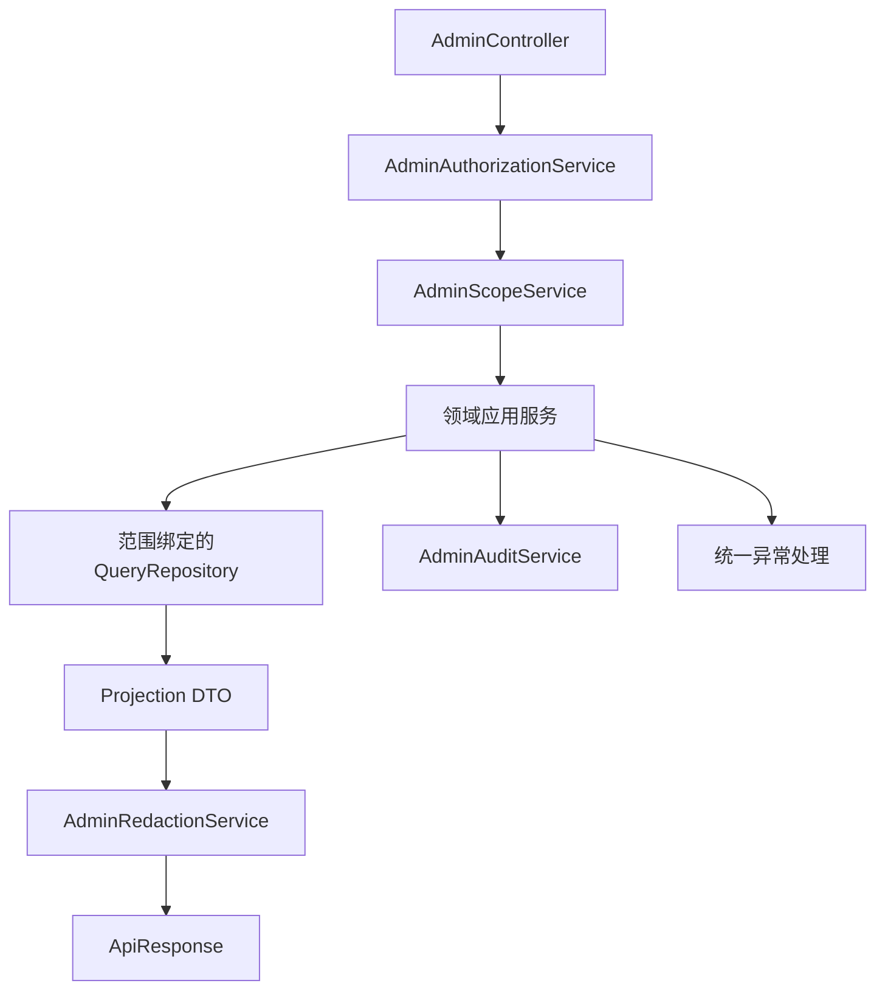

# 管理员后台后端模块设计

## 文档信息

| 字段 | 内容 |
|---|---|
| 文档类型 | 后端系统设计 |
| 当前状态 | 规划中 |
| 技术基线 | Spring Boot、JPA/Repository、Flyway、统一异常处理 |
| 正式位置 | `Code/backend/src/main/java/com/zhihuiji/backend/` |
| 关联服务 | 现有 Agent v2、用户/门店业务和审计组件 |
| 最后核对 | 2026-08-28 |

## 一、目标目录

```text
Code/backend/src/main/java/com/zhihuiji/backend/
├── api/controller/admin/
│   ├── AdminSessionController.java
│   ├── AdminOverviewController.java
│   ├── AdminOrganizationController.java
│   ├── AdminAgentController.java
│   ├── AdminConfigController.java
│   ├── AdminAuditController.java
│   └── AdminSystemController.java
├── api/dto/admin/
│   ├── AdminSessionDtos.java
│   ├── AdminOverviewDtos.java
│   ├── AdminOrganizationDtos.java
│   ├── AdminAgentDtos.java
│   ├── AdminConfigDtos.java
│   └── AdminAuditDtos.java
├── application/service/admin/
│   ├── AdminSessionService.java
│   ├── AdminScopeService.java
│   ├── AdminOverviewService.java
│   ├── AdminOrganizationService.java
│   ├── AdminAgentObservabilityService.java
│   ├── AdminConfigService.java
│   ├── AdminAuditService.java
│   ├── AdminExportService.java
│   └── AdminRedactionService.java
├── infrastructure/repository/admin/
│   ├── AdminUserQueryRepository.java
│   ├── AdminStoreQueryRepository.java
│   ├── AdminAgentQueryRepository.java
│   ├── AdminUsageQueryRepository.java
│   └── AdminAuditRepository.java
└── infrastructure/security/admin/
    ├── AdminPrincipal.java
    ├── AdminPermission.java
    └── AdminAuthorizationService.java
```

目录为目标设计，正式编码前要检查现有包结构，复用 `ApiResponse`、`BusinessException`、`GlobalExceptionHandler`、`PaginationUtils`、`ParseUtils` 和已有 owner/store 权限组件。

## 二、服务职责

| 服务 | 输入 | 处理 | 输出 |
|---|---|---|---|
| `AdminSessionService` | 当前统一会话 | 解析管理员身份、角色、范围和会话状态 | `AdminPrincipal` |
| `AdminScopeService` | principal、owner/store、资源归属 | 计算可见范围并拒绝越权 | `AdminDataScope` 或异常 |
| `AdminOverviewService` | 时间与范围筛选 | 执行白名单聚合和指标组合 | 总览 DTO |
| `AdminOrganizationService` | 用户/门店筛选和状态变更 | 分页查询、关系校验、受控状态变化 | 组织 DTO |
| `AdminAgentObservabilityService` | run/conversation、分页和内容模式 | 关联运行、消息、事件、草稿、检查点 | 运行 DTO、事件 DTO |
| `AdminConfigService` | 模型 ID、工具开关、版本、原因 | 校验、事务写入、刷新配置 | 配置版本 |
| `AdminAuditService` | 操作上下文和结果 | 写入管理员审计，连接 Agent 审计 ID | 审计事件 |
| `AdminRedactionService` | DTO 和内容模式 | 字段白名单、长度限制、敏感内容处理 | 可展示摘要 |
| `AdminExportService` | 导出类型、范围、字段 | 授权、异步任务、短期下载和清理 | 导出任务状态 |

## 三、调用链



Controller 只负责请求解析和响应，不能在 Controller 内自行拼接 SQL、截取全量列表或把请求字段当作权限结论。所有 Repository 查询需要明确 owner/store 条件和排序白名单。

## 四、Agent 观测实现

`AdminAgentObservabilityService` 只读访问现有 Agent 记录：

1. 先用 `runId` 或分页条件读取运行主记录。
2. 校验 `owner_user_id`、conversation 归属及管理员范围。
3. 按需关联 `agent_messages`、`agent_run_audit_events`、`agent_drafts`、`agent_context_checkpoints` 和 Agent 任务记录。
4. 对 `payload_json` 做事件类型解析和字段白名单转换，不把原始 JSON 原样返回。
5. 汇总 Token、耗时、工具数、事件数和审计丢失指标，标记精确/估算来源。
6. 写入管理员查看审计，不改变运行终态、草稿状态或业务数据。

当前 `agent_run_audits` migration 明确有 `owner_user_id`、`conversation_id`、`run_id`、状态、时间、工具数和审计质量字段；没有显式 `actor_user_id`、`store_id`。正式实现必须先确认能否从会话和业务上下文可靠取得这两个字段；不能可靠取得时，应在正式 migration 和 Agent 写入链中补充它们，并同步更新所有运行创建逻辑与测试。

## 五、组织管理实现

- 用户列表按 `users` 和管理员授权范围分页查询。
- 门店和成员关系按 `stores`、`store_memberships` 查询，并验证 owner/store/user 三者关系。
- 店长、店员是成员关系中的业务角色，后台展示其角色和状态，不在查询层复制一套用户表。
- 状态变化使用事务和乐观版本或等效并发控制；不直接删除已有业务历史。
- 超级管理员写入前必须再次验证自身权限和目标范围；审计观察员在 Controller 和 Service 两层均被拒绝。

## 六、配置变更实现

模型 ID、工具启用状态和保留策略属于受控配置。配置写服务必须：

1. 校验模型 ID 是否在服务端允许列表中。
2. 校验工具名是否存在于 `ToolRegistry`，不允许客户端注入任意类名或路径。
3. 校验 `expectedVersion` 与当前版本一致。
4. 校验 `idempotencyKey`，重复请求返回相同结果。
5. 在事务内写入配置和变更审计；提交后刷新运行配置。
6. 刷新失败时返回“配置已保存、运行实例待刷新”的明确状态，并触发告警。

Provider 密钥从受保护配置读取，配置查询 DTO 没有该字段，异常和审计也不能携带该字段。

## 七、错误处理

沿用项目统一异常映射：

| 异常场景 | HTTP | 业务处理 |
|---|---:|---|
| 会话不存在或失效 | 401 | 清理前端状态并记录登录/访问失败 |
| 角色无动作权限 | 403 | 不进入 Repository，记录拒绝原因 |
| 资源不在范围 | 403 或统一不可见 | 不泄露资源存在性 |
| 分页、时间、排序错误 | 400/422 | 返回字段路径和允许值 |
| 版本或幂等冲突 | 409 | 返回当前版本摘要或历史结果引用 |
| 下游数据库/Provider 健康失败 | 5xx | 返回通用错误与 request ID，不返回连接信息 |
| 审计写入失败 | 5xx 或受控降级 | 按安全策略阻止高风险动作，并保留失败指标 |

## 八、后端验收

| 项目 | 条件 |
|---|---|
| 范围 | 每个查询和写操作都有 owner/store 条件或明确系统级理由 |
| 分页 | Repository 直接分页，不能全量读取后内存切片 |
| Agent | 运行、消息、工具、草稿、上下文和审计关联可追踪 |
| 配置 | 模型 ID 可管理，认证秘密字段不存在于 DTO |
| 审计 | 登录、查看、拒绝、变更、导出均有事件 |
| 事务 | 状态/配置变化不存在半更新；重复请求不重复执行 |
| 测试 | 单元、Repository、Controller、安全和集成测试引用需求编号 |

## 对应实现

- 现有 Agent 服务：`Code/backend/src/main/java/com/zhihuiji/backend/application/service/v2/`
- 现有工具注册：`Code/backend/src/main/java/com/zhihuiji/backend/application/service/v2/agent/tool/ToolRegistry.java`
- 现有统一异常：`Code/backend/src/main/java/com/zhihuiji/backend/api/common/GlobalExceptionHandler.java`
- 现有分页：`Code/backend/src/main/java/com/zhihuiji/backend/api/common/PaginationUtils.java`

## 对应接口

目标接口见 `../接口设计/管理员后台接口契约设计.md`。

## 对应测试

至少覆盖 Controller 权限、Service 范围、Repository SQL、Agent 关联、配置并发、脱敏和审计失败策略。

## 当前限制

管理员专用后端模块尚未创建；`actor_user_id` 与 `store_id` 是否需要补入 Agent 运行审计表，需要结合现有会话模型和运行写入链确认。
