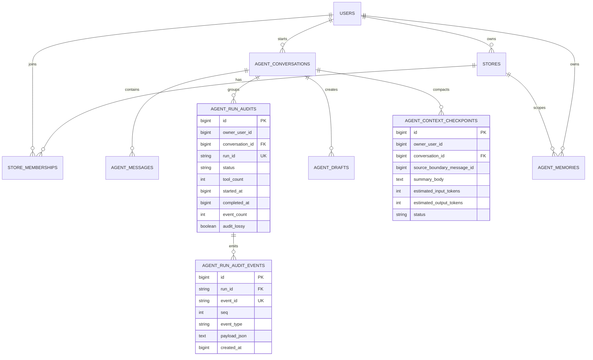

# 管理员后台数据模型设计

## 文档信息

| 字段 | 内容 |
|---|---|
| 文档类型 | 数据库与读模型设计 |
| 当前状态 | 规划中 |
| 数据源 | 现有共享数据库；当前迁移版本已核对至 V33 |
| 迁移位置 | `Code/backend/src/main/resources/db/migration/` |
| 设计原则 | 复用现有业务表，后台通过受控查询访问 |
| 最后核对 | 2026-08-28 |

## 一、数据源结论

正式项目目前是一套共享数据源中的多领域逻辑表，没有独立的“用户数据库”“Agent 数据库”或“审计数据库”可由管理员浏览器直接连接。管理员后台应增加受保护的查询和管理服务，而不是把数据库连接暴露给前端。

现有 Flyway 迁移包含用户/门店、业务数据、Agent、审计、上下文检查点、长期记忆、媒体、同步和额度等域。管理员页面优先使用投影查询，减少把大字段和内部实体直接序列化到响应的风险。

## 二、现有数据表分组

| 数据组 | 已有表/实体 | 后台用途 | 需要核对的字段 |
|---|---|---|---|
| 身份 | `users`、`sessions` | 管理员身份、普通用户总数、登录关联 | 管理员角色来源、账号状态、IP 事件是否独立保存 |
| 组织 | `stores`、`store_memberships` | owner、门店、店长、店员 | 多门店关系、成员角色、状态和有效期 |
| Agent 会话 | `agent_conversations`、`agent_messages` | 会话、消息、角色、结构化结果 | 内容权限、消息删除/脱敏状态、run 关联 |
| Agent 运行 | `agent_run_audits`、`agent_run_audit_events` | 运行主记录、工具事件、终态、审计质量 | 当前主表有 owner/conversation，没有显式 actor/store |
| Agent 任务 | `agent_tasks`、`agent_notifications` | 任务状态和通知 | owner/store 过滤与运行关联 |
| Agent 草稿 | `agent_drafts` | 草稿、确认、正式业务关联 | 确认人、确认时间、业务写入引用 |
| 上下文 | `agent_context_checkpoints` | 窗口、检查点、压缩前后估算 | 版本、边界消息、状态、失效原因 |
| 长期记忆 | `agent_memories` | 记忆摘要、范围、状态、过期 | owner/store、敏感级别、来源 |
| 商品库存 | `products`、分类/单位/价格/供应关系、库存流水/快照/月统计 | 工具域分布与业务规模 | owner/store 条件和统计口径 |
| 客户供应商 | `customers`、`suppliers`、伙伴联系人/分组 | 组织规模和 Agent 业务范围 | owner/store 条件、敏感联系字段 |
| 销售采购 | 销售单、采购单、收货、退货及明细 | 运行结果关联和平台统计 | 金额脱敏、owner/store 过滤 |
| 财务 | `accounts`、转账、付款、收款、财务记录、账单关联 | 运行和工具域统计 | 金额权限和汇总口径 |
| 同步导入 | `sync_*`、`import_jobs` | 系统状态、失败任务 | worker 系统范围与管理员读范围 |
| 媒体/额度 | `media_assets`、`media_bindings`、海报、额度与交易 | 系统规模和任务状态 | 文件地址、隐私字段和下载权限 |

## 三、Agent 观测 ER 图

上图描述当前已存在的核心关系。`actor_user_id` 和 `store_id` 没有在当前 Agent 运行审计 migration 中显式出现，正式管理员后台不能凭推测展示它们；需要可靠来源时，应补充字段或建立明确的关联查询，并为历史记录定义“未知/不可确定”状态。

## 四、管理员专用数据对象

以下对象是目标设计，是否新增表由正式实现阶段根据现有认证、配置和审计实现决定：

| 对象 | 建议用途 | 最小字段 | owner/store |
|---|---|---|---|
| `admin_scope_grants` | 为审计观察员保存明确授权范围 | admin、scope type、owner/store、status、时间、授予者 | 按授权范围 |
| `admin_audit_events` | 保存管理员登录、查看、拒绝、变更和导出 | event、admin、role、action、resource、IP、request、result、摘要 | 记录访问范围 |
| `admin_model_configs` | 保存可审计的模型 ID 和工具策略 | model ID、工具、enabled、scope、version、时间、操作者 | 可按范围 |
| `admin_export_jobs` | 管理异步脱敏导出 | job、类型、范围、字段白名单、状态、过期时间、操作者 | 按任务范围 |
| `admin_login_events` | 细化管理员登录历史 | admin、时间、IP、客户端、结果、原因 | 管理员维度 |

如果现有 `users` 角色字段、现有审计表或安全配置已经覆盖某对象，应优先扩展现有模型，避免新增重复表。任何新表必须包含必要的 owner/store 约束、索引、保留策略和迁移测试。

## 五、字段与索引要求

| 查询 | 必要条件 | 稳定排序 | 建议索引方向 |
|---|---|---|---|
| 用户列表 | owner/状态/搜索 | `updated_at DESC, id DESC` | owner、状态、更新时间 |
| 门店成员 | owner/store/角色 | `store_id, role_code, id` | owner/store/role |
| Agent 运行 | owner/store/时间/状态 | `started_at DESC, id DESC` | owner/时间、owner/状态/时间 |
| 事件时间线 | run ID | `seq ASC, id ASC` | run/seq |
| 消息 | conversation ID | 消息序号/ID | conversation/序号 |
| 上下文 | owner/conversation/status | 更新时间/边界消息 | owner/conversation/status |
| 管理员审计 | admin/时间/action/result | `occurred_at DESC, event_id DESC` | admin/时间、范围/时间 |
| 导出任务 | admin/status/过期 | 创建时间 | admin/status/created |

所有大字段只在详情请求按需读取；列表查询只返回摘要和统计字段。

## 六、迁移与历史数据原则

- 已应用的 Flyway migration 不直接修改；新结构使用新的版本迁移。
- 新表和新增字段需要明确默认值、非空条件、索引和数据保留策略。
- 不能凭猜测给历史 Agent 运行补充 actor/store；若无法解析，保存为可识别的未知状态并在页面展示。
- 迁移测试需要覆盖空库、已有数据、重复执行保护、范围索引和回滚恢复说明。
- 本规划不执行迁移、不改变正式数据库、不创建测试数据。

## 七、删除与保留

管理员后台的删除操作仅允许在已批准的保留策略和权限范围内执行，优先采用脱敏、失效或逻辑状态改变。运行审计、管理员审计和调查中的导出任务不能由普通查看动作删除。

## 对应实现

- Flyway：`Code/backend/src/main/resources/db/migration/`
- Agent 实体：`Code/backend/src/main/java/com/zhihuiji/backend/domain/entity/Agent*Entity.java`
- 组织实体：`UserEntity.java`、`StoreEntity.java`、`StoreMembershipEntity.java`

## 对应接口

数据通过管理员查询接口返回，见 `../接口设计/管理员后台接口契约设计.md`；不提供数据库直连接口。

## 对应测试

需要做迁移验证、Repository 范围验证、分页查询计划验证、字段脱敏验证、数据关联完整性验证和历史缺字段处理验证。

## 当前限制

管理员专用审计、范围授权、模型配置和导出任务对象尚未确定是否能完全复用现有表；Agent 运行的显式 actor/store 记录是正式实现前的关键数据缺口。
