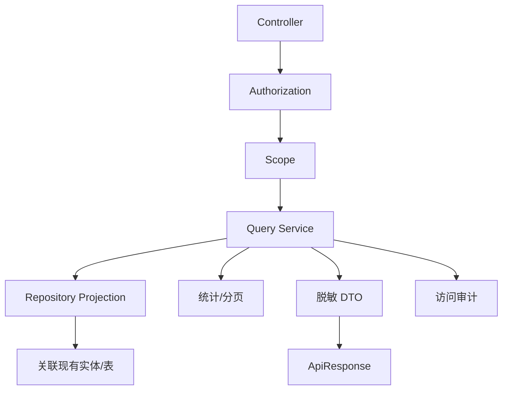
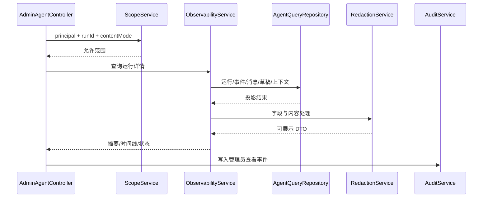

# 管理员后台后端实现计划

## 文档信息

| 字段 | 内容 |
|---|---|
| 文档类型 | 后端详细实现计划 |
| 当前状态 | 规划中 |
| 正式工程 | `Code/backend/` |
| 技术栈 | Spring Boot、JPA、Flyway、现有统一异常和响应 |
| 关联系统 | 用户/门店、Agent v2、审计和配置 |
| 最后核对 | 2026-08-28 |

## 一、后端实现步骤

| 步骤 | 内容 | 必须验证 |
|---|---|---|
| B1 | 确认管理员身份来源和两类角色 | 普通用户不能进入 |
| B2 | 实现 `AdminPrincipal`、权限字典和范围服务 | 客户端不能伪造角色/范围 |
| B3 | 实现总览和组织只读 Query | 数据库分页、owner/store 过滤 |
| B4 | 实现 Agent 运行投影和事件解析 | run、conversation、event 关联 |
| B5 | 补齐 actor/store 可靠来源 | 无法确定时明确返回未知 |
| B6 | 实现配置、导出和保留策略写服务 | 版本、幂等、事务、审计 |
| B7 | 接入统一异常、指标和日志 | 敏感信息不出响应/日志 |
| B8 | 运行单元、集成、安全和性能测试 | 结果可追溯 |

## 二、查询服务设计



Repository 方法名称和参数要体现范围，如 `findRuns(scope, filters, pageable)`，不提供一个调用方可自由拼接 owner/store 的宽泛方法。事件和消息大字段使用详情查询，首页不载入完整正文。

## 三、Agent 观测链



服务只读观察，不调用 `V2AgentAiService` 重新执行模型或工具。运行状态应来自已持久化记录和可靠事件，不以页面打开时间推断终态。

## 四、配置写入事务

```text
请求进入
  → 会话/角色/范围校验
  → idempotencyKey 查重
  → expectedVersion 校验
  → 字段和模型/工具白名单校验
  → 写配置与变更审计（同一事务或明确一致性策略）
  → 刷新运行配置
  → 返回新版本和生效状态
```

审计写入失败的策略必须在实现前确定。对于模型和工具等高风险动作，不能在审计失败时静默返回成功。

## 五、异常映射

使用项目已有 `GlobalExceptionHandler` 统一映射。管理员服务不得返回堆栈、SQL、连接信息、密钥或完整请求内容。详情见 `02_业务系统需求/管理员后台接口与数据需求.md`。

## 六、后端交付检查

| 检查 | 条件 |
|---|---|
| 编译 | 后端测试任务可运行 |
| 权限 | 两类角色和范围集成测试通过 |
| 查询 | Repository 有范围、稳定排序和数据库分页 |
| Agent | 事件配对、Token、终态、草稿和检查点一致 |
| 写入 | 版本、幂等和事务测试通过 |
| 审计 | 成功/失败/拒绝/查看原文均有记录 |
| 安全 | 响应、日志、异常无秘密字段 |

## 对应实现

- Agent 主链：`Code/backend/src/main/java/com/zhihuiji/backend/application/service/v2/`
- 统一错误：`Code/backend/src/main/java/com/zhihuiji/backend/api/common/`
- 数据访问：`Code/backend/src/main/java/com/zhihuiji/backend/infrastructure/repository/`

## 对应接口

实现 `API-ADM-01` 至 `API-ADM-15`，路径变化需同步契约文档和测试台账。

## 对应测试

后端测试计划见 `../05_测试与验收/功能测试/管理员后台功能测试计划.md` 和 `../05_测试与验收/安全测试/管理员后台安全测试计划.md`。

## 当前限制

管理员后端源码尚未创建；当前文档只规定实现边界，不表示任何接口已经可调用。
