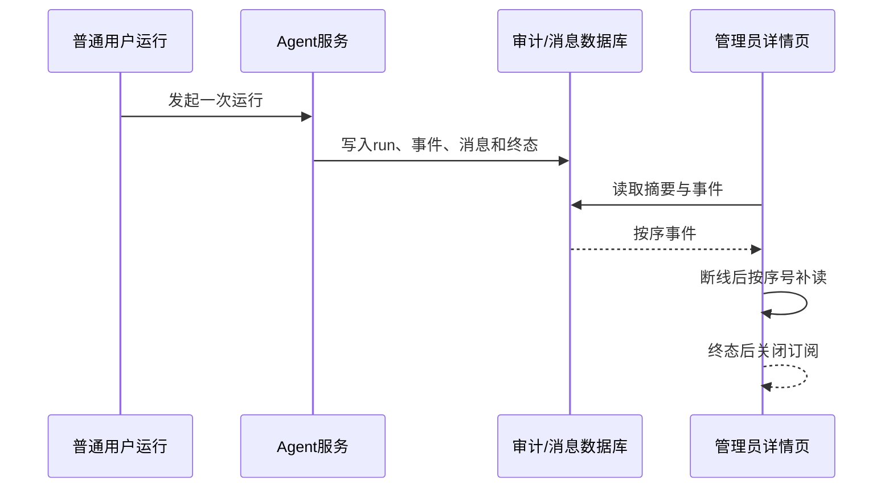

# 管理员后台可靠性与跨层验收计划

## 文档信息

| 字段 | 内容 |
|---|---|
| 文档类型 | 可靠性与跨层集成验收 |
| 当前状态 | 规划中 |
| 适用端 | Web、管理员 API、Agent 审计、数据库和配置服务 |
| 测试前缀 | `TEST-ADM-R` |
| 最后核对 | 2026-08-28 |

## 一、Agent 运行观测验收

| 用例 | 操作 | 验收 |
|---|---|---|
| `TEST-ADM-R01` | 完整运行从 started 到 completed | 工具、正式回答、终态、审计和消息一致 |
| `TEST-ADM-R02` | 工具失败后运行终止 | failed 事件和错误类别一致，不显示成功 |
| `TEST-ADM-R03` | 运行中打开详情 | 页面不触发第二次 Agent 执行 |
| `TEST-ADM-R04` | SSE 中途断开并补读 | 不丢事件、不重复、不改变运行状态 |
| `TEST-ADM-R05` | 事件乱序/重复/缺失 | 显示完整性提示，不能自动伪造事件 |
| `TEST-ADM-R06` | 上下文压缩发生 | 检查点、压缩事件、窗口和消息边界一致 |
| `TEST-ADM-R07` | 创建类工具生成草稿 | 草稿可见，正式业务表无新增 |
| `TEST-ADM-R08` | 用户拒绝草稿 | 拒绝事件存在，正式业务表无写入 |
| `TEST-ADM-R09` | 用户确认草稿 | 只有确认后正式写入，业务 ID 与审计一致 |

## 二、局部失败与恢复

| 场景 | 预期 |
|---|---|
| 总览一个面板 5xx | 其他面板保留，失败面板有重试 |
| 审计读取暂时失败 | 页面显示不可用，不声称审计完整 |
| 事件订阅失败 | 回退到分页补读，不能无限重连 |
| 配置刷新失败 | 显示保存状态和刷新状态差异，触发告警 |
| 导出任务超时 | 任务失败、文件清理、失败审计完整 |
| 服务重启 | 已持久化事件可继续读取，内存连接重新建立 |

## 三、跨层一致性

每个跨层用例按以下顺序核对：前端请求 → HTTP 状态 → DTO 字段 → Service 处理 → Repository 查询/写入 → Agent/业务表变化 → 审计事件 → 前端最终状态。任何一层缺失都记录为未完成或阻塞。

## 四、测试证据

保存 HTTP 脱敏摘要、SSE 原始事件、数据库前后计数、审计事件、页面状态和清理结果。对于用户消息和工具结果只保存摘要与哈希化的内部关联值，不能保存完整敏感正文。

## 对应实现

- Agent 运行：`Code/backend/src/main/java/com/zhihuiji/backend/application/service/v2/`
- SSE：`.../agent/component/SseStreamEmitter.java`
- 草稿确认：`.../agent/AgentDraftConfirmService.java`
- 原型详情抽屉：`Temp/grok-style-admin-preview/src/App.jsx`

## 对应接口

覆盖 `API-ADM-05` 至 `API-ADM-10`，以及配置和审计接口。

## 对应测试

建议证据目录：`testing/.artifacts/<日期>-admin-reliability/`。

## 当前限制

当前没有管理员真实接口和运行数据，SSE、数据库前后变化和真实草稿链尚未执行。
