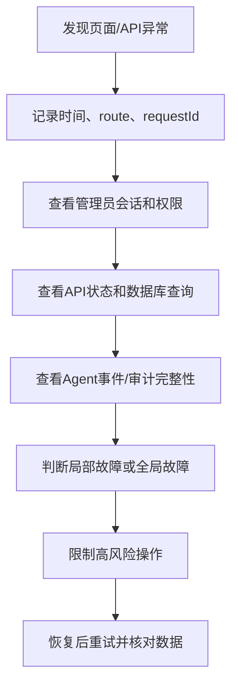

# 管理员后台故障处理

## 文档信息

| 字段 | 内容 |
|---|---|
| 文档类型 | 故障排查与恢复设计 |
| 当前状态 | 规划中 |
| 适用端 | 管理员 Web、API、数据库、Agent 审计和导出 |
| 最后核对 | 2026-08-28 |

## 一、故障定位顺序

## 二、常见问题

| 现象 | 可能原因 | 检查 | 处理边界 |
|---|---|---|---|
| 页面一直加载 | session 失败或关键接口超时 | 浏览器网络状态、request ID、健康状态 | 不在前端伪造数据 |
| 用户列表为空 | 授权范围为空或查询失败 | 角色、owner/store、接口错误 | 区分空数据和错误 |
| 运行详情缺事件 | 审计未写入、序号缺失或权限脱敏 | run、event count、auditLossy | 显示不完整，不补造事件 |
| Token 显示估算 | Provider 没有精确用量 | tokenSource、模型适配器 | 明确标记估算 |
| SSE 断线 | 网络、代理或事件服务异常 | 最后序号、补读接口 | 重新读取，不重新执行 Agent |
| 配置保存后未生效 | 运行配置刷新失败 | 配置版本、刷新状态和告警 | 明确保存/生效差异 |
| 导出无法下载 | 任务失败、过期或权限变化 | job 状态、下载审计 | 重新授权，不延长旧文件 |
| 审计缺失 | 审计存储或事务失败 | 审计失败指标和错误 | 高风险动作按策略阻止 |

## 三、数据一致性核对

故障恢复后依次核对：

1. 管理员 API 的最终状态码和 request ID。
2. 运行主记录、事件数量、序号和终态。
3. 会话消息、草稿和正式业务引用。
4. 管理员审计的成功/失败/拒绝结果。
5. 导出任务和临时文件清理。

不能通过重复执行 Agent、重复确认草稿或直接修改业务表来“修复”观测数据。

## 四、恢复验收

| 故障 | 验收 |
|---|---|
| API 重启 | 已持久化的运行/审计可继续读取 |
| 数据库短暂不可用 | 页面显示错误，恢复后重试成功 |
| SSE 中断 | 事件按序补读，不重复执行 |
| 审计写失败 | 高风险动作状态明确，不伪造成功 |
| 导出失败 | 任务结束、文件清理、失败审计完整 |
| 配置刷新失败 | 配置版本和实例生效状态可区分 |

## 对应实现

- 统一异常：`Code/backend/src/main/java/com/zhihuiji/backend/api/common/GlobalExceptionHandler.java`
- Agent 事件：`Code/backend/src/main/java/com/zhihuiji/backend/application/service/v2/agent/component/`
- 原型局部提示：`Temp/grok-style-admin-preview/src/App.jsx`

## 对应接口

重点覆盖 `API-ADM-05` 至 `API-ADM-15`。

## 对应测试

故障注入和恢复用例见 `../05_测试与验收/集成验收/管理员后台可靠性与跨层验收计划.md`。

## 当前限制

当前没有正式管理员服务、监控和恢复演练环境；本文档不执行任何恢复或数据修改。
