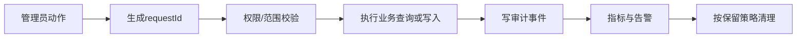

# 管理员后台日志与审计运维

## 文档信息

| 字段 | 内容 |
|---|---|
| 文档类型 | 日志与审计运维说明 |
| 当前状态 | 规划中 |
| 适用端 | 管理员 API、Agent 观测、审计存储和导出任务 |
| 最后核对 | 2026-08-28 |

## 一、日志分层

| 日志 | 内容 | 保留要求 |
|---|---|---|
| 请求日志 | request ID、路由、方法、状态、耗时、角色摘要 | 不保存凭据和正文 |
| 业务日志 | 查询/写操作结果类别和资源摘要 | 不保存完整请求载荷 |
| Agent 观测日志 | run、事件类型、序号、状态、耗时 | 参数/结果只保留脱敏摘要 |
| 安全日志 | 登录、拒绝、权限和 IP | 受访问权限和保留策略控制 |
| 审计记录 | 操作者、动作、资源、范围、结果、时间 | 不允许普通查看删除 |
| 导出日志 | 任务、字段白名单、下载、过期和清理 | 与文件生命周期关联 |

## 二、审计维护流程

审计写入失败时，查询类动作需要明确显示审计完整性状态；配置、权限、账号状态和保留策略等高风险动作应按安全策略阻止完成或进入待处理状态。

## 三、日志脱敏清单

必须从请求、异常、日志、审计、导出和监控中排除：密码、Cookie、Session Token、Provider 密钥、私钥和完整认证载荷。对话正文、工具参数和结果使用字段白名单、长度限制和内容权限，不使用日志过滤替代接口 DTO 排除。

## 四、保留与清理

| 对象 | 策略要求 |
|---|---|
| 登录事件 | 按安全和隐私策略保留，支持按账号/IP查询 |
| 管理员操作审计 | 受保护存储，清理需要高风险权限和二次确认 |
| Agent 运行事件 | 与 Agent 审计策略一致，保留关联 ID 和状态 |
| 原文内容 | 采用更短或独立保留周期，查看和清理均审计 |
| 导出文件 | 短期保留，过期自动清理，下载后不延长无上限 |
| 监控日志 | 只保留定位所需字段，定期轮转 |

实际天数必须由正式环境和合规要求确定，不能在临时原型中假设。

## 五、运维访问

运维人员查看日志和审计要使用受控账号、明确范围和 request ID。复制日志到工单或测试证据时只保留脱敏摘要，不复制完整认证载荷和业务正文。

## 对应实现

- Agent 审计：`Code/backend/src/main/java/com/zhihuiji/backend/application/service/v2/agent/component/RunAuditService.java`
- 现有日志/审计说明：正式项目 `docs/06_部署与运维/日志与审计说明.md`

## 对应接口

审计查询和导出使用 `API-ADM-12`、`API-ADM-14`、`API-ADM-15`。

## 对应测试

安全测试检查日志和审计脱敏；可靠性测试检查审计写入失败；性能测试检查日志不会拖慢管理 API。

## 当前限制

管理员审计存储和实际保留周期尚未在正式工程确定；本文件不执行日志清理。
