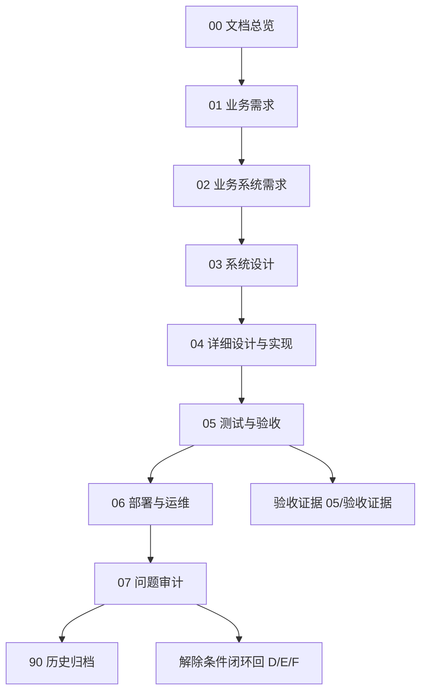

# 文档生命周期总图

## 文档信息

| 字段 | 内容 |
|---|---|
| 文档类型 | 文档总览 |
| 当前状态 | 已完成 |
| 适用端 | 多端 |
| 依据源码 | `Code/`（各文档依据源码见对应文档） |
| 依据测试 | `testing/README.md` |
| 依据证据 | `testing/.artifacts/2026-08-18-8220-current-baseline/current-8220-baseline.md` |
| 最后核对 | 2026-08-20 |

> 本文档按软件工程生命周期组织文档，不改变现有源码、测试证据和历史资料的物理位置。
> 2026-08-20 已按新中文目录结构（00_文档总览 ~ 90_历史归档）重写；旧英文目录路径不再有效。

## 1. 生命周期顺序

```text
业务需求
  ↓
系统需求
  ↓
系统设计
  ↓
详细设计与实现
  ↓
测试与验收
  ↓
部署与运行
  ↓
运维、审计与问题闭环
  ↓
历史归档
```

每个阶段都要回答一个问题：

| 阶段 | 需要回答的问题 | 主要产物 |
|---|---|---|
| 业务需求 | 用户要解决什么业务问题？ | 业务目标、业务流程、范围边界 |
| 系统需求 | 系统必须提供什么能力？ | 功能需求、接口需求、数据需求、非功能需求 |
| 系统设计 | 系统准备如何实现？ | 架构、模块、数据模型、交互和部署设计 |
| 详细设计与实现 | 具体代码放在哪里？ | 源码、迁移、配置、组件和构建入口 |
| 测试与验收 | 实际是否满足要求？ | 测试计划、台账、原始证据和门禁结论 |
| 部署与运行 | 如何上线和确认运行状态？ | 环境基线、部署模板、运行检查和回滚边界 |
| 运维与审计 | 出现问题如何追踪和解除？ | 问题清单、审计记录、性能数据和修复条件 |
| 历史归档 | 哪些内容只代表过去？ | 旧服务器、旧版本、旧报告和不可复用证据 |

## 2. 当前文档映射

### 2.1 文档总览层（00_文档总览/）

- `文档阅读指南.md`：阅读顺序、状态含义、证据规则。
- `文档生命周期总图.md`：本页。
- `项目文档索引.md`：全部文档一级索引。
- `文档状态说明.md`：状态定义与当前各范围状态。
- `需求追踪矩阵.md`：需求 → 系统需求 → 设计 → 源码 → 测试 → 证据。
- `项目目录地图.md`：跨后端、Android、Web、iOS、测试和数据目录的工程地图（原 `docs/PROJECT_DIRECTORY_MAP.md`，git mv 移动）。

### 2.2 业务需求层（01_业务需求/）

- `业务目标与项目范围.md`、`用户角色与使用场景.md`、`核心业务流程.md`、`多端产品范围.md`
- `商品与库存业务.md`、`客户与供应商业务.md`、`销售与采购业务.md`、`财务与报表业务.md`
- `Agent智能助手业务.md`、`业务范围与暂缓事项.md`

### 2.3 业务系统需求层（02_业务系统需求/）

- `系统需求总览.md`、`功能需求矩阵.md` + 14 篇领域需求（用户与权限、门店与多租户、商品与库存、客户与供应商、销售与采购、财务与报表、Agent 对话、多端同步、媒体与图片、接口、数据、安全、性能、可观测性）。

### 2.4 系统设计层（03_系统设计/）

- `系统总体架构.md`
- `后端系统设计/`：后端模块划分、接口分层设计、业务服务设计、数据访问设计、Provider适配设计、SSE流式服务设计。
- `数据库设计/`：数据库总览、用户与门店、商品与库存、销售与采购、财务与报表、Agent、媒体、数据隔离与owner设计。
- `Agent系统设计/`：Agent总体架构、对话生命周期、工具选择与执行、思考过程与执行过程、正式回答生成、结果块与图表、草稿与确认、取消与错误恢复、审计与运行轨迹、Provider兼容性；`工具目录与评估矩阵.md`（原 `docs/03-system-design/agent/agent-tool-catalog-and-evaluation-matrix.md`，git mv 移动）。
- `多端交互设计/`：多端交互总览、Android/iOS/Web 交互设计、Agent消息交互、历史会话交互、流式消息交互、结果块交互、错误与空状态交互、多端交互差异说明。
- `UI设计/`：UI设计系统总览、Android/iOS/Web 视觉规范、Agent对话界面、消息卡片、思考过程折叠、工具执行过程、KPI表格图表、发送区与输入区；参考图 `android-agent-reference-collapsed.png`（原 `docs/03-system-design/visual-design/`，git mv 移动）。
- `部署架构/`：当前8220运行架构、Provider运行配置、数据库运行边界、构建与发布架构、历史154环境说明。

### 2.5 详细设计与实现层（04_详细设计与实现/）

- `后端实现索引.md`、`Android实现索引.md`、`iOS实现索引.md`、`Web实现索引.md`、`Agent实现索引.md`
- `数据库迁移实现.md`、`构建命令与产物.md`（原 `docs/BUILD_INDEX.md`，git mv 移动）、`代码目录与业务映射.md`

### 2.6 测试与验收层（05_测试与验收/）

- `测试体系总览.md`、`测试生命周期.md`、`测试状态定义.md`、`发布验收规则.md`
- 后端 / Agent / Android / iOS / Web 测试说明
- `多端联调测试说明.md`、`流式对话验收说明.md`、`历史会话验收说明.md`、`图表结果验收说明.md`
- `验收证据/`：验收证据归档（原 `docs/acceptance-evidence/`，git mv 移动，含 ai-agent、b11、performance）。

### 2.7 部署与运维层（06_部署与运维/）

- `当前环境总览.md`、`8220服务器维护说明.md`、`Provider维护说明.md`、`数据库维护说明.md`
- `日志与审计说明.md`、`性能监控说明.md`、`故障排查说明.md`、`回滚与恢复边界.md`

### 2.8 问题审计层（07_问题审计/）

- `当前已知问题.md`、`问题解除条件.md`、`代码审查索引.md`
- `接口风险审计.md`、`数据隔离审计.md`、`多端一致性审计.md`、`历史问题处理记录.md`
- `性能安全函数审计.csv`（原 `docs/performance-security-function-audit-2026-06-23.csv`，git mv 移动）

### 2.9 历史归档层（90_历史归档/）

- `154服务器历史资料说明.md`、`历史版本报告说明.md`、`历史测试证据说明.md`、`历史文档索引.md`
- `旧文档/`：旧文档物理存放（如 `临时.md`，原 `docs/archived/`，git mv 移动）
- `项目目录盘点与清理记录.md`（原 `docs/PROJECT_CLEANUP_INVENTORY.md`，git mv 移动）

## 3. 生命周期总图



图表目的：展示文档生命周期流转与闭环。

图中输入：项目阶段产物。
图中处理：按生命周期流转，问题审计闭环回设计与实现。
图中输出：文档层级结构。

对应源码：`Code/`。
对应测试：`testing/README.md`。
当前状态：已完成。

## 4. 文档与物理位置规则

1. 正式实现放在 `Code/`，不放在 `docs/`。
2. 测试计划与台账放在 `testing/`；运行证据放在 `testing/.artifacts/`。
3. 验收证据放在 `docs/05_测试与验收/验收证据/`。
4. 历史资料放在 `docs/90_历史归档/`。
5. 不复制同一份完整正文到多个目录；使用主文档和链接索引。

## 5. 已迁移入口对照

| 旧路径 | 新路径 |
|---|---|
| `docs/PROJECT_DIRECTORY_MAP.md` | `docs/00_文档总览/项目目录地图.md` |
| `docs/DOCUMENT_LIFECYCLE_MAP.md` | `docs/00_文档总览/文档生命周期总图.md` |
| `docs/BUILD_INDEX.md` | `docs/04_详细设计与实现/构建命令与产物.md` |
| `docs/PROJECT_CLEANUP_INVENTORY.md` | `docs/90_历史归档/项目目录盘点与清理记录.md` |
| `docs/acceptance-evidence/` | `docs/05_测试与验收/验收证据/` |
| `docs/03-system-design/agent/*.md` | `docs/03_系统设计/Agent系统设计/工具目录与评估矩阵.md` |
| `docs/03-system-design/visual-design/*.png` | `docs/03_系统设计/UI设计/android-agent-reference-collapsed.png` |
| `docs/archived/临时.md` | `docs/90_历史归档/旧文档/临时.md` |
| `docs/performance-security-function-audit-2026-06-23.csv` | `docs/07_问题审计/性能安全函数审计.csv` |

## 对应实现

- 后端代码：`Code/backend/`
- Android 代码：`Code/frontend/android/`
- iOS 代码：`Code/frontend/ios/ZhihuijiIOS/`
- Web 代码：`Code/frontend/web/src/`
- Agent 代码：各端 agent 目录

## 对应接口

- 接口路径：`/v2/*`
- 请求模型：`api/dto/v2/`
- 响应模型：`api/dto/v2/`
- SSE 事件：`SseStreamEmitter.java`

## 对应测试

- 测试计划：`testing/*/TEST_PLAN.md`
- 台账：`testing/current-8220-wave-ledger.csv`
- 证据：`testing/.artifacts/`、`docs/05_测试与验收/验收证据/`

## 当前限制

- 未完成内容：iOS / Web Agent 主流程测试
- Blocked 内容：8220 生产 Agent 链路、Android 真机
- Deferred 内容：多模态、生图、图片输入与图片结果展示
- historical-only 内容：154 服务器相关全部内容
