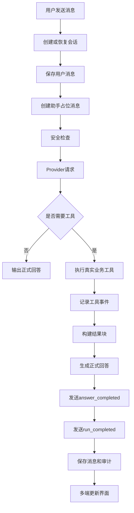

# Agent 智能助手业务

## 文档信息

| 字段 | 内容 |
|---|---|
| 文档类型 | 业务需求 |
| 当前状态 | 已完成 |
| 适用端 | Agent（后端 / Android / iOS / Web） |
| 依据源码 | `Code/backend/src/main/java/com/zhihuiji/backend/application/service/v2/V2AgentAiService.java`、`application/service/v2/agent/`、`infrastructure/ai/LongCatAnthropicClient.java` |
| 依据测试 | `testing/Agent/功能测试/TEST_PLAN.md`、`Code/backend/src/test/java/.../application/service/v2/V2AgentAiServiceTest.java` |
| 依据证据 | `testing/.artifacts/2026-08-18-8220-current-baseline/current-8220-baseline.md` |
| 最后核对 | 2026-08-20 |

## 一、业务描述

Agent 智能助手允许经营者用自然语言查询业务数据、生成报表图表，并在写操作前以草稿请求确认。核心能力：

1. **对话**：创建/恢复会话，保存用户消息，生成助手回答。
2. **工具调用**：模型选择真实业务工具（只读查询 + 写操作草稿），执行并记录。
3. **SSE 流式回答**：`answer_delta` 增量、`answer_completed` 完成、`result_block` 结果块。
4. **结果块**：KPI、表格、图表、草稿卡片按消息 part 顺序渲染。
5. **草稿与确认**：CREATE_ONLY 工具生成草稿，用户确认/取消后执行。
6. **取消与审计**：运行可取消，运行轨迹与审计落库。

## 二、Agent 对话业务流程图

图表目的：展示 Agent 对话的完整业务链路（与后端 `runChatStream` 实现对应）。

图中输入：用户消息、会话上下文、图片输入（Deferred）。
图中处理：`SafetyGuard` 安全检查 → `ToolPlanner` 工具规划 → `ToolRegistry` 执行 → `AnswerSynthesizer` 生成回答 → `SseStreamEmitter` 发送事件 → `RunAuditService` 落审计。
图中输出：`answer_completed`、`run_completed`、`result_block`、审计记录。

对应源码：`Code/backend/src/main/java/com/zhihuiji/backend/application/service/v2/V2AgentAiService.java`。
对应接口：`POST /v2/agent/chat`、`POST /v2/agent/chat/stream`、`POST /v2/agent/runs/{runId}/cancel`、`GET /v2/agent/runs/{runId}/audit`。
对应测试：`testing/Agent/功能测试/TEST_PLAN.md`。
当前状态：后端链路源码已完成；8220 生产链路 Blocked（无会话数据）。

## 三、业务规则要点（源码事实）

| 规则 | 源码事实 |
|---|---|
| 会话隔离 | 会话/消息/草稿/审计全部按 `owner_user_id` 隔离（`V13` 建表、`V15` 建审计表） |
| 安全检查 | `SafetyGuard.evaluateSafety`：高危关键词拦截（drop/delete/truncate）；写入意图用否定语义识别（"不要创建/Do not create"不误判）；写操作按 10 分钟 20 条窗口限流 |
| 工具规划 | `ToolPlanner` 产出 `AgentToolPlan`；模型原生工具调用（`native_tool_use`）与应用侧 JSON 计划并存 |
| 工具执行上限 | `MAX_TOOL_CALLS_PER_RUN = 12`；迭代上限 `MAX_AGENT_ITERATIONS = 3` |
| 结果块可见性 | `draft`/`draft_card` 始终可见；图表块仅在请求可视化且有真实数据时显示（`hasMeaningfulChartData`） |
| 正式回答 | 走模型路径（`model_stream` 或 `non_stream_retry`），不再使用规则摘要拼接（已知问题 #14 已解除） |
| 取消 | `POST /runs/{runId}/cancel` → `run_cancelled` 事件 + audit `cancelled` |
| 审计 | `agent_run_audits` + `agent_run_audit_events`，支持 `audit_id` / `trace_id` / `observability` |

## 四、当前 Agent 测试状态（8220 基线）

| 范围 | 状态 |
|---|---|
| Provider 直连（非流式 / SSE / tool_choice=auto） | Passed |
| 生产 Agent 鉴权与数据基线 | Blocked（session、store、Agent 数据为空） |
| Wave 1 真实数据 Agent | Blocked |
| Wave 2 最小夹具 | Blocked（未获授权，无隔离评测库） |
| Wave 3 长链路/性能 | Blocked |
| 多模态/生图 | Deferred |

## 对应实现

- 后端代码：`application/service/v2/V2AgentAiService.java`、`application/service/v2/agent/component/`、`application/service/v2/agent/tool/`、`infrastructure/ai/LongCatAnthropicClient.java`
- Android 代码：`feature/agent/`、`data/agent/`、`core/network/AgentSseClient.kt`、`core/model/v2/agent/`
- iOS 代码：`Features/Agent/AgentChatView.swift`、`AgentViewModel.swift`、`AgentWorkbenchView.swift`
- Web 代码：`pages/agent/AgentPage.vue`、`shared/api/agent-stream.ts`
- Agent 代码：后端 `application/service/v2/agent/` 全套

## 对应接口

- 接口路径：`/v2/agent/conversations`、`/v2/agent/messages`、`/v2/agent/drafts`、`/v2/agent/chat`、`/v2/agent/chat/stream`、`/v2/agent/runs/{runId}/cancel`、`/v2/agent/runs/{runId}/audit`、`/v2/agent/workbench`、`/v2/agent/tasks`、`/v2/agent/notifications`、`/v2/agent/images/generate`
- 请求模型：`api/dto/v2/agent/V2AgentDtos.java`
- 响应模型：同上
- SSE 事件：`run_started`、`plan`、`tool_started`、`tool_completed`、`tool_failed`、`tool_skipped`、`answer_delta`、`answer_completed`、`result_block`、`draft_created`、`run_cancelled`、`run_completed`、`error`

## 对应测试

- 单元测试：`Code/backend/src/test/java/.../application/service/v2/V2AgentAiServiceTest.java`、`V2AgentConversationServiceTest.java`、`AgentDraftConfirmServiceTest.java`、`component/*Test.java`、`tool/*Test.java`
- 功能测试：`testing/Agent/功能测试/TEST_PLAN.md`
- 性能测试：`testing/Agent/性能测试/TEST_PLAN.md`
- 审计：`testing/Agent/审计/`

## 当前限制

- 未完成内容：Web / iOS Agent 主流程本轮未展开
- Blocked 内容：8220 生产 Agent 链路（无 session/store/Agent 数据）；Wave 1/2/3
- Deferred 内容：多模态、生图、图片输入和图片结果展示
- historical-only 内容：154 环境 Agent 历史会话与证据
