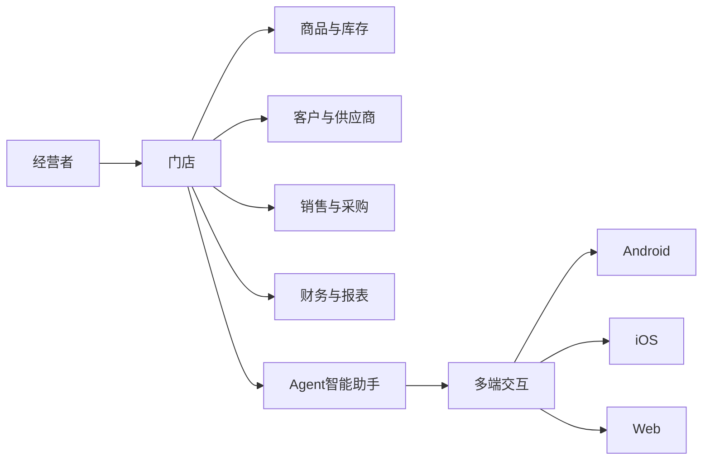
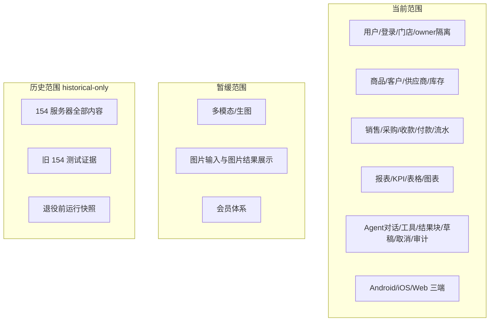

# 业务目标与项目范围

## 文档信息

| 字段 | 内容 |
|---|---|
| 文档类型 | 业务需求 |
| 当前状态 | 已完成 |
| 适用端 | 多端 |
| 依据源码 | `Code/backend/src/main/java/com/zhihuiji/backend/`（api/application/domain/infrastructure） |
| 依据测试 | `testing/README.md`、`testing/已知问题与解除条件.md` |
| 依据证据 | `testing/.artifacts/2026-08-18-8220-current-baseline/current-8220-baseline.md` |
| 最后核对 | 2026-08-20 |

## 一、项目解决什么问题

智慧记（master-goods）是面向小微经营者（门店、批发商、个体商户）的经营管理系统，覆盖从进货、库存、销售、采购到收款、付款、财务流水和经营报表的完整业务闭环，并通过 Agent 智能助手提供自然语言查询与经营分析能力。

项目要解决的问题：

1. 经营者需要一个集中的门店业务系统，管理商品、客户、供应商、销售、采购、库存和资金。
2. 数据必须按 owner（经营者）隔离，同一个账户体系下可建立门店与成员关系，成员按角色获得有限权限。
3. 经营者需要经营报表与 KPI 视图，快速了解销售、库存、应收应付和资金状况。
4. 经营者希望通过自然语言与系统对话（Agent），让系统代查数据、生成报表和图表，并在执行写操作前以草稿形式请求确认。

## 二、业务全景图

图表目的：展示业务顶层结构——经营者通过门店进入各业务域，Agent 助手横跨业务域为多端提供自然语言入口。

图中输入：经营者身份（owner）、门店上下文。
图中处理：门店作为业务域容器，汇聚商品、往来、单据、资金和报表。
图中输出：各业务域能力 + Agent 多端交互。

对应源码：
- 后端：`Code/backend/src/main/java/com/zhihuiji/backend/domain/entity/`（UserEntity、StoreEntity、StoreMembershipEntity）
- Android：`Code/frontend/android/feature/`（dashboard/products/sales/purchases/finance/reports/agent）
- iOS：`Code/frontend/ios/ZhihuijiIOS/Features/`
- Web：`Code/frontend/web/src/pages/`

对应接口：`V2StoreController`、`V2AgentController`、`V2ReportController` 等 v2 接口族。

对应测试：`testing/后端/功能测试/TEST_PLAN.md`、`testing/Agent/功能/TEST_PLAN.md`。

当前状态：业务顶层结构已在源码中实现；当前 8220 环境门店与业务数据为空，运行链路 Blocked。

## 三、当前范围、暂缓范围和历史范围

图表目的：明确当前范围、暂缓范围与历史范围边界，避免把 Deferred 或 historical-only 内容写成已实现。

图中输入：项目范围决策（源码、测试与基线记录）。
图中处理：按"当前源码存在 + 当前证据存在"分入当前范围；按"明确暂缓"分入 Deferred；按"退役环境"分入 historical-only。
图中输出：三类范围边界。

对应源码：`Code/` 全部工程（当前范围）；`AgentImageService.java` 等（Deferred 相关源码存在但未启用）；无 154 源码。
对应测试：`testing/README.md`（Execution Start Baseline：154 为 historical-only）。
对应证据：`testing/.artifacts/2026-08-18-8220-current-baseline/current-8220-baseline.md`。
当前状态：已完成（边界已按 2026-08-18 基线确认）。

## 四、多端职责概览

| 端 | 职责 | 真源位置 |
|---|---|---|
| Android | 移动端主营应用：五栏底部导航（首页/单据/档案/报表/助手），Agent 对话与结果块渲染 | `Code/frontend/android/feature/` |
| iOS | 移动端原生实现：与 Android 对齐的导航与页面，Agent 页面存在 | `Code/frontend/ios/ZhihuijiIOS/Features/` |
| Web | PC 宽屏管理端：文档中心、档案、报表、Agent 页面 | `Code/frontend/web/src/pages/` |

详见 `多端产品范围.md`。

## 五、当前服务器和历史服务器边界

- 当前运行与验证目标：`8.220.206.9`（8220），公共 API 入口 `https://zhj-api.sxyq27.online/`。
- 历史服务器：`154.217.241.207` 已完全退役，仅保留历史证据，标记 `historical-only`，不参与当前通过率、发布验收或运行状态判断。
- Provider：模型 `gpt-5.6-luna`，Base URL `https://oneapi.sxyq27.online/v1`，Wire API `chat_completions`。

详见 `06_部署与运维/当前环境总览.md` 与 `03_系统设计/部署架构/历史154环境说明.md`。

## 对应实现

- 后端代码：`Code/backend/src/main/java/com/zhihuiji/backend/`
- Android 代码：`Code/frontend/android/`
- iOS 代码：`Code/frontend/ios/ZhihuijiIOS/`
- Web 代码：`Code/frontend/web/src/`
- Agent 代码：后端 `application/service/v2/agent/`、Android `feature/agent/`、iOS `Features/Agent/`、Web `pages/agent/`

## 对应接口

- 接口路径：`/api/v1/*`（`api/controller/`）与 `/v2/*`（`api/controller/v2/`）
- 请求模型：`api/dto/`
- 响应模型：`api/dto/`
- SSE 事件：`SseStreamEmitter.java`

## 对应测试

- 单元测试：`testing/后端/单元测试/TEST_PLAN.md`、`testing/安卓/单元测试/TEST_PLAN.md`
- 功能测试：`testing/后端/功能测试/TEST_PLAN.md`、`testing/Agent/功能/TEST_PLAN.md`
- 性能测试：`testing/后端/性能测试/TEST_PLAN.md`
- 多端测试：`testing/安卓/`、`testing/ios/`、`testing/web/`

## 当前限制

- 未完成内容：iOS / Web Agent 主流程本轮未展开测试
- Blocked 内容：Android 真机（无 adb）；8220 生产 Agent 业务链路（无业务数据）
- Deferred 内容：多模态、生图、图片输入和图片结果展示、会员体系
- historical-only 内容：154 服务器全部内容
