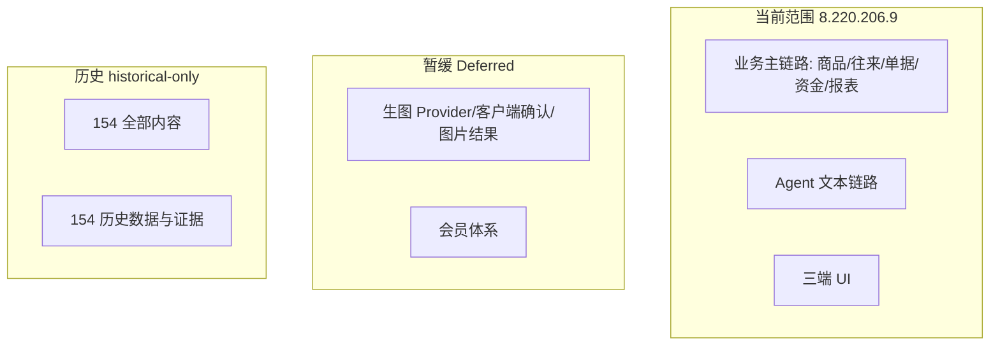

# 业务范围与暂缓事项

## 文档信息

| 字段 | 内容 |
|---|---|
| 文档类型 | 业务需求 |
| 当前状态 | 已完成 |
| 适用端 | 多端 |
| 依据源码 | `Code/`（当前范围）、`Code/backend/src/main/java/com/zhihuiji/backend/application/service/v2/AgentImageService.java`（Deferred 相关） |
| 依据测试 | `testing/README.md`、`testing/Agent/README.md`、`testing/Agent/功能/TEST_PLAN.md` |
| 依据证据 | `testing/.artifacts/2026-08-18-8220-current-baseline/current-8220-baseline.md`、`testing/current-8220-wave-ledger.csv` |
| 最后核对 | 2026-08-20 |

## 一、当前范围

| 范围 | 内容 | 状态依据 |
|---|---|---|
| 用户与认证 | 注册、登录、session 恢复 | `AuthService.java`、`V2AuthController.java` |
| 门店与成员 | 门店、成员、角色、owner 隔离 | `StoreAccessPolicy.java`、`V19__store_memberships.sql` |
| 商品与库存 | 商品、分类、单位、价格、库存台账/快照 | `V1/V8/V9/V10` 迁移 + 对应 Service |
| 客户与供应商 | 客户、供应商、联系人、分组 | `V1/V2/V8` 迁移 + 对应 Service |
| 销售与采购 | 销售单、采购单、收货、退货、收款付款 | `V1/V2/V18/V20` 迁移 + 对应 Service |
| 财务与报表 | 账户、转账、流水、现金变动、报表 | `V3/V10` 迁移 + `ReportService` |
| Agent | 对话、61 个工具、SSE、结果块、草稿、取消、审计 | `V2AgentAiService` + `application/service/v2/agent/` |
| 多端 | Android / iOS / Web | `Code/frontend/` |

## 二、暂缓范围（Deferred）

| 暂缓项 | 原因 | 恢复条件 | 证据 |
|---|---|---|---|
| 多模态 | Provider 与设计资料未提供 | 提供生图 Provider 与设计资料 | 8220 基线"多模态/生图 Deferred" |
| 生图 Provider | Provider 未配置，真实资源消耗与结果回传未验证 | 以运行时占位配置接入隔离 Provider，并完成错误、超时、取消、资源清理和审计验证 | `testing/Agent/集成/TEST_PLAN.md` AG-I-013、`testing/Agent/性能/TEST_PLAN.md` AG-P-027 |
| 图片输入 | 图片输入链路未启用 | 多模态链路启用 | 8220 基线 |
| 图片结果展示 | 图片结果展示未启用 | 多模态链路启用 | 8220 基线 |
| 会员体系 | 明确不纳入当前 Agent/UI 重构范围 | 后续另行立项 | `docs/README.md`（原说明） |

`AgentImageService`（`POST /v2/agent/images/generate`）已经存在并受 `agent:write` 保护；它是独立 REST 能力。`image_generate` 已注册为 Agent 的第 61 个工具，但工具阶段只创建草稿，确认后才调用该 Service。Provider、客户端覆盖式确认、结果展示和真实资源消耗仍为 **Deferred**，不能写成已完成。

## 三、历史范围（historical-only）

| 历史项 | 说明 |
|---|---|
| 154 服务器（`154.217.241.207`） | 已完全退役，部署资料、配置、数据库副本、测试结果只作为历史资料 |
| 154 历史数据基线 | users=5、sessions=5、stores=1、agent_conversations=18 等（`testing/README.md` 明确：不得回写成当前 8220 结果） |
| 154 旧探针结果 | 如 `function_call_output` 续轮 HTTP 400（`testing/已知问题与解除条件.md` #15：需在 8220 独立验证） |
| 旧设备证据 | `d715a3a4` 在 154 环境的截图/XML/logcat |

## 四、范围边界图

图表目的：固化当前、暂缓、历史三类范围的边界。

图中输入：2026-08-18 基线、源码目录、测试台账。
图中处理：按"当前源码+当前证据"、"明确暂缓"、"退役环境"分类。
图中输出：三类边界。

对应源码：`Code/` 全部工程。
对应测试：`testing/README.md`、`testing/current-8220-wave-ledger.csv`。
对应证据：`testing/.artifacts/2026-08-18-8220-current-baseline/current-8220-baseline.md`。
当前状态：已完成。

## 对应实现

- 后端代码：`Code/backend/src/main/java/com/zhihuiji/backend/`
- Android 代码：`Code/frontend/android/`
- iOS 代码：`Code/frontend/ios/ZhihuijiIOS/`
- Web 代码：`Code/frontend/web/src/`
- Agent 代码：`application/service/v2/agent/`

## 对应接口

- 接口路径：`/v2/*`（当前范围）；`/v2/agent/images/generate`（REST 源码存在，Provider 未配置）
- 请求模型：`api/dto/v2/`
- 响应模型：`api/dto/v2/`
- SSE 事件：Agent 链路事件

## 对应测试

- 功能测试：`testing/后端/功能测试/TEST_PLAN.md`、`testing/Agent/功能/TEST_PLAN.md`
- 契约/集成测试：`testing/Agent/契约/TEST_PLAN.md`、`testing/Agent/集成/TEST_PLAN.md`
- 基线台账：`testing/current-8220-wave-ledger.csv`

## 当前限制

- 未完成内容：无
- Blocked 内容：8220 生产 Agent 链路；Wave 1/2/3
- Deferred 内容：多模态、生图、图片输入和图片结果展示、会员体系
- historical-only 内容：154 全部内容
