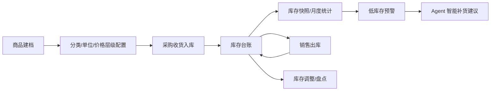

# 商品与库存业务

## 文档信息

| 字段 | 内容 |
|---|---|
| 文档类型 | 业务需求 |
| 当前状态 | 已完成 |
| 适用端 | 多端 |
| 依据源码 | `Code/backend/src/main/java/com/zhihuiji/backend/domain/entity/product/`、`application/service/v2/V2InventoryService.java`、`api/controller/v2/product/`、`api/controller/v2/V2InventoryController.java` |
| 依据测试 | `Code/backend/src/test/java/.../V2InventoryServiceTest.java`、`V2ProductControllerTest.java`、`testing/后端/功能测试/TEST_PLAN.md` |
| 依据证据 | `testing/.artifacts/2026-08-18-8220-current-baseline/current-8220-baseline.md` |
| 最后核对 | 2026-08-20 |

## 一、业务描述

商品与库存是系统的核心业务域之一：

- **商品档案**：商品（products）、分类（product_categories）、单位（product_units）、价格层级（product_price_levels）、商品-供应商关系（product_supplier_relations）。
- **库存**：库存调整（inventory_adjustments）、库存台账（inventory_ledger）、库存快照（inventory_snapshots）、月度统计（inventory_monthly_stats）。

## 二、数据实体（Flyway 迁移证据）

| 表 | 迁移文件 |
|---|---|
| products | `V1__init.sql` |
| product_categories / product_units | `V8__product_and_partner_expansion.sql` |
| product_price_levels / product_supplier_relations | `V9__product_price_levels_and_supplier_relations.sql` |
| inventory_adjustments | `V1__init.sql` |
| inventory_ledger / inventory_snapshots / inventory_monthly_stats | `V10__finance_and_inventory_foundation.sql` |
| owner 隔离索引 | `V24__owner_scoped_query_indexes.sql` |

## 三、商品与库存业务流程

图表目的：展示商品与库存的核心生命周期。

图中输入：商品档案、采购收货、销售出库、盘点调整。
图中处理：入库/出库写入 `inventory_ledger`；快照与月统计由库存服务生成；低库存由 Agent 工具查询。
图中输出：台账、快照、低库存清单、补货建议。

对应源码：
- `Code/backend/src/main/java/com/zhihuiji/backend/application/service/v2/V2InventoryService.java`
- `Code/backend/src/main/java/com/zhihuiji/backend/application/service/v2/agent/tool/readonly/InventoryLowStockLookupTool.java`
- `Code/backend/src/main/java/com/zhihuiji/backend/application/service/v2/agent/tool/readonly/SmartRestockLookupTool.java`
- `Code/backend/src/main/java/com/zhihuiji/backend/application/service/v2/agent/tool/readonly/InventoryPanoramaLookupTool.java`

对应接口：`/v2/inventory/*`、`/v2/products/*`。
对应测试：`V2InventoryServiceTest.java`、`V2ProductControllerTest.java`。
当前状态：源码已完成；8220 商品与库存表为空，运行链路 Blocked。

## 四、库存口径

- 库存台账按 owner 隔离（owner_user_id），支持来源索引（`V21__inventory_ledger_source_index.sql`）。
- 商品/客户/供应商等查询都有 owner-scoped 索引（`V24__owner_scoped_query_indexes.sql`）。
- 库存快照与月度统计用于报表与 Agent 查询（`V10` 建表）。

## 对应实现

- 后端代码：`domain/entity/product/`、`infrastructure/repository/product/`、`application/service/v2/V2InventoryService.java`
- Android 代码：`feature/products/`、`data/product/ProductV2Repository.kt`、`data/sync/`
- iOS 代码：`Features/Products/`、`Features/Inventory/`
- Web 代码：`pages/archives/product/`、`pages/inventory/`
- Agent 代码：`application/service/v2/agent/tool/readonly/`（Inventory* 与 Product* 工具）

## 对应接口

- 接口路径：`/v2/products/*`、`/v2/inventory/*`（含快照、台账、调整、月统计）
- 请求模型：`api/dto/v2/product/V2ProductDtos.java`、`api/dto/v2/inventory/V2InventoryDtos.java`
- 响应模型：同上
- SSE 事件：Agent 工具事件（`tool_started` / `tool_completed` / `result_block`）

## 对应测试

- 单元测试：`V2ProductControllerTest.java`、`V2InventoryServiceTest.java`
- 功能测试：`testing/后端/功能测试/TEST_PLAN.md`
- Agent 测试：`Code/backend/src/test/java/.../agent/tool/readonly/ProductCatalogLookupToolTest.java`

## 当前限制

- 未完成内容：无
- Blocked 内容：8220 无商品与库存数据，业务链路运行验证 Blocked
- Deferred 内容：无
- historical-only 内容：154 环境历史商品库存数据
