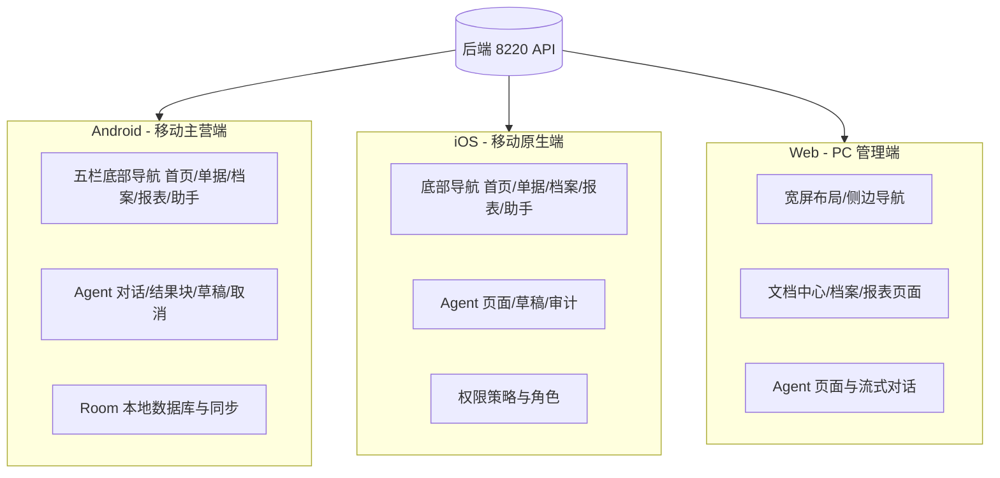

# 多端产品范围

## 文档信息

| 字段 | 内容 |
|---|---|
| 文档类型 | 业务需求 |
| 当前状态 | 已完成 |
| 适用端 | 多端 |
| 依据源码 | `Code/frontend/android/`、`Code/frontend/ios/ZhihuijiIOS/`、`Code/frontend/web/src/` |
| 依据测试 | `testing/安卓/`、`testing/ios/`、`testing/web/` 各 TEST_PLAN.md |
| 依据证据 | `testing/.artifacts/2026-08-18-8220-current-baseline/current-8220-baseline.md` |
| 最后核对 | 2026-08-20 |

## 一、Android / iOS / Web 职责分工图

图表目的：展示三端职责分工与统一后端。

图中输入：后端 API（`https://zhj-api.sxyq27.online/`）。
图中处理：Android 为主营移动端（最完整）；iOS 为原生实现；Web 为 PC 管理端。
图中输出：三端各自的产品形态。

对应源码：
- Android：`Code/frontend/android/app/src/main/java/com/zhihuiji/app/navigation/MainNavGraph.kt`（五栏导航）
- iOS：`Code/frontend/ios/ZhihuijiIOS/Features/ArchiveTab.swift`、`AppRouter.swift`（底部导航对齐）
- Web：`Code/frontend/web/src/app/router/routes.ts`、`app/layouts/AppLayout.vue`

对应接口：三端共用 `/v2/*` 接口族。
对应测试：`testing/安卓/`、`testing/ios/`、`testing/web/` 功能测试 TEST_PLAN。
当前状态：Android 本地构建与单元测试通过；iOS/Web Agent 主流程待验证。

## 二、各端页面范围

### Android（`Code/frontend/android/feature/`）

| 业务 | 页面 | 真源 |
|---|---|---|
| 认证 | 登录/注册 | `feature/auth/` |
| 首页 | 经营概览 | `feature/dashboard/DashboardScreen.kt` |
| 商品 | 商品列表/编辑 | `feature/products/` |
| 客户/供应商 | 档案列表/详情 | `feature/customers/`、`feature/suppliers/` |
| 销售 | 销售单 | `feature/sales/` |
| 采购 | 采购单 | `feature/purchases/` |
| 财务 | 账户/流水/转账 | `feature/finance/`、`feature/payments/` |
| 报表 | 报表页 | `feature/reports/` |
| Agent | 工作台/对话/草稿/任务通知 | `feature/agent/` |
| 设置 | 设置/成员 | `feature/settings/` |

### iOS（`Code/frontend/ios/ZhihuijiIOS/Features/`）

| 业务 | 页面 | 真源 |
|---|---|---|
| 认证 | LoginView / RegisterView | `Features/Auth/` |
| 首页 | DashboardView | `Features/Dashboard/` |
| 单据中心 | DocumentsHomeView | `Features/DocumentsHomeView.swift` |
| 档案 | CustomerList / SupplierList / ContactList | `Features/Archives/` |
| 销售/采购 | Sales* / Purchase* | `Features/Sales/`、`Features/Purchases/` |
| 财务 | AccountList / DailyExpense / FinanceRecord | `Features/Finance/` |
| 库存 | InventoryAdjust / InventorySnapshot | `Features/Inventory/` |
| 报表 | Reports* | `Features/Reports/` |
| Agent | AgentChatView / AgentWorkbenchView / AgentDraftsView / AgentTasksView | `Features/Agent/` |
| 设置 | Settings 与媒体资产 | `Features/Settings/` |

### Web（`Code/frontend/web/src/pages/`）

| 业务 | 页面 | 真源 |
|---|---|---|
| 认证 | LoginPage | `pages/auth/LoginPage.vue` |
| 首页 | DashboardPage | `pages/dashboard/DashboardPage.vue` |
| 单据 | 销售/采购列表、详情、编辑、退货、收款 | `pages/documents/sales/`、`pages/documents/purchase/` |
| 档案 | 客户/供应商/商品档案 | `pages/archives/` |
| 财务 | 账户、转账、付款、流水、日支出 | `pages/finance/` |
| 库存 | 调整、台账、快照 | `pages/inventory/` |
| 报表 | ReportsPage | `pages/reports/overview/ReportsPage.vue` |
| 规划 | PlanningOverviewPage | `pages/planning/PlanningOverviewPage.vue` |
| Agent | AgentPage | `pages/agent/AgentPage.vue` |
| 设置 | 角色权限、数据库 | `pages/settings/RoleAccessPage.vue`、`DatabasePage.vue` |

## 三、当前差异说明

- iOS 底部导航严格对齐 Android 移动端：`首页 / 单据 / 档案 / 报表 / 助手`；库存、资金、设置不是底部顶级 tab（来源：`Code/frontend/ios/PAGE_MAP.md`）。
- Web 是 PC 宽屏布局，包含规划页（PlanningOverviewPage）与设置页（RoleAccessPage 等）这类管理端页面。
- Android 是当前 Agent 能力最完整的端（工作台、对话、结果块、草稿、任务通知均有页面）。
- 三端 Agent 页面均消费同一组 `/v2/agent/*` 接口与 SSE 事件。

## 对应实现

- Android 代码：`Code/frontend/android/feature/`
- iOS 代码：`Code/frontend/ios/ZhihuijiIOS/Features/`
- Web 代码：`Code/frontend/web/src/pages/`

## 对应接口

- 接口路径：`/v2/*`
- 请求模型：`api/dto/v2/`
- 响应模型：`api/dto/v2/`
- SSE 事件：`SseStreamEmitter.java`

## 对应测试

- 单元测试：`testing/安卓/单元测试/`、`testing/ios/单元测试/`、`testing/web/单元测试/`
- 功能测试：`testing/安卓/功能测试/`、`testing/ios/功能测试/`、`testing/web/功能测试/`
- 性能测试：`testing/安卓/性能测试/`、`testing/ios/性能测试/`、`testing/web/性能测试/`

## 当前限制

- 未完成内容：iOS / Web Agent 主流程测试本轮未展开（`testing/Agent/功能测试/TEST_PLAN.md`）
- Blocked 内容：Android 真机验证（无 adb）
- Deferred 内容：多模态相关（三端均未启用图片输入链路）
- historical-only 内容：154 环境三端历史证据
