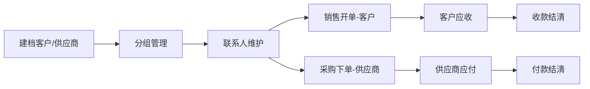

# 客户与供应商业务

## 文档信息

| 字段 | 内容 |
|---|---|
| 文档类型 | 业务需求 |
| 当前状态 | 已完成 |
| 适用端 | 多端 |
| 依据源码 | `Code/backend/src/main/java/com/zhihuiji/backend/domain/entity/CustomerEntity.java`、`SupplierEntity.java`、`PartnerContactEntity.java`、`PartnerGroupEntity.java`、`application/service/v2/V2CustomerService.java`、`V2SupplierService.java`、`V2PartnerContactService.java`、`V2PartnerGroupService.java` |
| 依据测试 | `V2CustomerServiceTest.java`、`V2SupplierServiceTest.java`、`V2PartnerContactServiceTest.java`、`V2PartnerGroupServiceTest.java`、`testing/后端/功能测试/TEST_PLAN.md` |
| 依据证据 | `testing/.artifacts/2026-08-18-8220-current-baseline/current-8220-baseline.md` |
| 最后核对 | 2026-08-20 |

## 一、业务描述

客户与供应商统称往来单位（partner），是销售与采购业务的对方实体：

- **客户**（customers）：销售对象，产生应收。
- **供应商**（suppliers）：采购对象，产生应付。
- **联系人**（partner_contacts）：往来单位的联系人。
- **分组**（partner_groups）：往来单位分组。
- **商品-供应商关系**（product_supplier_relations）：商品与供应商的关联。

## 二、数据实体（Flyway 迁移证据）

| 表 | 迁移文件 |
|---|---|
| customers | `V1__init.sql` |
| suppliers | `V2__suppliers_and_pay_orders.sql` |
| partner_groups / partner_contacts | `V8__product_and_partner_expansion.sql` |

## 三、客户与供应商业务流程

图表目的：展示往来单位从建档到应收应付闭环。

图中输入：客户、供应商、分组、联系人。
图中处理：`V2CustomerService` / `V2SupplierService` 维护档案；销售/采购单引用往来单位；Agent 工具汇总应收应付。
图中输出：客户应收、供应商应付、结清记录。

对应源码：
- `Code/backend/src/main/java/com/zhihuiji/backend/application/service/v2/V2CustomerService.java`
- `Code/backend/src/main/java/com/zhihuiji/backend/application/service/v2/V2SupplierService.java`
- `Code/backend/src/main/java/com/zhihuiji/backend/application/service/v2/agent/tool/readonly/CustomerReceivableLookupTool.java`
- `Code/backend/src/main/java/com/zhihuiji/backend/application/service/v2/agent/tool/readonly/SupplierPayableLookupTool.java`

对应接口：`/v2/customers/*`、`/v2/suppliers/*`、`/v2/customer-contacts/*`、`/v2/supplier-contacts/*`、`/v2/customer-groups/*`、`/v2/supplier-groups/*`。
对应测试：`V2CustomerServiceTest.java`、`V2SupplierServiceTest.java`、`V2PartnerContactServiceTest.java`、`V2PartnerGroupServiceTest.java`。
当前状态：源码已完成；8220 customers/suppliers 表为空。

## 四、Agent 侧往来单位工具

| 工具 | 用途 |
|---|---|
| `customer_receivable_lookup` | 查询当前账号客户应收余额 |
| `supplier_payable_lookup` | 查询当前账号供应商应付余额 |
| `receivable_payable_lookup` | 应收应付总览 |
| `supplier_directory_lookup` | 供应商目录 |
| `supplier_statement_lookup` | 供应商对账 |
| `partner_group_lookup` / `partner_contact_lookup` | 分组与联系人查询 |
| `write/CreateCustomerTool` | 创建客户草稿（CREATE_ONLY，需确认） |

来源：`Code/backend/src/main/java/com/zhihuiji/backend/application/service/v2/agent/tool/readonly/` 与 `tool/write/` 目录。

## 对应实现

- 后端代码：`application/service/v2/V2CustomerService.java`、`V2SupplierService.java`、`V2PartnerContactService.java`、`V2PartnerGroupService.java`
- Android 代码：`feature/customers/`、`feature/suppliers/`、`data/customer/CustomerV2Repository.kt`、`data/supplier/SupplierV2Repository.kt`
- iOS 代码：`Features/Archives/CustomerListView.swift`、`SupplierListView.swift`、`ContactListView.swift`
- Web 代码：`pages/archives/partner/PartnerArchivePage.vue`、`pages/archives/contact/ContactListPage.vue`
- Agent 代码：`application/service/v2/agent/tool/readonly/`（Customer*/Supplier* 工具）、`tool/write/CreateCustomerTool.java`

## 对应接口

- 接口路径：`/v2/customers/*`、`/v2/suppliers/*`、`/v2/customer-contacts/*`、`/v2/supplier-contacts/*`、`/v2/customer-groups/*`、`/v2/supplier-groups/*`
- 请求模型：`api/dto/v2/partner/V2PartnerDtos.java`
- 响应模型：同上
- SSE 事件：Agent 工具事件

## 对应测试

- 单元测试：`V2CustomerServiceTest.java`、`V2SupplierServiceTest.java`、`V2PartnerContactServiceTest.java`、`V2PartnerGroupServiceTest.java`、`V2PartnerControllerTest.java`
- 功能测试：`testing/后端/功能测试/TEST_PLAN.md`
- Agent 测试：`Code/backend/src/test/java/.../agent/tool/readonly/CustomerProfileLookupToolTest.java`

## 当前限制

- 未完成内容：无
- Blocked 内容：8220 客户供应商表为空
- Deferred 内容：无
- historical-only 内容：154 环境历史往来单位数据
