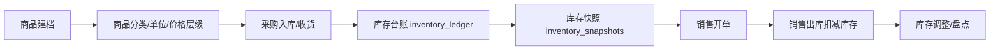
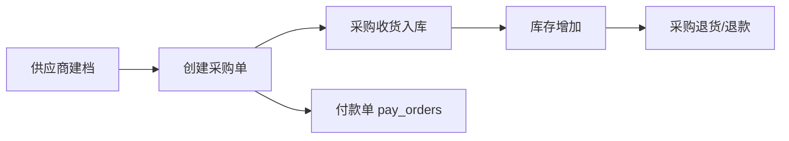
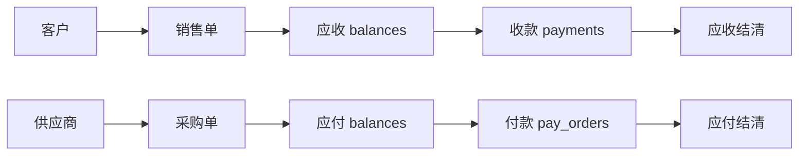
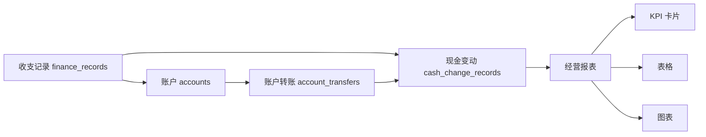
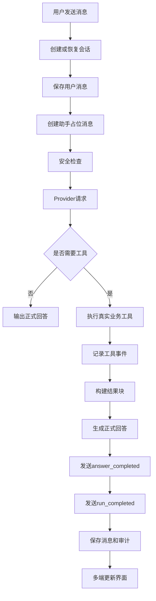

# 核心业务流程

## 文档信息

| 字段 | 内容 |
|---|---|
| 文档类型 | 业务需求 |
| 当前状态 | 已完成 |
| 适用端 | 多端 |
| 依据源码 | `Code/backend/src/main/java/com/zhihuiji/backend/application/service/`（v1 + v2）、`api/controller/` |
| 依据测试 | `testing/后端/功能测试/TEST_PLAN.md`、`testing/Agent/功能/TEST_PLAN.md` |
| 依据证据 | `testing/.artifacts/2026-08-18-8220-current-baseline/current-8220-baseline.md` |
| 最后核对 | 2026-08-20 |

## 一、商品入库到销售出库流程

图表目的：展示商品从建档到销售出库再到盘点调整的主链路。

图中输入：商品资料、采购收货、销售单。
图中处理：`V2PurchaseReceiptService` 入库写入 `inventory_ledger`；`V2SaleOrderService` 出库扣减；`V2InventoryService` 提供调整与快照。
图中输出：库存台账、库存快照、销售出库记录。

对应源码：
- `Code/backend/src/main/java/com/zhihuiji/backend/application/service/v2/V2InventoryService.java`
- `Code/backend/src/main/java/com/zhihuiji/backend/application/service/v2/V2SaleOrderService.java`
- `Code/backend/src/main/java/com/zhihuiji/backend/application/service/v2/V2PurchaseReceiptService.java`
- `Code/backend/src/main/java/com/zhihuiji/backend/domain/entity/product/ProductEntity.java`

对应接口：`/v2/products/*`、`/v2/inventory/*`、`/v2/purchase-receipts/*`、`/v2/sale-orders/*`。
对应测试：`V2InventoryServiceTest.java`、`V2SaleOrderServiceTest.java`、`V2PurchaseReceiptServiceTest.java`、`V2ProductControllerTest.java`。
当前状态：源码已完成；8220 业务表为空，运行链路 Blocked。

## 二、采购到入库流程

图表目的：展示采购从供应商到入库再到付款/退货的完整流程。

图中输入：供应商、采购单、收货单、付款单。
图中处理：`V2PurchaseOrderService` 建单；`V2PurchaseReceiptService` 收货；`V2PurchaseReturnService` 退货；`V2PayOrderService` 付款。
图中输出：采购单、收货记录、库存变化、付款单、采购退货。

对应源码：
- `Code/backend/src/main/java/com/zhihuiji/backend/application/service/v2/V2PurchaseOrderService.java`
- `Code/backend/src/main/java/com/zhihuiji/backend/application/service/v2/V2PurchaseReceiptService.java`
- `Code/backend/src/main/java/com/zhihuiji/backend/application/service/v2/V2PurchaseReturnService.java`
- `Code/backend/src/main/java/com/zhihuiji/backend/application/service/v2/V2PayOrderService.java`

对应接口：`/v2/purchase-orders/*`、`/v2/purchase-receipts/*`、`/v2/purchase-returns/*`、`/v2/pay-orders/*`。
对应测试：`V2PurchaseOrderServiceTest.java`、`V2PurchaseReceiptServiceTest.java`、`V2PurchaseReturnServiceTest.java`、`V2PayOrderServiceTest.java`。
当前状态：源码已完成；8220 无采购数据。

## 三、客户应收和供应商应付流程

图表目的：展示客户应收与供应商应付两条资金链。

图中输入：销售单、采购单、收款、付款。
图中处理：Agent 工具 `customer_receivable_lookup`、`supplier_payable_lookup`、`receivable_payable_lookup` 汇总应收应付；财务接口记录收款付款。
图中输出：应收余额、应付余额、结清记录。

对应源码：
- `Code/backend/src/main/java/com/zhihuiji/backend/application/service/v2/agent/tool/readonly/CustomerReceivableLookupTool.java`
- `Code/backend/src/main/java/com/zhihuiji/backend/application/service/v2/agent/tool/readonly/SupplierPayableLookupTool.java`
- `Code/backend/src/main/java/com/zhihuiji/backend/application/service/v2/agent/tool/readonly/ReceivablePayableLookupTool.java`
- `Code/backend/src/main/java/com/zhihuiji/backend/application/service/v2/V2PayOrderService.java`

对应接口：`/v2/pay-orders/*`、Agent 只读工具（无独立 REST 应收应付接口证据，应收应付以 Agent 工具查询为主）。
对应测试：`Code/backend/src/test/java/.../agent/tool/readonly/CustomerProfileLookupToolTest.java`、`SupplierStatementLookupToolTest`（存在相关测试目录）。
当前状态：源码已完成；应收应付运行数据 8220 为空。

## 四、财务数据到报表流程

图表目的：展示财务数据如何汇聚成报表、KPI、表格和图表。

图中输入：finance_records、accounts、account_transfers、cash_change_records。
图中处理：`V2FinanceRecordService`、`V2AccountService`、`V2AccountTransferService`、`V2CashChangeRecordService` 写入资金域；`ReportService` / `V2ReportController` 聚合出报表。
图中输出：经营概览、销售趋势、KPI、表格、图表。

对应源码：
- `Code/backend/src/main/java/com/zhihuiji/backend/application/service/v2/V2FinanceRecordService.java`
- `Code/backend/src/main/java/com/zhihuiji/backend/application/service/v2/V2AccountService.java`
- `Code/backend/src/main/java/com/zhihuiji/backend/application/service/v2/V2AccountTransferService.java`
- `Code/backend/src/main/java/com/zhihuiji/backend/application/service/ReportService.java`
- `Code/backend/src/main/java/com/zhihuiji/backend/api/controller/v2/V2ReportController.java`

对应接口：`/v2/finance-records/*`、`/v2/accounts/*`、`/v2/account-transfers/*`、`/v2/reports/*`。
对应测试：`ReportControllerTest.java`、`ReportServiceTest.java`、`V2AccountServiceTest.java`、`V2AccountTransferServiceTest.java`。
当前状态：源码已完成；8220 无财务数据，报表趋势存在历史 500 已知问题（见 `07_问题审计/当前已知问题.md` #9）。

## 五、Agent 对话业务流程图

图表目的：展示 Agent 对话的完整业务链路（对应后端 `V2AgentAiService.chatStream` 真实实现）。

图中输入：用户消息、会话上下文。
图中处理：会话解析、消息持久化、安全审查（`SafetyGuard`）、Provider 请求（`LongCatAnthropicClient`）、工具规划与执行（`ToolPlanner` + `ToolRegistry`）、正式回答生成（`AnswerSynthesizer`）、SSE 事件发送（`SseStreamEmitter`）。
图中输出：`answer_completed`、`run_completed`、结果块、审计记录。

对应源码：`Code/backend/src/main/java/com/zhihuiji/backend/application/service/v2/V2AgentAiService.java`。
对应接口：`POST /v2/agent/chat/stream`。
对应测试：`testing/Agent/功能/TEST_PLAN.md`。
当前状态：后端链路源码已完成；8220 生产链路 Blocked（无数据）。

## 六、其他核心流程

- 同步流程：`V2SyncController`、`V2SyncService`、`SyncCursorEntity`、`SyncChangeLogEntity`、`SyncTombstoneEntity`（多端数据同步）。
- 导入流程：`V2ImportJobController`、`V2ImportJobWorkerService`、`ImportJobRepository`（历史数据导入）。
- 海报与积分：`PosterService`、`CreditService`（`user_credits`、`credit_transactions`、`poster_generations`）。

## 对应实现

- 后端代码：`application/service/`（v1 与 v2 业务服务）
- Android 代码：`feature/`（各业务页面）、`data/`（各 Repository）
- iOS 代码：`ZhihuijiIOS/Features/`
- Web 代码：`src/pages/`
- Agent 代码：`application/service/v2/agent/tool/`

## 对应接口

- 接口路径：`/v2/*` 业务接口族
- 请求模型：`api/dto/v2/`
- 响应模型：`api/dto/v2/`
- SSE 事件：Agent 链路 `SseStreamEmitter.java`

## 对应测试

- 单元测试：`Code/backend/src/test/java/.../application/service/v2/` 各 ServiceTest
- 功能测试：`testing/后端/功能测试/TEST_PLAN.md`
- 多端测试：`testing/安卓/功能测试/TEST_PLAN.md`

## 当前限制

- 未完成内容：无（流程均有源码）
- Blocked 内容：8220 无业务数据，流程运行验证 Blocked
- Deferred 内容：多模态相关流程
- historical-only 内容：154 上的历史业务数据与流程证据
