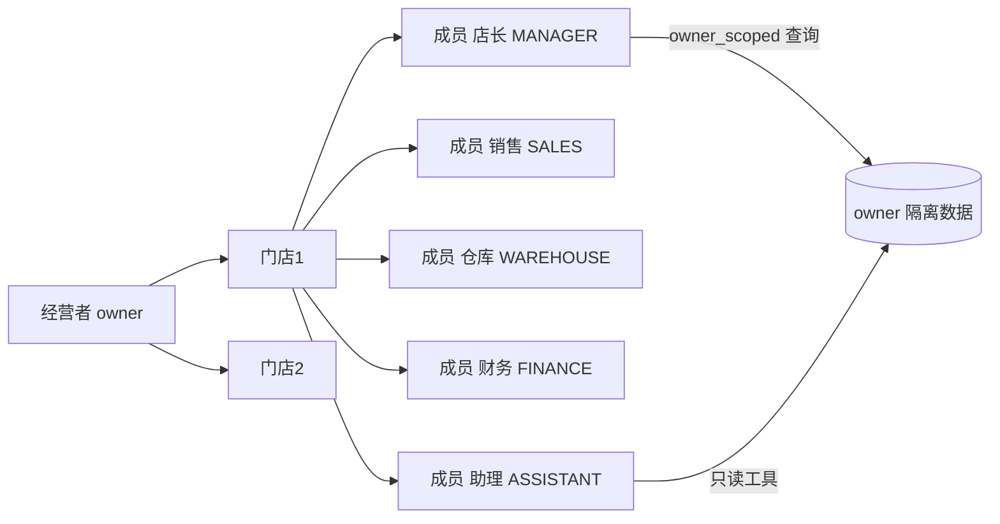

# 用户角色与使用场景

## 文档信息

| 字段 | 内容 |
|---|---|
| 文档类型 | 业务需求 |
| 当前状态 | 已完成 |
| 适用端 | 多端 |
| 依据源码 | `Code/backend/src/main/java/com/zhihuiji/backend/application/service/store/StoreAccessPolicy.java`、`domain/entity/UserEntity.java`、`StoreEntity.java`、`StoreMembershipEntity.java` |
| 依据测试 | `Code/backend/src/test/java/com/zhihuiji/backend/application/service/store/StoreAccessPolicyTest.java`、`testing/后端/功能测试/TEST_PLAN.md` |
| 依据证据 | `testing/.artifacts/2026-08-18-8220-current-baseline/current-8220-baseline.md` |
| 最后核对 | 2026-08-20 |

## 一、用户角色

系统按"经营者（owner）→ 门店 → 成员"组织权限。owner 是数据隔离的边界（owner_user_id），成员通过 `store_memberships` 关联到门店，并拥有角色。

| 角色 | 源码常量 | 典型能力 |
|---|---|---|
| 经营者（OWNER） | `StoreAccessPolicy` 中 OWNER | 全量权限，创建门店、邀请成员 |
| 店长/管理员（MANAGER） | 同上 | 门店级管理权限 |
| 销售（SALES） | 同上 | 销售单、收款 |
| 采购（PURCHASING） | 同上 | 采购单、入库 |
| 仓库（WAREHOUSE） | 同上 | 库存盘点、台账 |
| 财务（FINANCE） | 同上 | 财务记录、付款 |
| 助理（ASSISTANT） | 同上，iOS 展示为"AI/只读助理" | 只读查询，Agent 只读工具 |

后端角色集来源：`Code/backend/src/main/java/com/zhihuiji/backend/application/service/store/StoreAccessPolicy.java`；iOS 角色显示名对齐该策略（见 `Code/frontend/ios/PAGE_MAP.md`：`PermissionPolicy.rolePermissions` 已按后端 OWNER/MANAGER/SALES/PURCHASING/WAREHOUSE/FINANCE/ASSISTANT 权限集合核对）。

## 二、用户角色关系图

图表目的：展示 owner、门店、成员与数据隔离的关系。

图中输入：owner 账户、门店记录、成员角色。
图中处理：`store_memberships` 绑定成员到门店；`owner_user_id` 限定所有数据查询范围。
图中输出：成员按角色访问门店数据；所有数据以 owner 为隔离边界。

对应源码：
- `Code/backend/src/main/java/com/zhihuiji/backend/domain/entity/UserEntity.java`
- `Code/backend/src/main/java/com/zhihuiji/backend/domain/entity/StoreEntity.java`、`StoreMembershipEntity.java`
- `Code/backend/src/main/java/com/zhihuiji/backend/application/service/store/StoreAccessPolicy.java`
- `Code/backend/src/main/java/com/zhihuiji/backend/infrastructure/security/StorePermissionInterceptor.java`

对应接口：`/v2/store/*`（V2StoreController）、`/v2/agent/*`（RequireStorePermission("agent:view"/"agent:write")）。
对应测试：`Code/backend/src/test/java/com/zhihuiji/backend/application/service/store/StoreAccessPolicyTest.java`、`V2StoreControllerPermissionTest.java`。
当前状态：已完成（源码与测试存在）；8220 环境 stores=0，运行验证 Blocked。

## 三、使用场景

| 场景 | 用户 | 动作 | 系统响应 |
|---|---|---|---|
| 注册与登录 | 经营者 | 手机号注册、登录 | 创建用户与 session（`AuthService`） |
| 门店初始化 | 经营者 | 创建门店 | 创建 stores 记录 |
| 邀请成员 | 经营者/店长 | 添加成员与角色 | 创建 store_memberships |
| 商品建档 | 经营者/店长 | 新增商品、分类、单位 | products / product_categories / product_units |
| 客户与供应商建档 | 经营者/店长 | 新增客户/供应商 | customers / suppliers / partner_contacts / partner_groups |
| 销售开单 | 销售 | 新建销售单、收款 | sale_orders / sale_order_items / payments |
| 采购入库 | 采购/仓库 | 新建采购单、收货入库 | purchase_orders / purchase_receipts / inventory_ledger |
| 库存盘点 | 仓库 | 库存调整 | inventory_adjustments / inventory_snapshots |
| 记账 | 财务 | 记录收支流水、账户转账 | finance_records / accounts / account_transfers |
| 报表查询 | 经营者 | 查看经营概览 | /v2/reports/*（ReportController） |
| Agent 提问 | 任意有 agent:view 的成员 | 自然语言提问 | /v2/agent/chat、/v2/agent/chat/stream（V2AgentAiService） |
| 草稿确认 | 经营者/店长 | 确认 Agent 生成的写操作草稿 | /v2/agent/drafts/{id}/confirm（AgentDraftConfirmService） |

## 四、Agent 只读场景

`SseStreamEmitter.toolInputSummary` 中登记了典型只读查询场景：

- 查询当前账号低库存商品（`inventory_low_stock_lookup`）
- 查询当前账号商品目录（`product_catalog_lookup`）
- 查询当前账号客户应收余额（`customer_receivable_lookup`）
- 查询当前账号供应商应付余额（`supplier_payable_lookup`）
- 汇总当前账号近 7 天经营信号（`sales_overview_lookup`）
- 查询最近销售单 / 采购单 / 付款单 / 资金流水

这些查询全部以 `owner_scope=current_owner` 为窗口（`SseStreamEmitter.queryWindowFor`）。

## 对应实现

- 后端代码：`application/service/store/StoreAccessPolicy.java`、`application/service/CurrentOwnerService.java`、`infrastructure/security/`
- Android 代码：`feature/settings/`、`feature/auth/`
- iOS 代码：`Core/Auth/PermissionPolicy.swift`、`Features/Agent/AgentAccessPolicy.swift`
- Web 代码：`entities/auth/roles.ts`、`app/router/routes.ts`
- Agent 代码：`application/service/v2/agent/tool/ToolContext.java`（owner 上下文）

## 对应接口

- 接口路径：`/v2/store/*`、`/v2/agent/*`、`/auth/*`、`/v2/auth/*`
- 请求模型：`api/dto/v2/auth/V2AuthDtos.java`、`api/dto/v2/agent/V2AgentDtos.java`
- 响应模型：同上
- SSE 事件：`run_started`、`tool_started` 等（`SseStreamEmitter.java`）

## 对应测试

- 单元测试：`StoreAccessPolicyTest.java`、`AuthServiceTest.java`、`CurrentOwnerServiceTest.java`
- 功能测试：`testing/后端/功能测试/TEST_PLAN.md`
- 多端测试：`testing/安卓/功能测试/TEST_PLAN.md`（登录、门店同步）

## 当前限制

- 未完成内容：iOS / Web 角色页面（RoleAccessPage 存在于 Web）本轮未展开测试
- Blocked 内容：8220 无门店与成员数据，角色链路运行验证 Blocked
- Deferred 内容：会员体系不纳入当前范围（`docs/README.md` 说明）
- historical-only 内容：154 环境下的角色与成员历史数据
