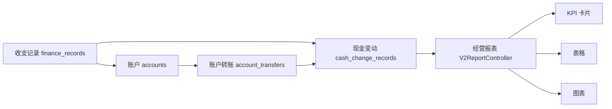

# 财务与报表业务

## 文档信息

| 字段 | 内容 |
|---|---|
| 文档类型 | 业务需求 |
| 当前状态 | 已完成 |
| 适用端 | 多端 |
| 依据源码 | `Code/backend/src/main/java/com/zhihuiji/backend/application/service/v2/V2FinanceRecordService.java`、`V2AccountService.java`、`V2AccountTransferService.java`、`V2CashChangeRecordService.java`、`V2BillFundLinkService.java`、`application/service/ReportService.java`、`api/controller/v2/V2ReportController.java` |
| 依据测试 | `ReportControllerTest.java`、`ReportServiceTest.java`、`V2AccountServiceTest.java`、`V2AccountTransferServiceTest.java`、`V2CashChangeRecordServiceTest.java`、`V2BillFundLinkServiceTest.java`、`V2FinanceInventoryControllerTest.java` |
| 依据证据 | `testing/.artifacts/2026-08-18-8220-current-baseline/current-8220-baseline.md` |
| 最后核对 | 2026-08-20 |

## 一、业务描述

财务与报表业务覆盖：

- **账户**（accounts）与**账户转账**（account_transfers）。
- **资金流水**（finance_records）与**现金变动**（cash_change_records）。
- **单据-资金关联**（bill_fund_links）。
- **报表**：经营概览、销售汇总、销售趋势、库存、应收应付等（`ReportService` + `V2ReportController`）。

## 二、数据实体（Flyway 迁移证据）

| 表 | 迁移文件 |
|---|---|
| finance_records | `V3__finance_records.sql` |
| accounts / account_transfers / bill_fund_links / cash_change_records | `V10__finance_and_inventory_foundation.sql` |

## 三、财务数据到报表流程

图表目的：展示财务数据汇聚为报表的过程。

图中输入：finance_records、accounts、account_transfers、cash_change_records。
图中处理：资金域服务写入数据；报表服务聚合。
图中输出：经营概览、销售趋势、KPI、表格、图表。

对应源码：`application/service/ReportService.java`、`api/controller/v2/V2ReportController.java`、`application/service/v2/V2FinanceRecordService.java` 等。
对应接口：`/v2/reports/*`、`/v2/finance-records/*`、`/v2/accounts/*`、`/v2/account-transfers/*`、`/v2/cash-change-records/*`、`/v2/bill-fund-links/*`。
对应测试：`ReportControllerTest.java`、`ReportServiceTest.java`、`V2AccountServiceTest.java`、`V2AccountTransferServiceTest.java`、`V2CashChangeRecordServiceTest.java`、`V2BillFundLinkServiceTest.java`。
当前状态：源码已完成；8220 财务表为空。

## 四、报表口径

- 首页/报表接口：`/v2/reports/sales-summary`、`/v2/reports/sales-trend` 等（历史证据见 `testing/已知问题与解除条件.md` #9：`sales-trend` 曾在 154 环境返回 500）。
- Agent 报表工具：`ReportQueryTool`（`report_type` / `period` 参数）、`SalesTrendLookupTool`、`SalesOverviewLookupTool`、`ResultVisualizationTool`（结果可视化）。
- 报表结果块：KPI（kpi_grid）、表格（table / rank_list）、图表（line_chart / area_chart / trend_chart / bar_chart / column_chart / horizontal_bar_chart / pie_chart），来源：`V2AgentAiService` 中 `TABLE_BLOCK_TYPES`、`CHART_BLOCK_TYPES`、`TIMELINE_BLOCK_TYPES` 常量。

## 对应实现

- 后端代码：`application/service/ReportService.java`、`api/controller/v2/V2ReportController.java`、`application/service/v2/`（财务域）
- Android 代码：`feature/reports/`、`feature/dashboard/`、`feature/finance/`、`feature/payments/`、`data/report/ReportRepository.kt`、`data/finance/FinanceV2Repository.kt`
- iOS 代码：`Features/Reports/`、`Features/Dashboard/DashboardView.swift`、`Features/Finance/`
- Web 代码：`pages/reports/overview/ReportsPage.vue`、`pages/dashboard/DashboardPage.vue`、`pages/finance/`
- Agent 代码：`application/service/v2/agent/tool/readonly/ReportQueryTool.java`、`SalesTrendLookupTool.java`、`ResultVisualizationTool.java`

## 对应接口

- 接口路径：`/v2/reports/*`、`/v2/finance-records/*`、`/v2/accounts/*`、`/v2/account-transfers/*`、`/v2/cash-change-records/*`、`/v2/bill-fund-links/*`
- 请求模型：`api/dto/report/ReportDto.java`、`api/dto/v2/finance/V2FinanceDtos.java`
- 响应模型：同上
- SSE 事件：Agent 报表工具事件与 `result_block`

## 对应测试

- 单元测试：`ReportControllerTest.java`、`ReportServiceTest.java`、`V2FinanceInventoryControllerTest.java`、`V2AccountServiceTest.java`
- 功能测试：`testing/后端/功能测试/TEST_PLAN.md`
- Agent 测试：`Code/backend/src/test/java/.../agent/tool/readonly/ReportQueryToolTest.java`

## 当前限制

- 未完成内容：无
- Blocked 内容：8220 财务与报表数据为空；首页 sales-trend 历史 500 未在当前 8220 复测
- Deferred 内容：无
- historical-only 内容：154 环境历史财务与报表证据
