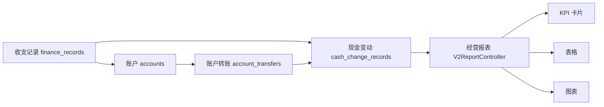

# 财务与报表业务

## 文档信息

| 字段 | 内容 |
|---|---|
| 文档类型 | 业务需求 |
| 当前状态 | 已有报表接口与多端报表页；日报、周报、月报推送方案待实现 |
| 适用端 | 多端 |
| 依据源码 | `Code/backend/src/main/java/com/zhihuiji/backend/application/service/v2/V2FinanceRecordService.java`、`V2AccountService.java`、`V2AccountTransferService.java`、`V2CashChangeRecordService.java`、`V2BillFundLinkService.java`、`application/service/ReportService.java`、`api/controller/v2/V2ReportController.java` |
| 依据测试 | `ReportControllerTest.java`、`ReportServiceTest.java`、`V2AccountServiceTest.java`、`V2AccountTransferServiceTest.java`、`V2CashChangeRecordServiceTest.java`、`V2BillFundLinkServiceTest.java`、`V2FinanceInventoryControllerTest.java` |
| 依据证据 | `testing/.artifacts/2026-08-18-8220-current-baseline/current-8220-baseline.md` |
| 最后核对 | 2026-09-07 |

## 一、业务描述

财务与报表业务覆盖：

- **账户**（accounts）与**账户转账**（account_transfers）。
- **资金流水**（finance_records）与**现金变动**（cash_change_records）。
- **单据-资金关联**（bill_fund_links）。
- **报表**：经营概览、销售汇总、销售趋势、库存、应收应付等（`ReportService` + `V2ReportController`）。

## 二、数据实体（Flyway 迁移证据）

| 表 | 迁移文件 |
|---|---|
| finance_records | `V3__finance_records.sql` |
| accounts / account_transfers / bill_fund_links / cash_change_records | `V10__finance_and_inventory_foundation.sql` |

## 三、财务数据到报表流程



图表目的：展示财务数据汇聚为报表的过程。

图中输入：finance_records、accounts、account_transfers、cash_change_records。
图中处理：资金域服务写入数据；报表服务聚合。
图中输出：经营概览、销售趋势、KPI、表格、图表。

对应源码：`application/service/ReportService.java`、`api/controller/v2/V2ReportController.java`、`application/service/v2/V2FinanceRecordService.java` 等。
对应接口：`/v2/reports/*`、`/v2/finance-records/*`、`/v2/accounts/*`、`/v2/account-transfers/*`、`/v2/cash-change-records/*`、`/v2/bill-fund-links/*`。
对应测试：`ReportControllerTest.java`、`ReportServiceTest.java`、`V2AccountServiceTest.java`、`V2AccountTransferServiceTest.java`、`V2CashChangeRecordServiceTest.java`、`V2BillFundLinkServiceTest.java`。
当前状态：源码已完成；8220 财务表为空。

## 四、报表口径

- 首页/报表接口：`/v2/reports/sales-summary`、`/v2/reports/sales-trend` 等（历史证据见 `testing/已知问题与解除条件.md` #9：`sales-trend` 曾在 154 环境返回 500）。
- Agent 报表工具：`ReportQueryTool`（`report_type` / `period` 参数）、`SalesTrendLookupTool`、`SalesOverviewLookupTool`、`ResultVisualizationTool`（结果可视化）。
- 报表结果块：KPI（kpi_grid）、表格（table / rank_list）、图表（line_chart / area_chart / trend_chart / bar_chart / column_chart / horizontal_bar_chart / pie_chart），来源：`V2AgentAiService` 中 `TABLE_BLOCK_TYPES`、`CHART_BLOCK_TYPES`、`TIMELINE_BLOCK_TYPES` 常量。

## 对应实现

- 后端代码：`application/service/ReportService.java`、`api/controller/v2/V2ReportController.java`、`application/service/v2/`（财务域）
- Android 代码：`feature/reports/`、`feature/dashboard/`、`feature/finance/`、`feature/payments/`、`data/report/ReportRepository.kt`、`data/finance/FinanceV2Repository.kt`
- iOS 代码：`Features/Reports/`、`Features/Dashboard/DashboardView.swift`、`Features/Finance/`
- Web 代码：`pages/reports/overview/ReportsPage.vue`、`pages/dashboard/DashboardPage.vue`、`pages/finance/`
- Agent 代码：`application/service/v2/agent/tool/readonly/ReportQueryTool.java`、`SalesTrendLookupTool.java`、`ResultVisualizationTool.java`

## 对应接口

- 接口路径：`/v2/reports/*`、`/v2/finance-records/*`、`/v2/accounts/*`、`/v2/account-transfers/*`、`/v2/cash-change-records/*`、`/v2/bill-fund-links/*`
- 请求模型：`api/dto/report/ReportDto.java`、`api/dto/v2/finance/V2FinanceDtos.java`
- 响应模型：同上
- SSE 事件：Agent 报表工具事件与 `result_block`

## 对应测试

- 单元测试：`ReportControllerTest.java`、`ReportServiceTest.java`、`V2FinanceInventoryControllerTest.java`、`V2AccountServiceTest.java`
- 功能测试：`testing/后端/功能测试/TEST_PLAN.md`
- Agent 测试：`Code/backend/src/test/java/.../agent/tool/readonly/ReportQueryToolTest.java`

## 当前限制

- 未完成内容：日报、周报、月报的定时生成、历史保存、站内通知投递、外部渠道和周期对比接口尚未形成完整功能
- Blocked 内容：8220 财务与报表数据为空；首页 sales-trend 历史 500 未在当前 8220 复测
- Deferred 内容：收入/支出时间趋势、收款/退款时间趋势、去年同期对比和外部推送渠道
- historical-only 内容：154 环境历史财务与报表证据

## 五、日报、周报、月报规划

### 5.1 产品目标

让店主在固定时间收到一份可快速阅读、可追溯到报表接口的经营摘要，并能从通知直接进入完整报告。报告的数字由后端报表结果提供；自然语言摘要可以由 Agent 生成，但不能负责计算金额、订单数、利润率或变化百分比。模型不可用时，仍发送确定性的数字内容。

### 5.2 报告内容

| 报告 | 覆盖范围 | 必推数据 | 建议补充 |
|---|---|---|---|
| 日报 | 前一日 00:00:00–23:59:59，Asia/Shanghai | 销售额、已收金额、退款金额、未收金额、订单数、客单价、估算成本、估算利润、利润率、净现金流 | 热销商品 Top 3、退款记录、低库存、应收最高客户、与前一日变化 |
| 周报 | 上一周周一–周日 | 周销售额、收款、退款、订单数、客单价、利润、利润率、收入、支出、净现金流、期末应收应付 | 每日销售趋势、热销商品 Top 5、利润商品 Top 5、退款与缺货、与上周变化 |
| 月报 | 上一自然月 1 日–月末 | 月销售额、收款、退款、订单数、客单价、成本、利润、利润率、收入、支出、净现金流、应收应付 | 按日趋势、商品/客户排行、库存流向、低库存、退款和异常、与上月及去年同月变化 |

每份报告顶部固定显示：报告周期、门店、生成时间、数据统计截止时间、时区、数据是否完整、失败的报表区块和“刷新/查看详情”入口。没有数据时显示 0 或“暂无数据”，不使用示例数字填充。

### 5.3 现有数据接口与图表安排

当前后端报表接口已经覆盖大部分页面内容：

| 数据用途 | 现有接口 | 页面表现 |
|---|---|---|
| 销售、收款、退款、未收、订单数 | `/v2/reports/sales-summary` | KPI 卡片、变化值、日报/周报/月报摘要 |
| 销售额和订单趋势 | `/v2/reports/sales-trend` | 折线图显示销售额，柱状图单独显示订单数；今日使用 6 小时粒度，周/月使用日粒度 |
| 成本、利润、利润率 | `/v2/reports/profit-summary` | 利润 KPI、成本与利润对比条；利润率显示百分比 |
| 收入、支出、净现金流 | `/v2/reports/cashflow-summary` | 现金流 KPI；当前接口只有汇总，不能绘制收入/支出时间趋势 |
| 应收、应付、收款、付款、净现金流 | `/v2/reports/reconciliation-summary` | 往来 KPI、应收/应付风险卡片 |
| 热销商品 | `/v2/reports/top-products` | 横向条形图和排行表 |
| 商品利润 | `/v2/reports/profit-by-products` | 利润条形图和排行表 |
| 客户利润、客户销售 | `/v2/reports/profit-by-customers`、`/v2/reports/customer-sales` | 客户排行表；客户数量较少时可用横向条形图 |
| 退款、销售出库、库存流向 | `/v2/reports/refund-records`、`/v2/reports/stock-out-records`、`/v2/reports/inventory-flow` | 风险明细表和最近记录 |
| 低库存、应收客户 | `/v2/reports/low-stock-products`、`/v2/reports/top-receivable-customers` | 低库存风险表、应收排行表 |

以下图表需要新增后端数据后才能上线：收入/支出按日趋势、收款/退款按日趋势、按小时销售趋势以外的细粒度趋势、上一周期和去年同期直接对比、报告生成历史和发送记录。页面 Agent 不得用多次汇总接口拼出不存在的时间序列，也不得把当前总额复制到每个日期点。

Web 当前 `ReportsPage.vue` 已有经营报表总览、时间范围、并行加载区块、销售趋势 SVG、CSV 导出和打印能力；Android 与 iOS 已有报表数据模型和报表页。页面实现应先复用这些入口。后端 Controller 的报表路径是 `/v2/reports/*`，页面 Agent 需要先确认 Web 当前客户端使用的 `/v1/reports/*` 是否由现有适配层兼容；未经确认不能新增另一套路径或悄悄改动服务端接口。

### 5.4 图表规则

1. 销售趋势使用折线图；订单数使用同一时间轴的柱状图，但不与金额共用一个纵轴。数据点少于 2 个时仍显示坐标和单点提示，不画虚假的连续趋势。
2. 热销商品和商品利润使用横向条形图，默认 Top 5，支持展开到 Top 10；长商品名截断后提供完整悬浮提示。
3. 利润与成本使用并列条形图或指标对比条；不使用饼图表达时间变化。
4. 现金流当前只显示收入、支出、净现金流 KPI 和明细入口；拿不到时间序列时不绘制折线。
5. 低库存使用表格加库存/安全库存对比条；库存为 0、低于安全库存、无安全库存分别显示不同状态。
6. 所有图表显示数据周期、单位、数据来源和空数据状态；金额统一货币格式，数量保留业务需要的小数位，时间使用门店时区。
7. 图表点击后进入对应明细：商品进入商品详情，客户进入客户详情，退款进入退款/收款单，低库存进入库存页面。没有对应路由时显示明细抽屉，不伪造链接。

### 5.5 推送规则

第一阶段先使用已有 `agent_notifications` 的站内通知能力，字段使用标题、正文、级别、已读和已送达状态；通知点击进入报告详情。短信、邮件、企业微信和系统推送需要单独的渠道配置、收件人授权和设备令牌，当前不假设这些能力已经存在。

| 项目 | 默认建议 | 说明 |
|---|---|---|
| 日报发送时间 | 次日 09:00 | 发送上一自然日数据；允许用户修改时间和关闭 |
| 周报发送时间 | 周一 09:00 | 发送上一周数据；周起始日固定为周一 |
| 月报发送时间 | 每月 1 日 09:00 | 发送上一自然月数据 |
| 收件人 | 当前店主及被授权成员 | 每个收件人按当前 owner/store 权限读取 |
| 通知内容 | 一句话结论 + 4–6 个 KPI + 1–3 个风险 + 查看详情 | 正文控制长度，完整数据进入报告页 |
| 重复发送 | 同一门店、周期、报告类型只生成一份主报告 | 重试不能产生多条重复通知；失败显示最近一次失败原因 |
| 数据不足 | 明确标记“数据不完整”或“暂无数据” | 不把部分接口成功写成完整报告 |

日报示例内容：`昨日销售额 ¥X，订单 N 笔，估算利润 ¥Y；销售额较前日 ±Z%；有 A 个低库存商品，请查看报告。`

周报/月报正文应优先列出变化最大的指标、热销商品、利润或现金风险；摘要中的每个数字必须能在报告详情中找到对应来源。

### 5.8 建设顺序

1. 先复用现有报表查询，完成 Web、Android、iOS 的总览、详情、空态、失败态和导出。
2. 再增加报告快照、报告类型、周期、数据截止时间、生成状态和发送状态的保存能力。
3. 增加日报、周报、月报的定时任务。任务按门店时区计算上一完整周期，生成过程记录开始、完成或失败状态。
4. 生成报告后写入站内通知；同一门店、报告类型和周期只允许一份结果，重试复用该周期记录。
5. 最后接入短信、邮件、企业微信或系统推送，并为每个渠道增加授权、失败重试和退订状态。
6. 为每个周期增加与上一周期和去年同期的查询结果；在接口具备前不显示对比图，只显示“暂无对比数据”。

### 5.6 页面清单

| 页面 | 建议入口 | 主要内容 |
|---|---|---|
| 经营报表总览 | 复用 `/reports` | 日/周/月切换、时间范围、KPI、销售趋势、热销商品、利润、现金流、风险摘要、刷新和导出 |
| 报告详情 | `/reports/detail?period=daily\|weekly\|monthly` | 报告元信息、完整 KPI、图表、排行、风险明细、数据完整性、分享/导出 |
| 报告历史 | `/reports/history` | 报告周期、类型、生成时间、状态、数据截止时间、查看、重新生成、重新发送 |
| 推送设置 | `/reports/subscriptions` | 日报/周报/月报开关、发送时间、收件人、站内通知开关、最近发送状态、预览 |
| 通知中心 | 复用现有 Agent 通知页 | 未读报告通知、级别、生成时间、点击进入对应详情、标记已读 |

Android 和 iOS 使用相同的信息结构，适配各端导航：总览、详情、历史、推送设置、通知入口。移动端优先单列 KPI 和纵向图表，支持下拉刷新、离线旧报告只读查看和部分区块失败提示；不在手机上复制桌面端的多列密集布局。

### 5.7 交给页面 Agent 的构建提示词

下面的提示词可以直接交给另一位页面 Agent。它要求先复用现有资产和真实接口，再输出可供后续 1:1 实现的页面结果；本轮这里只写规划，不修改前端代码。

```text
你负责为 master-goods 构建“日报 / 周报 / 月报”经营报告页面。请先阅读并复用：
- Code/frontend/web/src/pages/reports/overview/ReportsPage.vue
- Code/frontend/web/src/shared/api/client.ts
- Code/frontend/web/src/shared/utils/business.ts
- Code/frontend/android/feature/reports/
- Code/frontend/ios/ZhihuijiIOS/Features/Reports/
- docs/01_业务需求/财务与报表业务.md

目标：在现有经营报表风格和组件资产上扩展报告体验，保持现有导航、权限、金额格式、日期格式、owner/store 作用域和响应式规则。不要创建第二套报表体系，不要修改后端接口，不要使用固定示例数字。

页面范围：
1. 经营报表总览：复用 /reports，加入日报、周报、月报切换；展示销售额、已收、退款、未收、订单数、客单价、成本、利润、利润率、净现金流、应收、应付；展示销售趋势、订单数、热销商品、商品利润、风险摘要。
2. 报告详情：/reports/detail?period=daily|weekly|monthly；显示周期、门店、生成时间、数据截止时间、数据完整性、全部 KPI、趋势图、排行、退款、低库存和明细入口。
3. 报告历史：/reports/history；显示报告类型、周期、生成时间、状态、查看和重新发送。若后端历史接口不存在，先使用明确的空态并记录需要的接口，不要用前端假数据。
4. 推送设置：/reports/subscriptions；显示日报/周报/月报开关、发送时间、收件人、站内通知、预览和最近发送状态。若后端保存接口不存在，先完成只读视觉稿和清晰的不可保存提示。
5. 通知中心入口：复用现有 Agent 通知页；报告通知点击后进入对应报告详情。

真实接口：
- /v2/reports/sales-summary
- /v2/reports/sales-trend
- /v2/reports/profit-summary
- /v2/reports/cashflow-summary
- /v2/reports/reconciliation-summary
- /v2/reports/top-products
- /v2/reports/profit-by-products
- /v2/reports/profit-by-customers
- /v2/reports/customer-sales
- /v2/reports/refund-records
- /v2/reports/stock-out-records
- /v2/reports/inventory-flow
- /v2/reports/low-stock-products
- /v2/reports/top-receivable-customers

数据规则：
- 所有数字来自接口响应；客单价只能用销售额 / 订单数进行确定性计算，订单数为 0 时显示“暂无”。
- LLM 只能生成可选的自然语言摘要，不能计算或改写数字；LLM 失败时仍显示数字报告。
- 现金流当前只有汇总接口，不要绘制不存在的收入/支出时间趋势。
- 销售额用折线图，订单数用同轴柱状图但使用独立纵轴；热销商品和利润使用横向条形图；低库存使用表格和安全库存对比条。
- 所有区块支持加载、空数据、局部失败、权限不足、网络失败、数据不完整和重试；部分接口失败时保留已成功区块并说明失败区块。
- 所有请求遵守当前 session、reports:view 权限和 owner/store 作用域；不把大整数 ID 转成不安全的 Number。

视觉与交互交付：
- 延续 ReportsPage.vue 当前的浅色、细边框、紧凑经营控制台方向，不另造主题。
- 输出 Web 1440px、1024px、390px 三个尺寸的页面截图或等价视觉证据；同时输出 Android 常用宽度和 iOS 常用宽度的页面状态。
- 每页提供正常、加载、空数据、部分失败、全失败、无权限、离线旧报告、长文本和超长商品名状态。
- 记录每个页面的布局尺寸、栅格列数、卡片间距、字体层级、颜色、圆角、图表高度、按钮状态、滚动位置和点击路径，供后续 1:1 实现。
- 交互必须包含时间范围切换、查看详情、刷新、导出、通知跳转、报告预览和返回；没有后端保存能力的设置项必须明确显示未保存状态。

先给出页面地图、数据映射表、缺失接口清单和视觉证据，再开始页面实现。完成后报告实际改动的前端文件、运行命令、截图位置、已验证状态和仍未具备后端支持的功能。不要把空态或固定文本报告成真实数据已接通。
```
