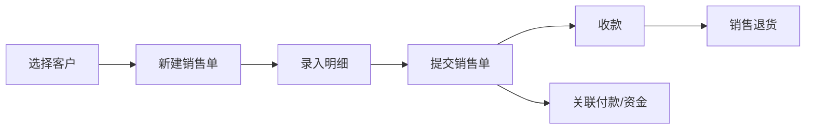
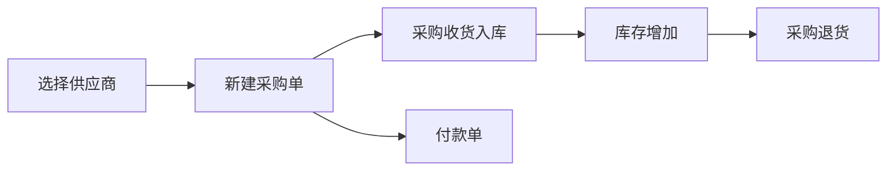

# 销售与采购业务

## 文档信息

| 字段 | 内容 |
|---|---|
| 文档类型 | 业务需求 |
| 当前状态 | 已完成 |
| 适用端 | 多端 |
| 依据源码 | `Code/backend/src/main/java/com/zhihuiji/backend/application/service/v2/V2SaleOrderService.java`、`V2SalesReturnService.java`、`V2PurchaseOrderService.java`、`V2PurchaseReceiptService.java`、`V2PurchaseReturnService.java`、`V2PayOrderService.java` |
| 依据测试 | `V2SaleOrderServiceTest.java`、`V2SalesReturnServiceTest.java`、`V2PurchaseOrderServiceTest.java`、`V2PurchaseReceiptServiceTest.java`、`V2PurchaseReturnServiceTest.java`、`V2PayOrderServiceTest.java` |
| 依据证据 | `testing/.artifacts/2026-08-18-8220-current-baseline/current-8220-baseline.md` |
| 最后核对 | 2026-08-20 |

## 一、业务描述

销售与采购是单据业务域：

- **销售**：销售单（sale_orders）、销售单明细（sale_order_items）、销售退货（sales_returns）、收款（payments）。
- **采购**：采购单（purchase_orders）、采购单明细（purchase_order_items）、采购收货（purchase_receipts）、采购退货（purchase_returns）。
- **付款**：付款单（pay_orders）。
- **单-款关联**：bill_fund_links（单据与资金关联）。

## 二、数据实体（Flyway 迁移证据）

| 表 | 迁移文件 |
|---|---|
| sale_orders / sale_order_items / payments | `V1__init.sql` |
| purchase_orders / purchase_order_items | `V1__init.sql` |
| suppliers / pay_orders | `V2__suppliers_and_pay_orders.sql` |
| bill_fund_links / cash_change_records | `V10__finance_and_inventory_foundation.sql` |
| purchase_returns | `V18__purchase_returns.sql` |
| 采购结算与仓库字段 | `V20__purchase_order_settlement_warehouse.sql` |
| 销售明细查询索引 | `V23__sale_order_item_query_indexes.sql` |

## 三、销售流程

图表目的：展示销售开单到收款的流程。

图中输入：客户、商品、明细、收款。
图中处理：`V2SaleOrderService` 创建销售单；`V2PayOrderService`/payments 处理收款；`V2SalesReturnService` 处理退货。
图中输出：销售单、收款记录、退货单。

对应源码：`V2SaleOrderService.java`、`V2SalesReturnService.java`、`V2PayOrderService.java`。
对应接口：`/v2/sale-orders/*`、`/v2/sales-returns/*`、`/v2/pay-orders/*`。
对应测试：`V2SaleOrderServiceTest.java`、`V2SalesReturnServiceTest.java`、`V2PayOrderServiceTest.java`。
当前状态：源码已完成；8220 无销售数据。

## 四、采购流程

图表目的：展示采购下单到入库与付款的流程。

图中输入：供应商、采购单、收货、付款。
图中处理：`V2PurchaseOrderService` 建单；`V2PurchaseReceiptService` 收货；`V2PurchaseReturnService` 退货；`V2PayOrderService` 付款。
图中输出：采购单、收货单、库存变动、付款单、退货单。

对应源码：`V2PurchaseOrderService.java`、`V2PurchaseReceiptService.java`、`V2PurchaseReturnService.java`。
对应接口：`/v2/purchase-orders/*`、`/v2/purchase-receipts/*`、`/v2/purchase-returns/*`。
对应测试：`V2PurchaseOrderServiceTest.java`、`V2PurchaseReceiptServiceTest.java`、`V2PurchaseReturnServiceTest.java`。
当前状态：源码已完成；8220 无采购数据。

## 五、Agent 侧单据工具

| 工具 | 用途 |
|---|---|
| `sale_order_lookup` | 查询当前账号最近销售单 |
| `sales_return_lookup` | 销售退货查询 |
| `sales_full_chain_lookup` | 销售全链路 |
| `purchase_order_lookup` | 查询当前账号最近采购单 |
| `purchase_receipt_lookup` | 采购收货查询 |
| `purchase_return_lookup` | 采购退货查询 |
| `purchase_tracking_lookup` | 采购跟踪 |
| `pay_order_lookup` | 查询当前账号最近付款单 |
| `write/CreateSaleOrderDraftTool`（如存在）/ CREATE_ONLY 草稿工具 | 写操作草稿化 |

来源：`Code/backend/src/main/java/com/zhihuiji/backend/application/service/v2/agent/tool/readonly/` 与 `tool/write/`。

## 六、草稿与确认

写操作（如创建销售单）通过 CREATE_ONLY 工具生成草稿，由用户确认后才执行（`AgentDraftConfirmService`）。已知问题 #5：草稿确认时 `items` 为空会直接失败（`订单明细不能为空`），属于预期的最小夹具要求，不是产品缺陷（来源：`testing/已知问题与解除条件.md`）。

## 对应实现

- 后端代码：`application/service/v2/V2SaleOrderService.java`、`V2PurchaseOrderService.java` 等
- Android 代码：`feature/sales/`、`feature/purchases/`、`data/order/`（SaleOrderV2Repository.kt、PurchaseOrderV2Repository.kt 等）
- iOS 代码：`Features/Sales/`、`Features/Purchases/`
- Web 代码：`pages/documents/sales/`、`pages/documents/purchase/`
- Agent 代码：`application/service/v2/agent/tool/readonly/` 与 `tool/write/`

## 对应接口

- 接口路径：`/v2/sale-orders/*`、`/v2/sales-returns/*`、`/v2/purchase-orders/*`、`/v2/purchase-receipts/*`、`/v2/purchase-returns/*`、`/v2/pay-orders/*`
- 请求模型：`api/dto/v2/sales/V2SaleOrderDtos.java`、`api/dto/v2/purchase/V2PurchaseOrderDtos.java`、`api/dto/v2/pay/V2PayOrderDtos.java`
- 响应模型：同上
- SSE 事件：Agent 工具事件、`draft_created`

## 对应测试

- 单元测试：`V2SaleOrderServiceTest.java`、`V2PurchaseOrderServiceTest.java`、`V2PurchaseReceiptServiceTest.java`、`V2PurchaseReturnServiceTest.java`、`V2PayOrderServiceTest.java`
- 功能测试：`testing/后端/功能测试/TEST_PLAN.md`
- 草稿测试：`AgentDraftConfirmServiceTest.java`

## 当前限制

- 未完成内容：无
- Blocked 内容：8220 无销售/采购数据；草稿确认需最小商品夹具
- Deferred 内容：无
- historical-only 内容：154 环境历史单据数据
