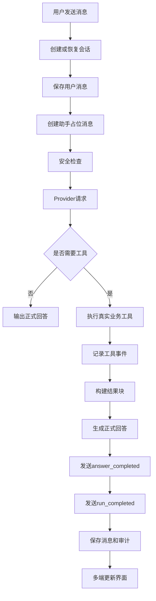

# Agent 总体架构

## 文档信息

| 字段 | 内容 |
|---|---|
| 文档类型 | 系统设计 |
| 当前状态 | 已完成 |
| 适用端 | Agent（后端 / Android / iOS / Web） |
| 依据源码 | `application/service/v2/V2AgentAiService.java`、`application/service/v2/agent/component/`、`application/service/v2/agent/tool/`、`infrastructure/ai/LongCatAnthropicClient.java` |
| 依据测试 | `testing/Agent/Agent综合功能与性能测试方案.md`、`Code/backend/src/test/java/.../application/service/v2/` |
| 依据证据 | `testing/.artifacts/2026-08-18-8220-current-baseline/current-8220-baseline.md` |
| 最后核对 | 2026-08-20 |

## 一、Agent 系统架构图

图表目的：展示 Agent 完整链路（后端 `runChatStream` 真实实现的主干）。

图中输入：用户消息、会话上下文。
图中处理：会话解析 → 消息持久化 → 安全检查 → Provider → 工具规划/执行 → 回答生成 → SSE 事件 → 审计。
图中输出：`answer_completed`、`run_completed`、结果块、审计记录。

对应源码：`V2AgentAiService.runChatStream()`。
对应接口：`POST /v2/agent/chat/stream`。
对应测试：`testing/Agent/Agent综合功能与性能测试方案.md`。
当前状态：后端链路已完成；8220 生产链路 Blocked。

## 二、组件职责

| 组件 | 位置 | 职责 |
|---|---|---|
| `V2AgentAiService` | `application/service/v2/V2AgentAiService.java` | 编排主服务：chat / chatStream / cancelRun / getRunAudit |
| `V2AgentConversationService` | `application/service/v2/V2AgentConversationService.java` | 会话/消息/草稿 CRUD |
| `SafetyGuard` | `component/SafetyGuard.java` | 安全检查（高危词、写入意图、限流） |
| `ToolPlanner` | `component/ToolPlanner.java` | 工具规划（模型选择 → AgentToolPlan） |
| `ToolRegistry` | `tool/ToolRegistry.java` | 工具注册、参数校验、执行分发 |
| `AgentTool` | `tool/AgentTool.java` | 工具接口（READ_ONLY / CREATE_ONLY） |
| `ToolContext` | `tool/ToolContext.java` | 工具执行上下文（owner） |
| `AnswerSynthesizer` | `component/AnswerSynthesizer.java` | 正式回答生成（model_stream / non_stream_retry） |
| `SseStreamEmitter` | `component/SseStreamEmitter.java` | SSE 事件发送与审计联动 |
| `RunAuditService` | `component/RunAuditService.java` | 运行生命周期与审计 |
| `LongCatAnthropicClient` | `infrastructure/ai/LongCatAnthropicClient.java` | Provider 客户端 |
| `AgentDraftConfirmService` | `application/service/v2/agent/AgentDraftConfirmService.java` | 草稿确认/取消 |

## 三、运行上下文（8220）

- Provider：`gpt-5.6-luna` / `https://oneapi.sxyq27.online/v1` / `chat_completions`。
- SSE 超时：180 秒；工具上限 12 次/run；迭代上限 3 轮。
- 事件与审计：每个 run 有 `audit_id` / `trace_id` / `observability`。

## 四、SSE 事件处理对照表

| SSE 事件 | 后端产生位置 | Android 处理位置 | iOS 处理位置 | Web 处理位置 | 持久化结果 | 当前状态 |
|---|---|---|---|---|---|---|
| `run_started` | `V2AgentAiService` | `AgentStreamModels.RunStarted` → `AgentChatViewModel` | 待验证 | `AgentRunStartedEvent`（agent-stream.ts） | 审计 run 开始 | 后端已完成 |
| `plan` | `V2AgentAiService.emitPlan()` | `PlanDelta`（计划过程） | 待验证 | `AgentPlanDeltaEvent` | 审计事件 | 后端已完成 |
| `tool_started` | `SseStreamEmitter.emitToolStarted()` | `ToolStarted` → 工具过程 UI | 待验证 | `AgentToolStartedEvent` | `agent_run_audit_events` | 后端已完成 |
| `tool_completed` | `SseStreamEmitter.emitToolCompleted()` | `ToolCompleted` | 待验证 | `AgentToolCompletedEvent` | 审计事件 | 后端已完成 |
| `tool_failed` | `SseStreamEmitter.emitToolFailed()` | `ToolFailed` | 待验证 | `AgentToolFailedEvent` | 审计事件 | 后端已完成 |
| `answer_delta` | `SseStreamEmitter.AnswerDeltaBatcher` | `AnswerDelta` → 消息增量 | 待验证 | `AgentAnswerDeltaEvent` | 无（仅流） | 后端已完成 |
| `answer_completed` | `SseStreamEmitter.emitAnswerCompleted()` | `AnswerCompleted` → 正式回答 | 待验证 | `AgentAnswerCompletedEvent` | 消息 content | 后端已完成 |
| `result_block` | `SseStreamEmitter.emitBlocks()` | `ResultBlock` → `ResultBlockRenderer` | 待验证 | `AgentResultBlockEvent` | 消息 structured_data | 后端已完成 |
| `draft_created` | `V2AgentAiService`（1040 行） | `DraftCreated` | 待验证 | `AgentDraftCreatedEvent` | `agent_drafts` | 后端已完成 |
| `run_cancelled` | `SseStreamEmitter.emitRunCancelled()` | `RunCancelled` | 待验证 | `AgentRunCancelledEvent` | 审计 cancelled | 后端已完成 |
| `run_completed` | `runChatStream()` | `RunCompleted` → 终态 | 待验证 | `AgentRunCompletedEvent` | 审计 completed/blocked | 后端已完成 |
| `error` | `runChatStream()` 异常路径 | `StreamError` → 错误状态 | 待验证 | `AgentErrorEvent` | 审计 failed | 后端已完成 |

## 对应实现

- 后端代码：`application/service/v2/V2AgentAiService.java`、`application/service/v2/agent/`
- Android 代码：`feature/agent/`、`data/agent/`、`core/network/AgentSseClient.kt`、`core/model/v2/agent/stream/AgentStreamModels.kt`
- iOS 代码：`Features/Agent/`
- Web 代码：`pages/agent/AgentPage.vue`、`shared/api/agent-stream.ts`
- Agent 代码：`application/service/v2/agent/` 全套

## 对应接口

- 接口路径：`/v2/agent/*`
- 请求模型：`V2AgentDtos.AgentChatRequest`
- 响应模型：`AgentChatResponse` / SSE 事件流
- SSE 事件：见上表

## 对应测试

- 单元测试：`V2AgentAiServiceTest.java`、`V2AgentConversationServiceTest.java`、`component/*`、`tool/*`
- 功能测试：`testing/Agent/Agent综合功能与性能测试方案.md`
- 审计：`testing/Agent/Agent执行台账.csv`

## 当前限制

- 未完成内容：iOS / Web Agent 主流程测试
- Blocked 内容：8220 生产 Agent 链路（无会话数据）
- Deferred 内容：多模态
- historical-only 内容：154 环境 Agent 链路证据
