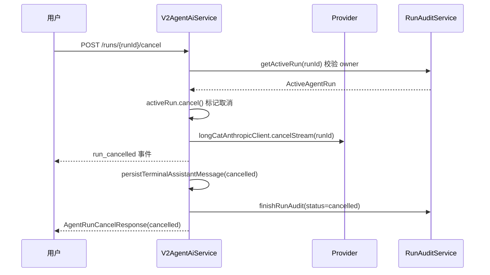
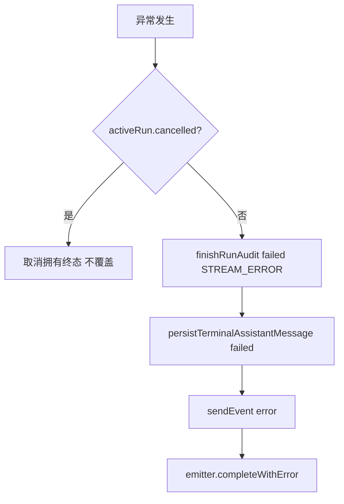

# 取消与错误恢复设计

## 文档信息

| 字段 | 内容 |
|---|---|
| 文档类型 | 系统设计 |
| 当前状态 | 进行中 |
| 适用端 | 后端 / Agent / Android / Web |
| 依据源码 | `application/service/v2/V2AgentAiService.java`（`cancelRun`、`runChatStream` 异常路径）、`application/service/v2/agent/component/RunAuditService.java`（ActiveAgentRun）、`SseStreamEmitter.java`（emitRunCancelled） |
| 依据测试 | `testing/.artifacts/2026-07-31-continuation-6/17-backend-cancel-test/`、`AgentSseClientCancellationTest.kt` |
| 依据证据 | `testing/已知问题与解除条件.md` #7 |
| 最后核对 | 2026-08-20 |

## 一、取消流程

图表目的：展示取消运行的真实链路。

图中输入：runId。
图中处理：校验 owner → 标记取消 → 取消 Provider 流 → 发 `run_cancelled` → 审计 cancelled。
图中输出：`run_cancelled` 事件、取消消息、审计终态。

对应源码：`V2AgentAiService.cancelRun()`（第 498-536 行）。
对应接口：`POST /v2/agent/runs/{runId}/cancel`。
对应测试：`testing/.artifacts/2026-07-31-continuation-6/17-backend-cancel-test/11-cancel-evidence.md`。
当前状态：后端链路存在；极早取消时序已知问题 #7。

## 二、错误传播

图表目的：展示流式运行异常处理（`runChatStream` catch 分支）。

图中输入：运行时异常。
图中处理：区分取消与真实错误；错误时审计 failed + error 事件。
图中输出：`error` 事件、failed 审计。

对应源码：`V2AgentAiService.chatStream()` catch 分支（第 442-480 行）。
对应接口：SSE `error` 事件。
对应测试：`AgentSseClientCancellationTest.kt`。
当前状态：已完成。

## 三、已知问题

| 问题 | 现象 | 状态 |
|---|---|---|
| #7 极早取消 SSE 收尾失败 | `run_started` 后立即取消，audit 落成 `failed`（STREAM_ERROR，`ResponseBodyEmitter has already completed`） | 失败，待修复后复测 |
| #12 run 完成后 Android 停留旧会话 | 服务端完成但 Android 未展示当前回答并报流中断 | 历史 154 环境证据；当前 8220 待复测 |

## 四、错误状态与空状态（多端）

详见 `03_系统设计/多端交互设计/错误与空状态交互设计.md`。

## 对应实现

- 后端代码：`V2AgentAiService.cancelRun()`、`RunAuditService.ActiveAgentRun`、`SseStreamEmitter.emitRunCancelled()`
- Android 代码：`AgentChatViewModel.stopGeneration()`、`AgentSseClient`（取消与重试）
- iOS 代码：待验证
- Web 代码：`AgentPage.vue`（cancelAgentRun）
- Agent 代码：`RunAuditService`

## 对应接口

- 接口路径：`POST /v2/agent/runs/{runId}/cancel`
- 请求模型：无
- 响应模型：`AgentRunCancelResponse`（not_found / already_cancelled / cancelled）
- SSE 事件：`run_cancelled`、`error`

## 对应测试

- 单元测试：`AgentSseClientCancellationTest.kt`
- 功能测试：`testing/Agent/功能测试/TEST_PLAN.md`（cancel run）
- 证据：`testing/.artifacts/2026-07-31-continuation-6/17-backend-cancel-test/`

## 当前限制

- 未完成内容：已知问题 #7 完整解除；#12 当前 8220 复测
- Blocked 内容：8220 无会话数据
- Deferred 内容：无
- historical-only 内容：154 环境取消链路证据
