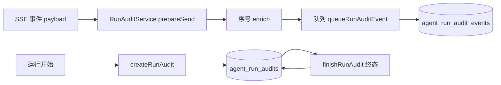

# 审计与运行轨迹设计

## 文档信息

| 字段 | 内容 |
|---|---|
| 文档类型 | 系统设计 |
| 当前状态 | 已完成 |
| 适用端 | 后端 / Agent |
| 依据源码 | `application/service/v2/agent/component/RunAuditService.java`、`domain/entity/AgentRunAuditEntity.java`、`AgentRunAuditEventEntity.java`、`infrastructure/repository/AgentRunAuditRepository.java`、`AgentRunAuditEventRepository.java` |
| 依据测试 | `V2AgentAiServiceTest.java`、`testing/Agent/Agent执行台账.csv` |
| 依据证据 | `testing/.artifacts/2026-08-18-8220-current-baseline/current-8220-baseline.md` |
| 最后核对 | 2026-08-20 |

## 一、审计数据流

图表目的：展示审计数据写入链路。

图中输入：SSE 事件、运行生命周期。
图中处理：`SseStreamEmitter.sendEvent` 调用 `runAuditService.prepareSend` / `queueRunAuditEvent`；`createRunAudit` / `finishRunAudit` 管理父记录。
图中输出：审计父记录 + 事件序列。

对应源码：`RunAuditService.java`、`SseStreamEmitter.sendEvent()`。
对应接口：`GET /v2/agent/runs/{runId}/audit`。
对应测试：`V2AgentAiServiceTest.java`。
当前状态：已完成。

## 二、审计字段（AgentRunAuditResponse 源码）

| 字段 | 说明 |
|---|---|
| run_id / owner_user_id / conversation_id | 归属 |
| status | completed / blocked / failed / cancelled |
| mode | 运行模式（如 tool_query_llm_streamed、multimodal_direct） |
| llm_status | completed / not_requested / model_empty_or_ungrounded 等 |
| plan_source | safety / native_tool_use / llm 等 |
| tool_count / event_count | 计数 |
| audit_write_dropped_count / audit_write_failed_count / audit_lossy | V17 丢损指标 |
| emitted_event_count | 发射事件数 |
| audit_id / trace_id | 观测关联 |
| error_code / error_message | 错误信息 |
| started_at / completed_at / updated_at | 时间线 |

## 三、RunTrace（运行轨迹）

- 服务端审计事件即运行轨迹（按 `seq` 排序，V15 索引 `idx_agent_run_audit_events_run_seq`）。
- Android：`AgentRunTraceModels.kt`（`AgentRunTraceDto` / `AgentTraceEventDto` / `AgentRunTraceReducer`）、`feature/agent/trace/AgentResponseProvenance.kt`。
- 已知问题 #3：Android 历史消息恢复时未恢复 RunTrace（`AgentMessageDto.toChatMessage()` 只映射 content/blocks/parts）。

## 四、审计与 SSE 一致性

- `SseStreamEmitter.sendEvent` 每次发送都调用 `runAuditService.prepareSend`（活跃检测 + 序号 enrich）与 `queueRunAuditEvent`。
- 事件 `event_type` 落审计事件表；`cancellationEvent` 特殊处理（`run_cancelled` 不因客户端断开而丢失）。

## 对应实现

- 后端代码：`RunAuditService.java`、`AgentRunAuditRepository`、`AgentRunAuditEventRepository`
- Android 代码：`data/agent/audit/AgentAuditRepository.kt`、`core/model/v2/agent/stream/AgentRunTraceModels.kt`、`feature/agent/trace/AgentResponseProvenance.kt`
- iOS 代码：`Features/Agent/AgentChatView.swift`（运行审计 sheet）
- Web 代码：`AgentPage.vue`（fetchAgentRunAudit）
- Agent 代码：`RunAuditService.java`

## 对应接口

- 接口路径：`GET /v2/agent/runs/{runId}/audit`
- 请求模型：无
- 响应模型：`AgentRunAuditResponse`（含 events 列表）
- SSE 事件：所有事件携带 `audit_id` / `trace_id` / `observability`

## 对应测试

- 单元测试：`V2AgentAiServiceTest.java`
- 审计：`testing/Agent/Agent执行台账.csv`
- 证据：`docs/05_测试与验收/验收证据/ai-agent/`（03-run-audit.json、03-run-audit-headers.txt）

## 当前限制

- 未完成内容：Android 历史消息 RunTrace 恢复（已知问题 #3）
- Blocked 内容：8220 无审计数据（agent_run_audits=0）
- Deferred 内容：无
- historical-only 内容：154 环境审计数据（agent_run_audits=18、events=41）
