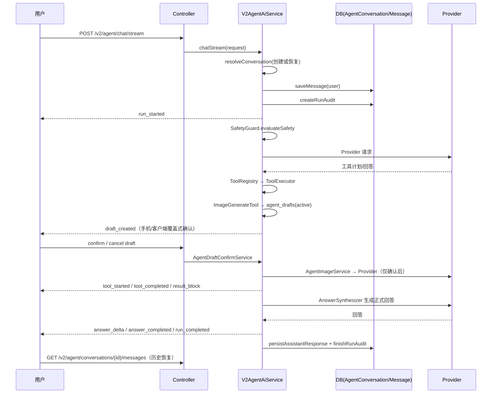

# 对话生命周期设计

## 文档信息

| 字段 | 内容 |
|---|---|
| 文档类型 | 系统设计 |
| 当前状态 | 已完成 |
| 适用端 | 后端 / Agent |
| 依据源码 | `application/service/v2/V2AgentAiService.java`（`chat`/`chatStream`/`resolveConversation`/`saveMessage`）、`application/service/v2/V2AgentConversationService.java` |
| 依据测试 | `V2AgentConversationServiceTest.java`、`V2AgentAiServiceTest.java` |
| 依据证据 | `testing/.artifacts/2026-08-18-8220-current-baseline/current-8220-baseline.md` |
| 最后核对 | 2026-08-20 |

## 一、对话创建与恢复

`V2AgentAiService.chat()` / `chatStream()` 的会话处理（源码事实）：

1. `resolveConversation(request.conversationId(), ownerUserId, message, now)`：按 conversationId 恢复既有会话，或创建新会话。
2. `saveMessage(ownerUserId, conversation.getId(), runId, "user", "text", buildStoredUserMessage(...), null, now)`：持久化用户消息。
3. `runAuditService.createRunAudit(...)`：创建审计父记录。
4. `runAuditService.registerRun(...)`：注册活跃运行（ActiveAgentRun）。

## 二、助手消息占位

- 非流式 `chat()`：回答完成后 `persistAssistantResponse()` 或 `persistTerminalAssistantMessage()` 写助手消息。
- 流式 `chatStream()`：Android 端在 `sendMessage()` 中创建助手占位消息（`AgentChatViewModel` 第 543/587 行附近：创建 `createdAt` 消息），等待 SSE 事件更新。
- 终态消息类型：`completed`（正常回答）、`blocked`（安全检查拦截）、`failed`（LLM/流错误）、`cancelled`（用户取消）。

## 三、对话生命周期时序图

图表目的：展示对话从发送到历史恢复的完整时序。

图中输入：用户消息。
图中处理：会话解析、消息持久化、安全检查、Provider、工具、回答、审计。
图中输出：SSE 事件、消息落库、历史可读。

对应源码：`V2AgentAiService.chatStream()`、`V2AgentConversationService.listMessages()`。
对应接口：`POST /v2/agent/chat/stream`、`GET /v2/agent/conversations/{id}/messages`。
对应测试：`V2AgentConversationServiceTest.java`、`V2AgentAiServiceTest.java`。
当前状态：已完成。

## 四、历史恢复

- 服务端：`listMessages(conversationId, page, limit)` 按 owner + conversation 分页（V13 索引 `idx_agent_messages_owner_conversation_created`）。
- Android：`AgentChatViewModel.loadConversationMessages()` + `restoreMessagesWithRunTraces()` 恢复消息与运行轨迹；历史分页恢复首个可见消息位置（8220 基线确认）。
- 已知问题 #3：历史消息恢复时未恢复 RunTrace（`AgentMessageDto.toChatMessage()` 只映射 content/blocks/parts）。

## 对应实现

- 后端代码：`V2AgentAiService`、`V2AgentConversationService`
- Android 代码：`AgentChatViewModel`、`AgentV2Repository`
- iOS 代码：`AgentViewModel.swift`（消息加载）
- Web 代码：`AgentPage.vue`（fetchAgentMessages）
- Agent 代码：`V2AgentAiService`

## 对应接口

- 接口路径：`POST /v2/agent/chat`、`POST /v2/agent/chat/stream`、`GET /v2/agent/conversations`、`GET /v2/agent/conversations/{id}/messages`
- 请求模型：`AgentChatRequest`、`AgentConversationCreateRequest`
- 响应模型：`AgentChatResponse`、`AgentMessageResponse`
- SSE 事件：`run_started`、`run_completed` 等

## 对应测试

- 单元测试：`V2AgentConversationServiceTest.java`、`V2AgentAiServiceTest.java`
- Android：`AgentChatViewModelAnswerMergeTest.kt`、`AgentWorkbenchHistoryTest.kt`
- 功能测试：`testing/Agent/功能/TEST_PLAN.md`
- 生图闭环：`testing/Agent/集成/TEST_PLAN.md`（AG-I-013）、`testing/Agent/可靠性/TEST_PLAN.md`（AG-R-013）

## 当前限制

- 未完成内容：Android 历史消息未恢复 RunTrace（已知问题 #3）
- Blocked 内容：8220 无会话数据
- Deferred 内容：无
- historical-only 内容：154 环境会话（conversations=18、messages=29）
