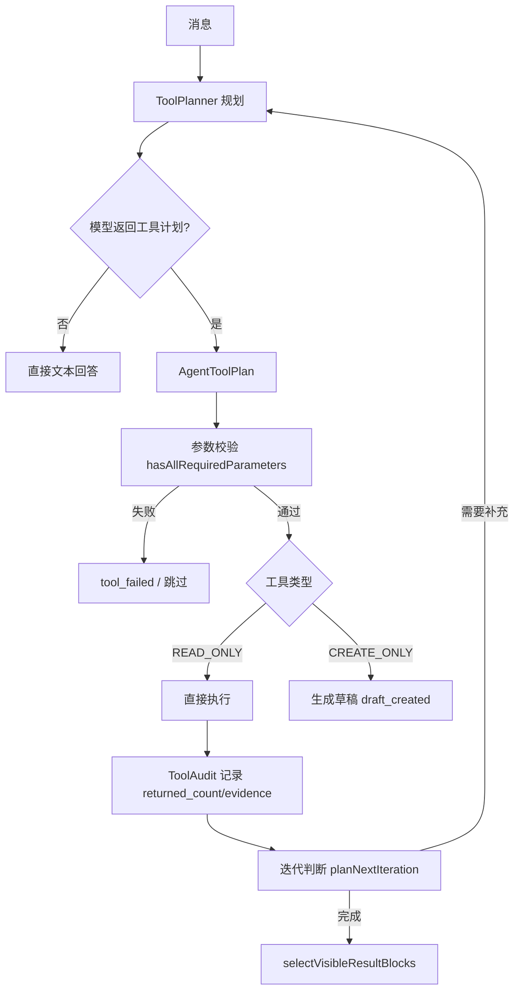

# 工具选择与执行设计

## 文档信息

| 字段 | 内容 |
|---|---|
| 文档类型 | 系统设计 |
| 当前状态 | 已完成 |
| 适用端 | 后端 / Agent |
| 依据源码 | `application/service/v2/agent/component/ToolPlanner.java`、`application/service/v2/agent/tool/ToolRegistry.java`、`tool/AgentTool.java`、`tool/ToolContext.java`、`tool/ToolResult.java`、`application/service/v2/V2AgentAiService.java`（executeToolPlan / buildResponse） |
| 依据测试 | `ToolPlannerTest.java`、`ToolRegistryTest.java`、`ToolInvocationIdentityTest.java`、各 `*LookupToolTest.java` |
| 依据证据 | `testing/.artifacts/2026-08-18-8220-current-baseline/current-8220-baseline.md` |
| 最后核对 | 2026-08-20 |

## 一、工具注册（ToolRegistry）

- `ToolRegistry` 通过构造注入 `List<AgentTool>` 自动收集所有 `@Component` 工具（源码注释：扩展只需实现 `AgentTool` + `@Component`，0 核心代码改动）。
- `listReadOnlyTools()`：按名称排序的只读工具列表。
- `listCreateTools()`：CREATE_ONLY 工具列表。
- `getTool(name)` / `hasAllRequiredParameters(name, params)`：参数校验。

## 二、工具类型

| 类型 | 常量 | 行为 |
|---|---|---|
| READ_ONLY | `AgentTool.ToolType.READ_ONLY` | 只读查询，直接执行 |
| CREATE_ONLY | `AgentTool.ToolType.CREATE_ONLY` | 写操作，走草稿确认流程 |

## 三、工具目录（readonly，真实源码）

| 工具 | 用途 |
|---|---|
| `ProductCatalogLookupTool` | 商品目录 |
| `ProductCategoryLookupTool` / `ProductPriceLevelLookupTool` / `ProductSupplierRelationLookupTool` | 商品辅助资料 |
| `InventoryLowStockLookupTool` / `InventoryLedgerLookupTool` / `InventorySnapshotLookupTool` / `InventoryAdjustmentLookupTool` / `InventoryPanoramaLookupTool` | 库存 |
| `CustomerReceivableLookupTool` / `SupplierPayableLookupTool` / `ReceivablePayableLookupTool` / `SupplierStatementLookupTool` / `SupplierDirectoryLookupTool` / `CustomerProfileLookupTool` | 应收应付 |
| `SaleOrderLookupTool` / `SalesReturnLookupTool` / `SalesOverviewLookupTool` / `SalesTrendLookupTool` / `SalesFullChainLookupTool` | 销售 |
| `PurchaseOrderLookupTool` / `PurchaseReceiptLookupTool` / `PurchaseReturnLookupTool` / `PurchaseTrackingLookupTool` | 采购 |
| `PayOrderLookupTool` / `PaymentLookupTool` / `FinanceRecordLookupTool` | 资金 |
| `ReportQueryTool` | 报表（report_type / period） |
| `ResultVisualizationTool` | 结果可视化 |
| `SmartRestockLookupTool` | 智能补货 |
| `StoreInfoLookupTool` / `SyncStatusLookupTool` / `ImportJobLookupTool` / `DataExportTool` / `GeneratePosterPromptTool` | 门店/同步/导入/导出/海报 |
| `PartnerGroupLookupTool` / `PartnerContactLookupTool` | 往来分组/联系人 |

## 四、工具选择与执行流程

图表目的：展示工具选择与执行的完整链路。

图中输入：用户消息。
图中处理：`ToolPlanner` 规划 → `ToolRegistry` 校验执行 → 审计累积 → ReAct 迭代（最多 3 轮）。
图中输出：工具结果、结果块、草稿、审计事件。

对应源码：`ToolPlanner.java`、`ToolRegistry.java`、`V2AgentAiService.buildResponse()`。
对应接口：Agent 链路（无独立 REST）。
对应测试：`ToolPlannerTest.java`、`ToolRegistryTest.java`、`ToolInvocationIdentityTest.java`。
当前状态：已完成。

## 五、执行上限（源码常量）

- `MAX_TOOL_CALLS_PER_RUN = 12`：单 run 工具调用上限。
- `MAX_AGENT_ITERATIONS = 3`：ReAct 迭代上限。
- `DEFAULT_TOOL_LIMIT = 10`：工具默认返回条数。
- `SUPPLIER_SCAN_LIMIT = 50`、`OVERVIEW_SIGNAL_LIMIT = 5`：查询窗口限制。

## 六、工具事件与审计

- `SseStreamEmitter.emitToolStarted` → `tool_started`（含 tool_call_id、input_summary、query_window）。
- `ToolAudit` 累积 `returned_count` / `total_count` / `limit` / `is_truncated` / `next_cursor` / `evidence`。
- `emitToolCompleted` → `tool_completed`；失败 → `tool_failed`（error_code=TOOL_QUERY_FAILED）；跳过 → `tool_skipped`。

## 对应实现

- 后端代码：`application/service/v2/agent/tool/`、`application/service/v2/agent/component/ToolPlanner.java`
- Android 代码：`feature/agent/`（工具过程 UI）、`core/model/v2/agent/stream/AgentStreamModels.kt`（ToolStarted/ToolCompleted 等）
- iOS 代码：待验证
- Web 代码：`AgentPage.vue`（UiToolCall）
- Agent 代码：`ToolRegistry`、`AgentTool`

## 对应接口

- 接口路径：Agent 链路
- 请求模型：无
- 响应模型：无
- SSE 事件：`plan`、`tool_started`、`tool_completed`、`tool_failed`、`tool_skipped`、`draft_created`、`result_block`

## 对应测试

- 单元测试：`ToolPlannerTest.java`、`ToolRegistryTest.java`、`ToolInvocationIdentityTest.java`、`readonly/*LookupToolTest.java`
- 功能测试：`testing/Agent/功能测试/TEST_PLAN.md`（tool-execution）
- 审计：`testing/Agent/审计/`

## 当前限制

- 未完成内容：无
- Blocked 内容：8220 无业务数据，真实工具查询 Blocked
- Deferred 内容：无
- historical-only 内容：154 环境工具执行证据
