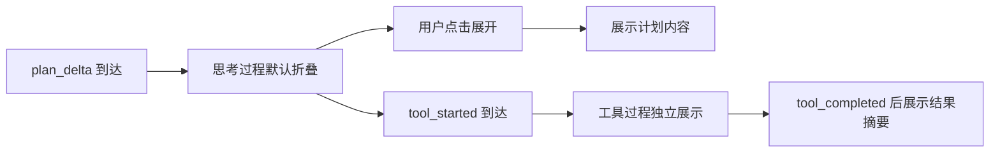

# 思考过程与执行过程设计

## 文档信息

| 字段 | 内容 |
|---|---|
| 文档类型 | 系统设计 |
| 当前状态 | 已完成 |
| 适用端 | 多端 |
| 依据源码 | 后端 `AgentTypes.AgentToolPlan`、`V2AgentAiService.emitPlan()`、`SseStreamEmitter.java`；Android `feature/agent/trace/`、`feature/agent/conversation/AgentChatScreen.kt` |
| 依据测试 | `AgentChatScreenToolStatusTest.kt`、`AgentChatViewModelAnswerMergeTest.kt`（Android） |
| 依据证据 | `testing/.artifacts/2026-08-18-8220-current-baseline/current-8220-baseline.md`（思考完成后自动折叠） |
| 最后核对 | 2026-08-20 |

## 一、思考过程（计划）

- 后端：`ToolPlanner` 产出 `AgentToolPlan`（tools、rationale、source、toolParams）；`emitPlan()` 发送 `plan` 事件；`selectionOrigin()` 区分 `model_tool_call`（模型原生）与 `unknown`（服务端兜底，不允许标记为模型选择）。
- Android 模型：`AgentStreamModels.PlanDelta`（`plan_delta` 事件，计划片段可折叠过程轨迹）。
- Web 模型：`AgentPlanDeltaEvent`（agent-stream.ts）。

## 二、执行过程（工具过程）

- 后端：`tool_started` / `tool_progress` / `tool_completed` / `tool_failed` / `tool_skipped` 事件。
- Android：工具过程独立展示组件（`AgentChatScreenToolStatusTest` 覆盖工具状态展示）。
- Web：`UiToolCall`（toolName 等）渲染工具过程。

## 三、Android 思考折叠行为（8220 基线确认）

- 思考内容默认收起（collapsed）。
- 点击后再次展开。
- 8220 基线："思考完成后自动折叠"已确认（Android 本地验证）。

图表目的：展示 Android 思考折叠与工具过程展示逻辑。

图中输入：plan_delta / tool_* 事件。
图中处理：折叠/展开状态管理、工具过程渲染。
图中输出：思考区、工具过程区。

对应源码：`AgentChatScreen.kt`、`feature/agent/trace/AgentMarkdownText.kt`。
对应接口：SSE `plan_delta`、`tool_*` 事件。
对应测试：`AgentChatScreenToolStatusTest.kt`。
当前状态：Android 已完成（本地验证）；iOS/Web 待验证。

## 四、iOS / Web 现状

- iOS：`AgentChatView.swift` 存在（消息、结果块、草稿、审计），但未发现思考过程折叠/工具过程独立展示的明确实现证据——标记待验证。
- Web：`AgentPage.vue` 有 `UiToolCall` 与 toolCalls 渲染，思考过程折叠交互待验证。

## 对应实现

- 后端代码：`V2AgentAiService.emitPlan()`、`SseStreamEmitter.java`
- Android 代码：`feature/agent/trace/`、`AgentChatScreen.kt`、`AgentChatViewModel.reduceLiveTrace()`
- iOS 代码：`Features/Agent/AgentChatView.swift`（待验证）
- Web 代码：`pages/agent/AgentPage.vue`
- Agent 代码：`ToolPlanner.java`、`AgentTypes.AgentToolPlan`

## 对应接口

- 接口路径：`POST /v2/agent/chat/stream`
- 请求模型：无
- 响应模型：无
- SSE 事件：`plan` / `plan_delta`、`tool_started`、`tool_completed`、`tool_failed`、`tool_skipped`

## 对应测试

- 单元测试：`ToolPlannerTest.java`、`AgentChatScreenToolStatusTest.kt`、`AgentChatViewModelAnswerMergeTest.kt`
- 功能测试：`testing/Agent/Agent综合功能与性能测试方案.md`

## 当前限制

- 未完成内容：iOS / Web 思考折叠与工具过程交互验证
- Blocked 内容：Android 真机截图验证（无 adb）
- Deferred 内容：无
- historical-only 内容：154 环境过程展示证据
