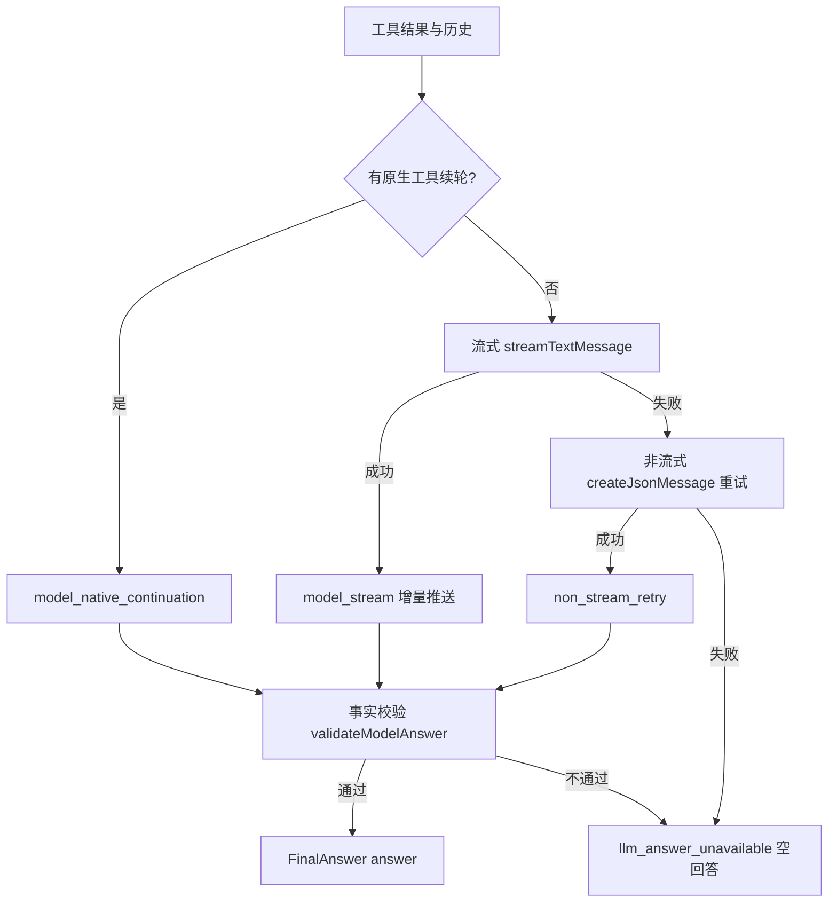

# 正式回答生成设计

## 文档信息

| 字段 | 内容 |
|---|---|
| 文档类型 | 系统设计 |
| 当前状态 | 已完成 |
| 适用端 | 后端 / Agent |
| 依据源码 | `application/service/v2/agent/component/AnswerSynthesizer.java`、`V2AgentAiService.java`、`infrastructure/ai/LongCatAnthropicClient.java` |
| 依据测试 | `AnswerSynthesizerTest.java`、`V2AgentAiServiceTest.java`、`testing/.artifacts/2026-07-29-agent-real-model-no-template/` |
| 依据证据 | `testing/已知问题与解除条件.md` #14（已解除） |
| 最后核对 | 2026-08-20 |

## 一、正式回答生成路径

图表目的：展示正式回答生成的真实路径（`AnswerSynthesizer`）。

图中输入：工具结果（ResponsePayload）、历史消息。
图中处理：优先原生工具续轮 → 流式模型回答 → 非流式重试 → 事实校验。
图中输出：`FinalAnswer(answer, mode, llmStatus, modelAttempted)`。

对应源码：`AnswerSynthesizer.java`（`buildFinalAnswer` / `buildFinalAnswerForStream`）。
对应接口：Agent 链路。
对应测试：`AnswerSynthesizerTest.java`。
当前状态：已完成（已知问题 #14 已于 2026-07-29 解除：正式回答走模型路径，不再规则摘要拼接）。

## 二、mode / llm_status 事实（源码）

| 场景 | mode | llmStatus |
|---|---|---|
| 流式模型回答 | `tool_query_llm_streamed` | `completed`（delta 源 `model_stream`） |
| 非流式重试 | `tool_query_llm` | `non_stream_retry` |
| 原生工具续轮 | （`model_native_continuation` 分支） | - |
| 多模态直接分析 | `multimodal_direct` / `multimodal_direct_llm` | `non_stream_retry`（重试路径） |
| 工具选择失败 | `llm_answer_unavailable` | `model_tool_selection_failed` |
| 模型空/未接地 | `llm_answer_unavailable` | `model_empty_or_ungrounded` |

来源：`AnswerSynthesizer.buildFinalAnswer()`（第 90-124 行）、`buildFinalAnswerForStream()`（第 324-399 行）、`V2AgentAiService.buildMultimodalDirectAnswerForStream()`（第 1498-1519 行）。

## 三、事实校验

`validateModelAnswer()` 校验模型回答与工具事实的一致性（如金额数字口径，源码注释："a model may say '7月' after the tool returned '2025-07'"）。校验不通过时返回空回答与错误状态，不生成模拟回答。

## 四、非流式与流式的一致性

- 非流式 `chat()`：`buildFinalAnswer` 直接返回；失败时 `persistTerminalAssistantMessage(failed)`。
- 流式 `chatStream()`：`buildFinalAnswerForStream` 通过 `AnswerDeltaBatcher` 推送 `answer_delta`（阈值 24 字符合并），完成后发 `answer_completed`。

## 对应实现

- 后端代码：`AnswerSynthesizer.java`、`V2AgentAiService.java`
- Android 代码：`AgentChatViewModel.enqueueAnswerDelta()/flushPendingAnswerDelta()`
- iOS 代码：待验证
- Web 代码：`AgentPage.vue`（回答渲染）
- Agent 代码：`AnswerSynthesizer.java`

## 对应接口

- 接口路径：`POST /v2/agent/chat`、`POST /v2/agent/chat/stream`
- 请求模型：`AgentChatRequest`
- 响应模型：`AgentChatResponse`（answer/mode/llmStatus）
- SSE 事件：`answer_delta`、`answer_completed`、`error`

## 对应测试

- 单元测试：`AnswerSynthesizerTest.java`、`V2AgentAiServiceTest.java`
- 证据：`testing/.artifacts/2026-07-29-agent-real-model-no-template/backend-agent-no-template-test.txt`
- 功能测试：`testing/Agent/功能测试/TEST_PLAN.md`

## 当前限制

- 未完成内容：原生 function_call_output 续轮在 8220 的独立验证（已知问题 #15）
- Blocked 内容：8220 无会话数据
- Deferred 内容：无
- historical-only 内容：旧规则摘要证据（`tool_query_rule_summary`，已解除）
