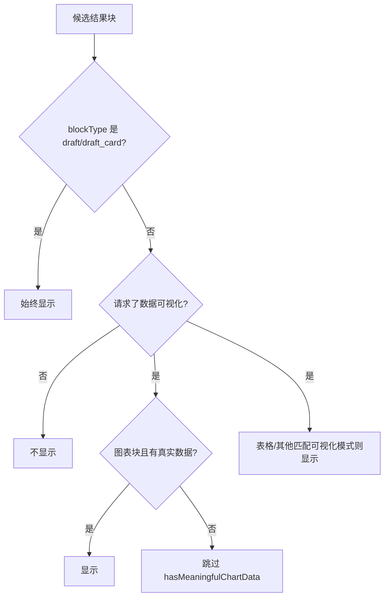

# 结果块与图表设计

## 文档信息

| 字段 | 内容 |
|---|---|
| 文档类型 | 系统设计 |
| 当前状态 | 已完成 |
| 适用端 | 多端 |
| 依据源码 | `V2AgentAiService.java`（`selectVisibleResultBlocks`、`hasMeaningfulChartData`、`requestedResultVisualization`）、`api/dto/v2/agent/V2AgentDtos.java`（ResultBlockDto）、Android `feature/agent/result/ResultBlockRenderer.kt`、iOS `AgentChatView.resultBlockView()`、Web `AgentPage.vue` |
| 依据测试 | `ResultBlockRendererContractTest.kt`、`AgentStoredResultBlockParseTest.kt`、`testing/Agent/功能测试/TEST_PLAN.md` |
| 依据证据 | `testing/.artifacts/2026-08-18-8220-current-baseline/current-8220-baseline.md`（结果块按消息 part 顺序渲染） |
| 最后核对 | 2026-08-20 |

## 一、结果块类型（源码常量）

| 常量 | 块类型集合 |
|---|---|
| `ALWAYS_VISIBLE_BLOCK_TYPES` | `draft`、`draft_card`（始终可见） |
| `TABLE_BLOCK_TYPES` | `table`、`rank_list` |
| `CHART_BLOCK_TYPES` | `line_chart`、`area_chart`、`trend_chart`、`bar_chart`、`column_chart`、`horizontal_bar_chart`、`pie_chart` |
| `TIMELINE_BLOCK_TYPES` | `line_chart`、`area_chart`、`trend_chart`、`timeline` |

## 二、结果块可见性规则（源码事实）

图表目的：展示结果块可见性过滤逻辑（`selectVisibleResultBlocks`）。

图中输入：工具候选块（candidateBlocks）。
图中处理：按块类型与可视化请求过滤。
图中输出：可见结果块列表。

对应源码：`V2AgentAiService.selectVisibleResultBlocks()`（第 877 行起）。
对应接口：Agent 链路。
对应测试：`ResultBlockRendererContractTest.kt`。
当前状态：已完成。

## 三、KPI / 表格 / 图表渲染

| 块类型 | Android 渲染（`ResultBlockRenderer`） | iOS 渲染（`AgentChatView`） | Web 渲染（`AgentPage.vue`） |
|---|---|---|---|
| kpi_grid | KPI 卡片 | kpis 枚举渲染 | KPI 组件 |
| table / rank_list | 表格 | headers/rows 渲染 | 表格 |
| line_chart / bar_chart 等 | 图表组件 | 待验证 | 图表组件 |
| draft_card | 草稿卡片 | AgentDraftCardBlock | 草稿块 |

## 四、结果块持久化

- 服务端：消息 `structured_data`（V16 text 列）保存结果块；`AgentMessageResponse` 包含 content / blocks / parts（Android `AgentMessageDto.toChatMessage()` 映射）。
- 历史恢复：消息加载后按 part 顺序渲染结果块（8220 基线确认 Android 行为）。

## 对应实现

- 后端代码：`V2AgentAiService.selectVisibleResultBlocks()`、`V2AgentDtos.ResultBlockDto`
- Android 代码：`feature/agent/result/ResultBlockRenderer.kt`、`core/model/v2/agent/result/AgentResultBlockModels.kt`
- iOS 代码：`Features/Agent/AgentChatView.swift`（resultBlockView）
- Web 代码：`pages/agent/AgentPage.vue`（resultBlocks）
- Agent 代码：`application/service/v2/agent/tool/readonly/ResultVisualizationTool.java`

## 对应接口

- 接口路径：Agent 链路
- 请求模型：无
- 响应模型：`AgentChatResponse.blocks`、`AgentMessageResponse.structuredData`
- SSE 事件：`result_block`

## 对应测试

- 单元测试：`ResultBlockRendererContractTest.kt`、`AgentStoredResultBlockParseTest.kt`（Android）
- 功能测试：`testing/Agent/功能测试/TEST_PLAN.md`（result-block）
- 证据：`docs/05_测试与验收/验收证据/ai-agent/20260609-*/18-result-block-evidence.md`

## 当前限制

- 未完成内容：iOS 图表块渲染待验证
- Blocked 内容：8220 无 Agent 数据
- Deferred 内容：图片结果展示
- historical-only 内容：154 环境结果块证据（conversation 59 evidence_card 已确认不再默认出现）
