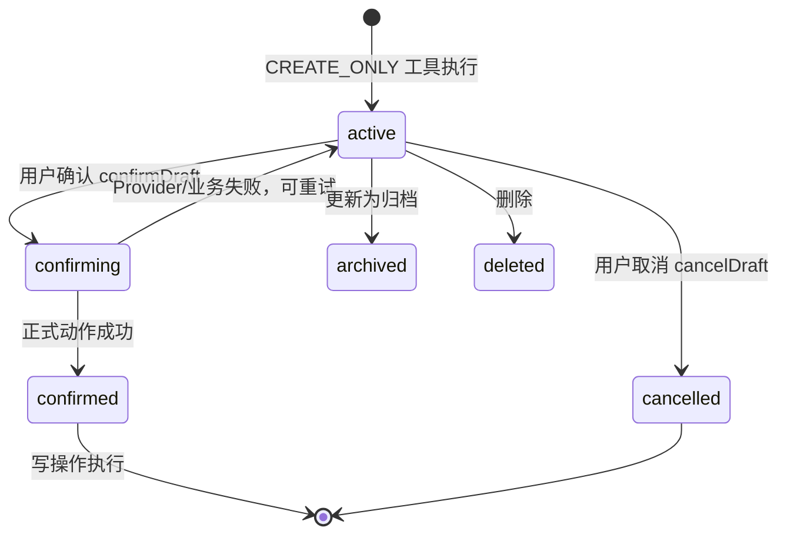
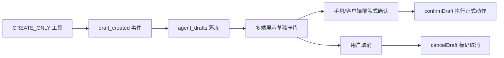

# 草稿与确认设计

## 文档信息

| 字段 | 内容 |
|---|---|
| 文档类型 | 系统设计 |
| 当前状态 | 已完成 |
| 适用端 | 后端 / Agent / Android / iOS / Web |
| 依据源码 | `application/service/v2/agent/AgentDraftConfirmService.java`、`application/service/v2/AgentImageService.java`、`application/service/v2/agent/tool/write/ImageGenerateTool.java`、`application/service/v2/V2AgentConversationService.java`（drafts CRUD）、`api/controller/v2/V2AgentController.java`（drafts 接口）、`api/dto/v2/agent/V2AgentDtos.java`（AgentDraftResponse） |
| 依据测试 | `AgentDraftConfirmServiceTest.java`、`ImageGenerateToolTest.java`、`AgentImageServiceTest.java`、`testing/Agent/功能/TEST_PLAN.md` |
| 依据证据 | `testing/已知问题与解除条件.md` #2、#5 |
| 最后核对 | 2026-08-20 |

## 一、草稿生命周期

图表目的：展示草稿状态机。

图中输入：草稿创建/更新/确认/取消/删除。
图中处理：`AgentDraftConfirmService.confirmDraft()` 先将状态置为 `confirming`，再执行正式动作；Provider/业务失败保留可重试状态；`cancelDraft()` 取消。
图中输出：草稿终态和确认后的业务/生图结果。

对应源码：`AgentDraftConfirmService.java`、`V2AgentConversationService`（updateDraft/deleteDraft）。
对应接口：`/v2/agent/drafts`、`/v2/agent/drafts/{id}/confirm`、`/v2/agent/drafts/{id}/cancel`、`PUT/DELETE /v2/agent/drafts/{id}`。
对应测试：`AgentDraftConfirmServiceTest.java`。
当前状态：后端已完成。

## 二、写操作草稿化流程

图表目的：展示写操作从工具到草稿到确认的流程。

图中输入：写操作请求。
图中处理：工具生成草稿 → 手机/客户端覆盖式确认 → 确认后执行正式业务动作或 Provider 生图。
图中输出：业务写操作/生图结果，或草稿取消；拒绝不写正式业务表。

对应源码：`V2AgentAiService`（`emitDraftCreatedEvents`，1040 行）、`AgentDraftConfirmService.java`。
对应接口：`/v2/agent/drafts/{id}/confirm`、`/v2/agent/drafts/{id}/cancel`。
对应测试：`AgentDraftConfirmServiceTest.java`。
当前状态：后端已完成。

### 生图草稿规则

`image_generate` 的 `execute` 只保存 `agent_drafts`：`draft_type=image_generate`、`status=active`、`content_json` 包含 `prompt` 和 `reference_asset_ids`。Provider 不在工具阶段调用。客户端确认后 `dispatchCreate` 调用 `AgentImageService.generate`；成功才置 `confirmed` 并返回 `imageResult`，失败、超时或取消保留可重试状态。参考图按当前 owner 校验，拒绝或跨 owner/store 请求不写正式业务表。

## 三、当前已知问题

| 问题 | 说明 | 状态 |
|---|---|---|
| 草稿列表 UI 无可达入口（#2） | `DraftListScreen` 路由已注册，但真机 UI 无可见入口 | Blocked / 部分完成 |
| 草稿确认最小夹具（#5） | `items` 为空时 confirm 失败（`订单明细不能为空`） | 预期行为，测试需最小夹具 |

## 四、多端草稿实现

| 端 | 实现 | 状态 |
|---|---|---|
| Android | `feature/agent/task/DraftListScreen.kt`、`DraftListViewModel.kt`（路由已注册） | 后端已通；UI 入口 Blocked（#2） |
| iOS | `Features/Agent/AgentDraftsView.swift`、`AgentDraftSheet`（编辑草稿 sheet） | 源码存在，待验证 |
| Web | `AgentPage.vue`（草稿表单、confirm/cancel 动作） | 源码存在，待验证 |

## 对应实现

- 后端代码：`AgentDraftConfirmService.java`、`V2AgentConversationService.java`
- Android 代码：`feature/agent/task/`
- iOS 代码：`Features/Agent/AgentDraftsView.swift`
- Web 代码：`pages/agent/AgentPage.vue`
- Agent 代码：`tool/write/*`（CREATE_ONLY 工具）

## 对应接口

- 接口路径：`/v2/agent/drafts`、`/v2/agent/drafts/pending`、`/v2/agent/drafts/{id}`（PUT/DELETE）、`/v2/agent/drafts/{id}/confirm`、`/v2/agent/drafts/{id}/cancel`
- 请求模型：`AgentDraftCreateRequest`、`AgentDraftUpdateRequest`
- 响应模型：`AgentDraftResponse`
- SSE 事件：`draft_created`

## 对应测试

- 单元测试：`AgentDraftConfirmServiceTest.java`
- 功能测试：`testing/Agent/功能/TEST_PLAN.md`（AG-F-DRAFT-CO-015）
- 契约/集成测试：`testing/Agent/契约/TEST_PLAN.md`（AG-C-SCHEMA-008）、`testing/Agent/集成/TEST_PLAN.md`（AG-I-013）
- 证据：`testing/.artifacts/2026-07-28-draft-closedloop/evidence-summary.md`

## 当前限制

- 未完成内容：Android 草稿列表 UI 入口（#2）
- Blocked 内容：草稿确认需最小夹具（#5）
- Deferred 内容：生图 Provider、真实客户端覆盖式确认和结果展示
- historical-only 内容：154 环境草稿证据（agent_drafts=3）
