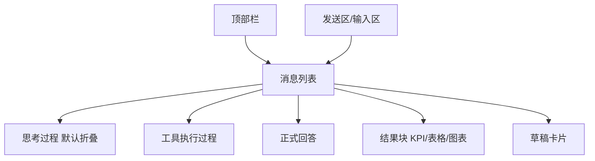

# Agent 对话界面规范

## 文档信息

| 字段 | 内容 |
|---|---|
| 文档类型 | 系统设计 |
| 当前状态 | Android 已完成；iOS/Web 待验证 |
| 适用端 | 多端 |
| 依据源码 | Android `feature/agent/conversation/AgentChatScreen.kt`、`docs/03_系统设计/UI设计/android-agent-reference-collapsed.png`、iOS `AgentChatView.swift`、Web `AgentPage.vue` |
| 依据测试 | `AgentChatScreenToolStatusTest.kt`、`testing/Agent/功能/TEST_PLAN.md` |
| 依据证据 | `testing/.artifacts/2026-08-18-8220-current-baseline/current-8220-baseline.md`（参考图静态检查） |
| 最后核对 | 2026-08-20 |

## 一、界面结构（Android 参考图与源码对应）

图表目的：展示 Agent 对话界面结构。

图中输入：界面组件。
图中处理：按消息 part 顺序渲染。
图中输出：对话界面。

对应源码：`AgentChatScreen.kt`；参考图 `android-agent-reference-collapsed.png`。
对应测试：`AgentChatScreenToolStatusTest.kt`。
当前状态：Android 已完成（静态检查对应）。

## 二、界面规范要点

1. 消息卡片含：思考（默认收起）、工具过程（独立展示）、正式回答、结果块（按 part 顺序）。
2. 发送区位于底部；输入框 + 发送按钮。
3. IME 打开时顶部栏不得重叠（已知问题 #19 待修）。
4. 历史分页恢复首个可见消息位置（8220 基线确认）。

## 三、参考图位置说明

- 参考图真实位置：`docs/03_系统设计/UI设计/android-agent-reference-collapsed.png`。
- 旧路径 `docs/design/android-agent-reference-collapsed.png` 已随目录重组移动，不再有效。

## 对应实现

- Android 代码：`feature/agent/conversation/AgentChatScreen.kt`
- iOS 代码：`Features/Agent/AgentChatView.swift`
- Web 代码：`pages/agent/AgentPage.vue`
- 后端代码：不适用
- Agent 代码：不适用

## 对应接口

- 接口路径：无
- 请求模型：无
- 响应模型：无
- SSE 事件：消息流事件（驱动界面更新）

## 对应测试

- 单元测试：`AgentChatScreenToolStatusTest.kt`、`AgentChatViewModelAnswerMergeTest.kt`
- 功能测试：`testing/Agent/功能/TEST_PLAN.md`

## 当前限制

- 未完成内容：iOS/Web 界面规范验证
- Blocked 内容：Android 真机截图
- Deferred 内容：多模态界面
- historical-only 内容：154 环境截图
