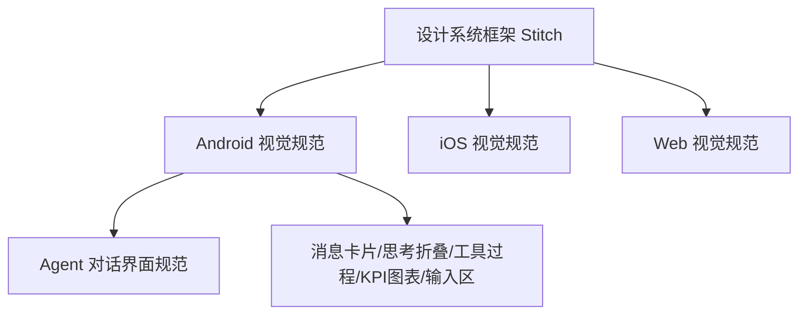

# UI 设计系统总览

## 文档信息

| 字段 | 内容 |
|---|---|
| 文档类型 | 系统设计 |
| 当前状态 | 已完成 |
| 适用端 | 多端 |
| 依据源码 | `Code/frontend/android/UI-DESIGN-SPEC.md`、`DEVELOPMENT-PLAN.md`、`Code/frontend/ios/PAGE_MAP.md`、`Code/frontend/web/public/stitch_exports/` |
| 依据测试 | 视觉验收证据（`testing/.artifacts/`、验收证据截图） |
| 依据证据 | `testing/.artifacts/2026-08-18-8220-current-baseline/current-8220-baseline.md`（参考图静态检查） |
| 最后核对 | 2026-08-20 |

## 一、设计真源

| 真源 | 位置 | 说明 |
|---|---|---|
| Android UI 设计规范 | `Code/frontend/android/UI-DESIGN-SPEC.md` | Stitch 版摘要，正式重构基线 |
| Android 开发计划 | `Code/frontend/android/DEVELOPMENT-PLAN.md` | UI 重构计划 |
| Stitch 导出清单 | `Code/frontend/web/public/stitch_exports/visual-design_system_framework_14840154594131085259/manifest.tsv` | 设计资源清单 |
| iOS 页面与接口地图 | `Code/frontend/ios/PAGE_MAP.md` | iOS 导航与页面 |
| Android Agent 参考图 | `docs/03_系统设计/UI设计/android-agent-reference-collapsed.png` | 参考图（原 docs/design/ 下，已移动） |

## 二、设计语言

- 关键词：极光玻璃、经营工具、高密度信息、轻盈但专业。
- 页面气质：不是营销页，不使用大面积插画或夸张阴影。
- 交互基调：快速录入、快速扫读、快速跳转、底部拇指优先（移动端）。

## 三、多端设计分层

图表目的：展示设计系统到各端规范的派生关系。

图中输入：设计系统框架（Stitch 导出）。
图中处理：各端规范适配。
图中输出：Agent 界面组件规范。

对应源码：`UI-DESIGN-SPEC.md`、`manifest.tsv`。
对应测试：视觉验收证据。
当前状态：已完成（设计真源确认）。

## 四、组件规范文档

| 组件规范 | 文档 |
|---|---|
| Agent 对话界面 | `Agent对话界面规范.md` |
| 消息卡片 | `消息卡片规范.md` |
| 思考过程折叠 | `思考过程折叠规范.md` |
| 工具执行过程 | `工具执行过程规范.md` |
| KPI 表格图表 | `KPI表格图表规范.md` |
| 发送区与输入区 | `发送区与输入区规范.md` |

## 对应实现

- Android 代码：`core/designsystem/`（颜色、形状、组件、主题）
- iOS 代码：`Core/Design/ZhihuijiTheme.swift`、`Core/Design/Components/`
- Web 代码：`shared/ui/`、`style.css`
- 后端代码：不适用
- Agent 代码：不适用

## 对应接口

- 接口路径：无（设计规范）
- 请求模型：无
- 响应模型：无
- SSE 事件：无

## 对应测试

- 视觉证据：`testing/.artifacts/`（截图、UI XML）
- 验收证据：`docs/05_测试与验收/验收证据/`（screenshots）

## 当前限制

- 未完成内容：iOS/Web 视觉规范实现验证
- Blocked 内容：Android 真机视觉验收（无 adb）
- Deferred 内容：多模态视觉
- historical-only 内容：154 环境视觉证据
