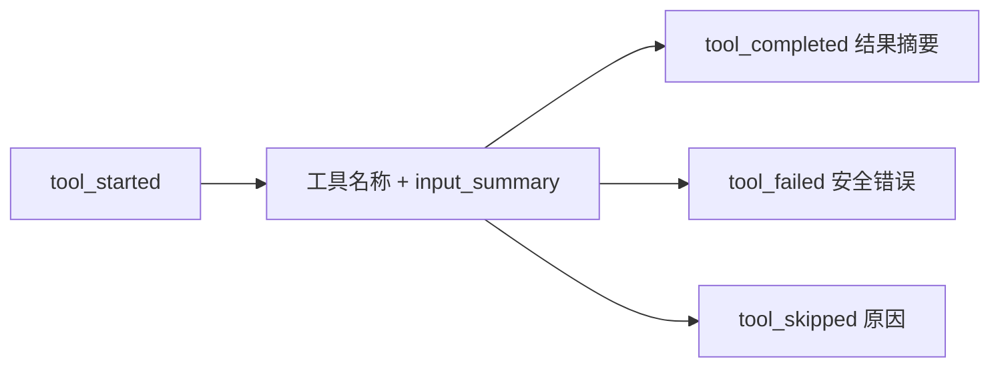

# 工具执行过程规范

## 文档信息

| 字段 | 内容 |
|---|---|
| 文档类型 | 系统设计 |
| 当前状态 | Android 已完成；iOS/Web 待验证 |
| 适用端 | 多端 |
| 依据源码 | Android `AgentChatScreen.kt`（工具过程组件）、`AgentChatViewModel.reduceLiveTrace()`、`AgentStreamModels`（ToolStarted/ToolCompleted/ToolFailed）；Web `AgentPage.vue`（UiToolCall） |
| 依据测试 | `AgentChatScreenToolStatusTest.kt` |
| 依据证据 | `testing/.artifacts/2026-08-18-8220-current-baseline/current-8220-baseline.md` |
| 最后核对 | 2026-08-20 |

## 一、工具过程展示规范

1. 工具执行过程独立于正式回答展示。
2. 每个工具显示：工具名称、输入摘要（input_summary）、状态（开始/完成/失败）。
3. 失败工具显示安全消息（safe_message）与错误码。
4. 与后端 `tool_started` / `tool_completed` / `tool_failed` / `tool_skipped` 事件一一对应。

图表目的：展示工具过程状态展示。

图中输入：工具事件。
图中处理：状态渲染。
图中输出：工具过程区。

对应源码：`AgentChatScreen.kt`、`AgentStreamModels.ToolStarted` 等。
对应测试：`AgentChatScreenToolStatusTest.kt`。
当前状态：Android 已完成。

## 二、审计关联

- 工具事件含 `audit_id` / `trace_id`，可关联运行审计。
- `ToolAudit` 累积 returned_count / evidence（`SseStreamEmitter.ToolAudit`）。

## 对应实现

- Android 代码：`AgentChatScreen.kt`、`AgentChatViewModel`（工具状态归约）
- iOS 代码：待验证
- Web 代码：`AgentPage.vue`（UiToolCall）
- 后端代码：`SseStreamEmitter.java`
- Agent 代码：`ToolRegistry`、`SseStreamEmitter`

## 对应接口

- 接口路径：无
- 请求模型：无
- 响应模型：无
- SSE 事件：`tool_started`、`tool_progress`、`tool_completed`、`tool_failed`、`tool_skipped`

## 对应测试

- 单元测试：`AgentChatScreenToolStatusTest.kt`
- 功能测试：`testing/Agent/功能/TEST_PLAN.md`（tool-execution）

## 当前限制

- 未完成内容：iOS/Web 工具过程验证
- Blocked 内容：Android 真机
- Deferred 内容：无
- historical-only 内容：154 环境工具过程证据
