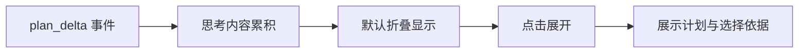

# 思考过程折叠规范

## 文档信息

| 字段 | 内容 |
|---|---|
| 文档类型 | 系统设计 |
| 当前状态 | Android 已完成；iOS/Web 待验证 |
| 适用端 | 多端 |
| 依据源码 | Android `feature/agent/conversation/AgentChatScreen.kt`、`AgentStreamModels.PlanDelta`、`AgentRunTraceModels.kt` |
| 依据测试 | `AgentChatScreenToolStatusTest.kt` |
| 依据证据 | `testing/.artifacts/2026-08-18-8220-current-baseline/current-8220-baseline.md`（思考完成后自动折叠） |
| 最后核对 | 2026-08-20 |

## 一、折叠规范

1. 思考/计划内容默认折叠（collapsed），不占主阅读区。
2. 点击"思考过程"区域可再次展开。
3. 思考完成后自动折叠（8220 基线确认的 Android 行为）。

图表目的：展示思考折叠交互。

图中输入：plan_delta 事件。
图中处理：累积 → 折叠 → 展开。
图中输出：折叠/展开状态。

对应源码：`AgentChatScreen.kt`（思考区域）、`AgentStreamModels.PlanDelta`。
对应测试：`AgentChatScreenToolStatusTest.kt`。
当前状态：Android 已完成。

## 二、Web / iOS

- Web：`AgentPlanDeltaEvent` 事件模型存在；折叠交互待验证。
- iOS：未发现思考折叠实现证据，待验证。

## 对应实现

- Android 代码：`AgentChatScreen.kt`、`feature/agent/trace/`
- iOS 代码：待验证
- Web 代码：`AgentPage.vue`
- 后端代码：`V2AgentAiService.emitPlan()`（plan 事件）
- Agent 代码：`ToolPlanner`

## 对应接口

- 接口路径：`POST /v2/agent/chat/stream`
- 请求模型：无
- 响应模型：无
- SSE 事件：`plan` / `plan_delta`

## 对应测试

- 单元测试：`AgentChatScreenToolStatusTest.kt`
- 功能测试：`testing/Agent/功能测试/TEST_PLAN.md`

## 当前限制

- 未完成内容：iOS/Web 折叠交互验证
- Blocked 内容：Android 真机截图
- Deferred 内容：无
- historical-only 内容：154 环境思考展示证据
