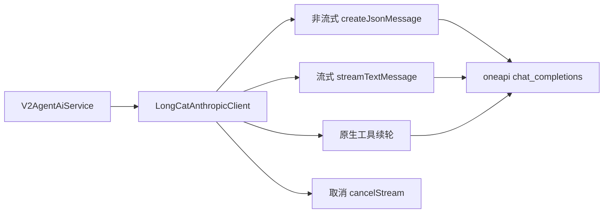

# Provider 适配设计

## 文档信息

| 字段 | 内容 |
|---|---|
| 文档类型 | 系统设计 |
| 当前状态 | 已完成 |
| 适用端 | 后端 / Agent |
| 依据源码 | `Code/backend/src/main/java/com/zhihuiji/backend/infrastructure/ai/LongCatAnthropicClient.java`、`infrastructure/config/AgentLlmProperties.java`、`AgentImageProperties.java`、`HttpClientConfig.java` |
| 依据测试 | `V2AgentAiServiceTest.java`、`AnswerSynthesizerTest.java`、`testing/.artifacts/2026-07-19-agent-llm-live-recheck/` |
| 依据证据 | `testing/.artifacts/2026-08-18-8220-current-baseline/current-8220-baseline.md`（Provider 直连结果） |
| 最后核对 | 2026-08-20 |

## 一、Provider 配置（8220 当前基线）

| 配置项 | 当前值 |
|---|---|
| 模型 | `gpt-5.6-luna` |
| Base URL | `https://oneapi.sxyq27.online/v1` |
| Wire API | `chat_completions` |
| OpenAI 认证 | 已启用（`requires-openai-auth: true`） |
| API Key | 仅存在于 8220 运行时 Secret，文档不保存不回显 |
| max-tokens | 4096 |
| temperature | 0.2 |
| enable-thinking | true（thinking-budget 2048） |

来源：`application.yml` / `application-prod.yml` 的 `agent.llm.*`（env 引用 `AGENT_LLM_*`）。

## 二、Provider 适配设计

图表目的：展示 Provider 适配层的调用面。

图中输入：Agent 编排请求。
图中处理：`LongCatAnthropicClient` 提供非流式、流式、原生工具续轮、取消四类调用。
图中输出：模型回答（JSON / 流式 chunk / 工具调用）。

对应源码：`infrastructure/ai/LongCatAnthropicClient.java`、`infrastructure/config/AgentLlmProperties.java`。
对应接口：`/v2/agent/chat`、`/v2/agent/chat/stream`。
对应测试：`V2AgentAiServiceTest.java`、`testing/.artifacts/2026-07-19-agent-llm-live-recheck/gpt-5.6-luna-provider-probe.md`。
当前状态：已完成（8220 非流式/SSE/tool_choice=auto 直连均 HTTP 200）。

## 三、直连探针结果（8220 基线）

| 协议 | 结果 |
|---|---|
| 非流式 chat/completions | HTTP 200 |
| SSE chat/completions | HTTP 200，3 个数据 chunk + 1 个 `[DONE]` |
| tool_choice=auto | HTTP 200 |

## 四、已知 Provider 边界

1. 原生 `function_call_output` 续轮在 154 探针返回 HTTP 400；当前工作树使用应用侧工具编排 + 真实模型重请求路径（`model_stream` / `non_stream_retry`），原生续轮需在 8220 独立验证（`testing/已知问题与解除条件.md` #15）。
2. 多模态 / 生图 Provider 未配置，相关链路 Deferred（`AgentImageProperties`、`AgentImageService` 源码存在）。
3. 生图 provider 未配置（`testing/已知问题与解除条件.md` #6、#13）。

## 对应实现

- 后端代码：`infrastructure/ai/LongCatAnthropicClient.java`、`infrastructure/config/AgentLlmProperties.java`、`AgentImageProperties.java`、`HttpClientConfig.java`
- Android 代码：不适用
- iOS 代码：不适用
- Web 代码：不适用
- Agent 代码：`V2AgentAiService`（调用方）、`AnswerSynthesizer`（回答路径）

## 对应接口

- 接口路径：`POST /v2/agent/chat`、`POST /v2/agent/chat/stream`
- 请求模型：`V2AgentDtos.AgentChatRequest`
- 响应模型：`AgentChatResponse`
- SSE 事件：`answer_delta`、`answer_completed`、`run_completed`、`error`

## 对应测试

- 单元测试：`V2AgentAiServiceTest.java`、`AnswerSynthesizerTest.java`
- Provider 探针：`testing/.artifacts/2026-07-19-agent-llm-live-recheck/gpt-5.6-luna-provider-probe.md`
- 基线：`testing/.artifacts/2026-08-18-8220-current-baseline/current-8220-baseline.md`

## 当前限制

- 未完成内容：原生 function_call_output 续轮在 8220 的独立验证
- Blocked 内容：无
- Deferred 内容：多模态、生图 Provider
- historical-only 内容：154 环境 Provider 配置与探针
