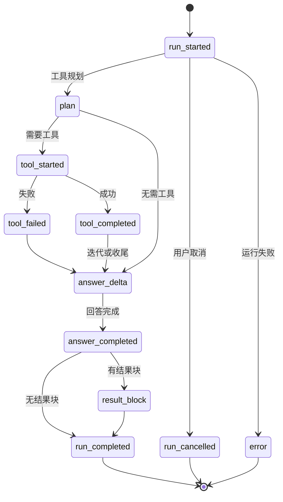

# SSE 流式服务设计

## 文档信息

| 字段 | 内容 |
|---|---|
| 文档类型 | 系统设计 |
| 当前状态 | 已完成 |
| 适用端 | 后端 / Android / Web（iOS 待验证） |
| 依据源码 | `application/service/v2/V2AgentAiService.java`（`chatStream`/`runChatStream`）、`application/service/v2/agent/component/SseStreamEmitter.java` |
| 依据测试 | `testing/Agent/Agent综合功能与性能测试方案.md`、`AgentSseClientCancellationTest.kt`、`AgentStreamEventSerializationTest.kt` |
| 依据证据 | `testing/.artifacts/2026-08-18-8220-current-baseline/current-8220-baseline.md`（SSE 直连 200、3 chunk、1 DONE） |
| 最后核对 | 2026-08-20 |

## 一、SSE 事件状态图

图表目的：展示 Agent SSE 事件状态流转（对应 `runChatStream` 真实事件序列）。

图中输入：用户消息。
图中处理：`SseStreamEmitter` 发送各事件。
图中输出：事件终态 `run_completed` / `run_cancelled` / `error`。

对应源码：`V2AgentAiService.runChatStream()`、`SseStreamEmitter.java`。
对应接口：`POST /v2/agent/chat/stream`。
对应测试：`AgentStreamEventSerializationTest.kt`、`testing/Agent/Agent综合功能与性能测试方案.md`。
当前状态：已完成（后端）；Android 本地完成；iOS/Web 待验证。

## 二、事件清单（源码事实）

| 事件类型 | 发送位置（源码） | 说明 |
|---|---|---|
| `run_started` | `V2AgentAiService.chat()` / `runChatStream()` | 运行开始，含 run_id/conversation_id/audit_id/trace_id |
| `plan` | `V2AgentAiService.emitPlan()`（第 2008 行） | 工具规划 |
| `tool_started` | `SseStreamEmitter.emitToolStarted()` | 工具开始，含 tool_call_id/tool_name/input_summary |
| `tool_completed` | `SseStreamEmitter.emitToolCompleted()` | 工具完成，含 result_summary/returned_count/evidence |
| `tool_failed` | `SseStreamEmitter.emitToolFailed()` | 工具失败，error_code=TOOL_QUERY_FAILED |
| `tool_skipped` | `SseStreamEmitter.emitToolSkipped()` | 工具跳过 |
| `answer_delta` | `SseStreamEmitter.emitAnswerDeltaUnchecked()` / `AnswerDeltaBatcher` | 回答增量 |
| `answer_completed` | `SseStreamEmitter.emitAnswerCompleted()` | 正式回答完成 |
| `result_block` | `SseStreamEmitter.emitBlocks()` | 结果块 |
| `draft_created` | `V2AgentAiService`（第 1040 行） | 草稿创建 |
| `run_cancelled` | `SseStreamEmitter.emitRunCancelled()` | 运行取消 |
| `run_completed` | `runChatStream()`（blocked/正常路径） | 运行完成 |
| `error` | `runChatStream()` 异常路径 | 运行错误（STREAM_ERROR 等） |

## 三、超时与执行

- SSE 超时：`STREAM_TIMEOUT_MS = 180_000L`（大于 Provider 读超时）。
- 执行：`Executors.newVirtualThreadPerTaskExecutor()` 异步执行 `runChatStream`。
- 取消：`cancelRun()` → `longCatAnthropicClient.cancelStream(runId)` → `run_cancelled`。
- 事件统一：`SseStreamEmitter.eventMap(eventType, payload)` 生成 `{"event_type": ..., ...}` JSON，`objectMapper` 序列化。

## 四、客户端消费

| 端 | 消费实现 | 状态 |
|---|---|---|
| Android | `core/network/AgentSseClient.kt`：`Flow<AgentStreamEvent>`，解析 `event_type` 密封类，含重试（`retryWithBackoff`） | 已完成（本地） |
| Web | `shared/api/agent-stream.ts`：fetch + `ReadableStream` 解析 | 待验证 |
| iOS | 未发现 SSE 流式消费实现证据 | 待验证 |

## 对应实现

- 后端代码：`V2AgentAiService.chatStream()`、`SseStreamEmitter.java`
- Android 代码：`core/network/AgentSseClient.kt`、`core/model/v2/agent/stream/AgentStreamModels.kt`
- iOS 代码：待验证
- Web 代码：`shared/api/agent-stream.ts`
- Agent 代码：`SseStreamEmitter.java`

## 对应接口

- 接口路径：`POST /v2/agent/chat/stream`
- 请求模型：`V2AgentDtos.AgentChatRequest`
- 响应模型：SSE 事件流
- SSE 事件：见上表

## 对应测试

- 单元测试：`AgentSseClientCancellationTest.kt`、`AgentStreamEventSerializationTest.kt`
- 功能测试：`testing/Agent/Agent综合功能与性能测试方案.md`（流式对话）
- 证据：`testing/.artifacts/2026-08-03-*/sse-performance-20260803/`、验收证据中 SSE log

## 当前限制

- 未完成内容：iOS SSE 消费实现验证
- Blocked 内容：8220 无 Agent 数据，流式业务链路 Blocked
- Deferred 内容：无
- historical-only 内容：154 环境流式证据（如 conversation 59 的 35 事件）
