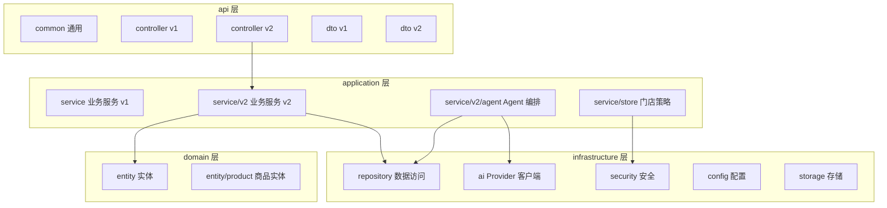

# 后端模块划分

## 文档信息

| 字段 | 内容 |
|---|---|
| 文档类型 | 系统设计 |
| 当前状态 | 已完成 |
| 适用端 | 后端 |
| 依据源码 | `Code/backend/src/main/java/com/zhihuiji/backend/` |
| 依据测试 | `Code/backend/src/test/java/` |
| 依据证据 | `testing/.artifacts/2026-08-18-8220-current-baseline/current-8220-baseline.md`（bootJar 构建通过） |
| 最后核对 | 2026-08-20 |

## 一、后端模块图

图表目的：展示后端四层模块划分及依赖方向。

图中输入：HTTP 请求。
图中处理：分层路由与依赖注入。
图中输出：业务响应、数据落库。

对应源码：`Code/backend/src/main/java/com/zhihuiji/backend/`（api/application/domain/infrastructure）。
对应接口：`/v2/*`。
对应测试：`Code/backend/src/test/java/com/zhihuiji/backend/`。
当前状态：已完成。

## 二、模块职责

| 模块 | 代表性文件 | 职责 |
|---|---|---|
| api/common | `ApiResponse.java`、`GlobalExceptionHandler.java`、`BusinessException.java`、`IdGenerator.java`、状态枚举 | 统一响应、异常、ID、状态 |
| api/controller | `AuthController.java`、`ProductController.java`、`SyncController.java` 等 | v1 接口 |
| api/controller/v2 | `V2AgentController.java`、`V2ProductController.java`、`V2StoreController.java` 等 | v2 接口 |
| api/dto | `SaleOrderDto.java`、`PurchaseOrderDto.java` 等 | v1 DTO |
| api/dto/v2 | `V2AgentDtos.java`、`V2ProductDtos.java` 等 | v2 DTO |
| application/service | `AuthService.java`、`ProductService.java`、`ReportService.java`、`SyncService.java` 等 | v1 业务 |
| application/service/v2 | `V2AgentAiService.java`、`V2ProductService`、`V2InventoryService.java` 等 | v2 业务 |
| application/service/v2/agent | `component/`、`tool/` | Agent 编排、组件、工具 |
| application/service/store | `StoreAccessPolicy.java` | 角色权限策略 |
| domain/entity | `UserEntity.java`、`SaleOrderEntity` 等 | JPA 实体 |
| domain/entity/product | `ProductEntity.java`、`ProductCategoryEntity.java` 等 | 商品实体 |
| infrastructure/repository | `AgentMessageRepository.java`、`SaleOrderRepository.java` 等 | 数据访问 |
| infrastructure/security | `TokenService.java`、`TokenAuthenticationFilter.java`、`StorePermissionInterceptor.java` | 认证授权 |
| infrastructure/ai | `LongCatAnthropicClient.java` | LLM Provider 客户端 |
| infrastructure/config | `SecurityConfig.java`、`AgentLlmProperties.java`、`AgentImageProperties.java`、`HttpClientConfig.java`、`WebMvcConfig.java`、`LocalDemoDataInitializer.java` | 配置 |
| infrastructure/storage | `MediaStorageService.java`、`LocalMediaStorageService.java` | 媒体存储 |

## 三、业务域划分（四级）

| 业务域 | Controller / DTO | Service | Entity | Repository |
|---|---|---|---|---|
| auth | `V2AuthController`、`V2AuthDtos` | `AuthService`、`CurrentOwnerService` | `UserEntity`、`SessionEntity`、`UserCreditEntity` | `UserRepository`、`SessionRepository` |
| store | `V2StoreController` | `V2StoreService`、`StoreAccessPolicy` | `StoreEntity`、`StoreMembershipEntity` | Store 相关 |
| product | `V2ProductController` 等 | `V2ProductService` 等 | `ProductEntity` 等 | `product/` |
| partner | 客户/供应商 Controller | `V2CustomerService`、`V2SupplierService` | `CustomerEntity`、`SupplierEntity` | 对应 Repository |
| sales | `V2SaleOrderController`、`V2SalesReturnController` | `V2SaleOrderService`、`V2SalesReturnService` | 销售实体 | 销售 Repository |
| purchase | `V2PurchaseOrderController` 等 | `V2PurchaseOrderService` 等 | 采购实体 | 采购 Repository |
| inventory | `V2InventoryController` | `V2InventoryService` | 库存实体 | `Inventory*Repository` |
| finance | `V2AccountController` 等 | `V2AccountService` 等 | 财务实体 | 财务 Repository |
| agent | `V2AgentController`、`V2AgentDtos` | `V2AgentAiService`、`V2AgentConversationService`、`AgentDraftConfirmService` | Agent 实体 | Agent Repository |
| media-sync | `V2MediaController`、`V2SyncController`、`V2ImportJobController` | 对应 Service | 媒体/同步实体 | 媒体/同步 Repository |

## 对应实现

- 后端代码：`Code/backend/src/main/java/com/zhihuiji/backend/`
- Android 代码：不适用（本页为后端设计）
- iOS 代码：不适用
- Web 代码：不适用
- Agent 代码：`application/service/v2/agent/`

## 对应接口

- 接口路径：`/v2/*`、v1 接口
- 请求模型：`api/dto/`、`api/dto/v2/`
- 响应模型：同上
- SSE 事件：`SseStreamEmitter.java`

## 对应测试

- 单元测试：`Code/backend/src/test/java/com/zhihuiji/backend/`
- 功能测试：`testing/后端/功能测试/TEST_PLAN.md`

## 当前限制

- 未完成内容：无
- Blocked 内容：8220 无业务数据
- Deferred 内容：多模态模块（AgentImageService）
- historical-only 内容：154 环境后端部署
