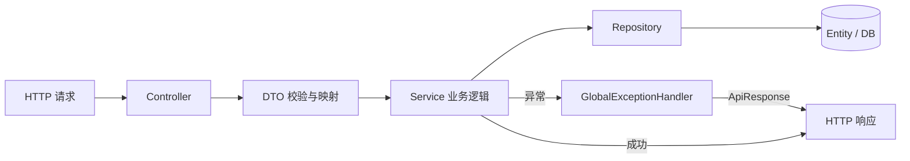

# 接口分层设计

## 文档信息

| 字段 | 内容 |
|---|---|
| 文档类型 | 系统设计 |
| 当前状态 | 已完成 |
| 适用端 | 后端 |
| 依据源码 | `Code/backend/src/main/java/com/zhihuiji/backend/api/` |
| 依据测试 | `ApiValidationTest.java`、`V1CatalogCompatibilityControllerTest.java`、`V1FinanceCompatibilityControllerTest.java` |
| 依据证据 | `testing/.artifacts/2026-08-18-8220-current-baseline/current-8220-baseline.md` |
| 最后核对 | 2026-08-20 |

## 一、Controller → DTO → Service → Entity → Repository 关系

图表目的：展示后端接口分层调用链与异常处理。

图中输入：HTTP 请求。
图中处理：Controller 接收并校验 DTO → Service 执行业务 → Repository 访问数据。
图中输出：`ApiResponse<T>` 统一响应。

对应源码：`api/controller/`、`api/dto/`、`application/service/`、`infrastructure/repository/`、`api/common/GlobalExceptionHandler.java`。
对应接口：全部。
对应测试：`ApiValidationTest.java`。
当前状态：已完成。

## 二、统一响应与异常

| 组件 | 位置 | 说明 |
|---|---|---|
| `ApiResponse<T>` | `api/common/ApiResponse.java` | 统一响应包装 |
| `BusinessException` | `api/common/BusinessException.java` | 业务异常 |
| `GlobalExceptionHandler` | `api/common/GlobalExceptionHandler.java` | 全局异常 → ApiResponse |
| `IdGenerator` | `api/common/IdGenerator.java` | ID 生成 |
| 状态枚举 | `api/common/OrderStatus.java`、`PayOrderStatus.java`、`PaymentStatus.java`、`PurchaseOrderStatus.java`、`PurchaseReceiptStatus.java`、`PurchaseReturnStatus.java`、`SalesReturnStatus.java`、`PartnerTypes.java` 等 | 业务状态 |

## 三、认证与权限注解

| 组件 | 说明 |
|---|---|
| `TokenAuthenticationFilter` | 从请求头读取 token 并设置认证 |
| `TokenService` | token 签发与校验 |
| `StorePermissionInterceptor` | 拦截 `@RequireStorePermission` 注解并校验门店权限 |
| `@RequireStorePermission("agent:view"/"agent:write")` | 权限注解（如 `V2AgentController` 每个接口） |

## 四、SSE 接口设计

`POST /v2/agent/chat/stream`：

- `produces = "text/event-stream"`
- 返回 `SseEmitter`（超时 `STREAM_TIMEOUT_MS = 180_000L`）
- 事件通过 `SseStreamEmitter.sendEvent()` 发送，格式 `{"event_type": "...", ...}`
- 异步执行：`Executors.newVirtualThreadPerTaskExecutor()`

详见 `03_系统设计/后端系统设计/SSE流式服务设计.md`。

## 五、命名与序列化

- JSON 字段：snake_case（`spring.jackson.property-naming-strategy=SNAKE_CASE`）。
- DTO 未知字段容忍：`fail-on-unknown-properties: false`。
- 请求校验：`@Valid` + jakarta validation。

## 对应实现

- 后端代码：`api/controller/`、`api/controller/v2/`、`api/dto/`、`api/common/`
- Android 代码：`core/network/ZhihuijiV2Api.kt`
- iOS 代码：`Core/API/APIEndpoint.swift`
- Web 代码：`shared/api/client.ts`、`shared/api/contracts.ts`

## 对应接口

- 接口路径：`/v2/*`
- 请求模型：`api/dto/v2/`
- 响应模型：`api/dto/v2/`
- SSE 事件：`SseStreamEmitter.java`

## 对应测试

- 单元测试：`ApiValidationTest.java`、`V1CatalogCompatibilityControllerTest.java`、`V1FinanceCompatibilityControllerTest.java`
- 契约测试：`ZhihuijiV2ApiContractTest.kt`（Android）
- 功能测试：`testing/后端/功能测试/TEST_PLAN.md`

## 当前限制

- 未完成内容：无
- Blocked 内容：8220 无业务数据
- Deferred 内容：多模态接口
- historical-only 内容：154 环境接口行为
