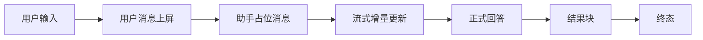

# Agent 消息交互设计

## 文档信息

| 字段 | 内容 |
|---|---|
| 文档类型 | 系统设计 |
| 当前状态 | 已完成 |
| 适用端 | 多端 |
| 依据源码 | `V2AgentDtos.AgentMessageResponse`（后端）、`AgentChatModels.kt`（Android）、`AgentModels.swift`（iOS）、`AgentPage.vue`（Web） |
| 依据测试 | `AgentChatResponseSerializationTest.kt`、`testing/Agent/Agent综合功能与性能测试方案.md` |
| 依据证据 | `testing/.artifacts/2026-08-18-8220-current-baseline/current-8220-baseline.md` |
| 最后核对 | 2026-08-20 |

## 一、消息模型

后端 `AgentMessageResponse`（`V2AgentDtos.java` 第 36 行起）：

| 字段 | 说明 |
|---|---|
| id / conversationId | 归属 |
| role | user / assistant |
| messageType | text 等 |
| content | 消息正文 |
| structuredData | 结构化数据（结果块 JSON，V16 text 列） |
| createdAt | 时间 |

## 二、用户消息与助手消息交互

图表目的：展示用户/助手消息的交互顺序。

图中输入：用户输入。
图中处理：占位消息 → 增量 → 回答 → 结果块。
图中输出：消息终态。

对应源码：Android `AgentChatViewModel.handleStreamEvent()`（649 行起）、`updateAssistantMessage()`。
对应接口：`/v2/agent/chat/stream`。
对应测试：`AgentChatViewModelAnswerMergeTest.kt`。
当前状态：Android 已完成；iOS/Web 待验证。

## 三、Android 消息状态（源码事实）

- `AgentChatViewModel.handleStreamEvent()` 按事件更新消息：`run_started` 创建/绑定 runId；`tool_started`/`tool_completed`/`tool_failed` 更新工具过程；`answer_delta` 增量合并（`enqueueAnswerDelta` + `flushPendingAnswerDelta`）；`draft_created` 附加草稿信息（draftId/draftType）。
- `updateRunTrace()` / `reduceLiveTrace()`：实时运行轨迹归约。
- `saveAuditRecord()`：审计记录本地保存。

## 四、多端消息交互对比

| 能力 | Android | iOS | Web |
|---|---|---|---|
| 用户消息 | userBubble | userBubble | UiMessage.user |
| 助手占位 | 有（sendMessage 创建） | 未发现明确占位逻辑 | 待验证 |
| 消息增量 | enqueueAnswerDelta | 待验证 | answer_delta 事件 |
| 消息持久化 | 服务端 + Room | 服务端 | 服务端 |

## 对应实现

- Android 代码：`feature/agent/conversation/AgentChatViewModel.kt`、`core/model/v2/agent/conversation/AgentChatModels.kt`
- iOS 代码：`Core/Models/AgentModels.swift`、`Features/Agent/AgentViewModel.swift`
- Web 代码：`pages/agent/AgentPage.vue`
- 后端代码：`V2AgentDtos.AgentMessageResponse`
- Agent 代码：`V2AgentAiService.persistAssistantResponse()`

## 对应接口

- 接口路径：`/v2/agent/conversations/{id}/messages`、`/v2/agent/chat/stream`
- 请求模型：`AgentMessageCreateRequest`、`AgentChatRequest`
- 响应模型：`AgentMessageResponse`
- SSE 事件：`run_started`、`answer_delta`、`answer_completed`、`draft_created`、`run_completed`

## 对应测试

- 单元测试：`AgentChatViewModelAnswerMergeTest.kt`、`AgentChatResponseSerializationTest.kt`
- 功能测试：`testing/Agent/Agent综合功能与性能测试方案.md`

## 当前限制

- 未完成内容：iOS / Web 消息交互验证
- Blocked 内容：8220 无消息数据
- Deferred 内容：图片消息（多模态）
- historical-only 内容：154 环境消息数据（agent_messages=29）
