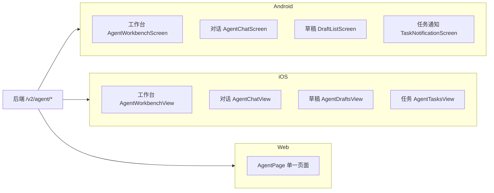

# 多端交互总览

## 文档信息

| 字段 | 内容 |
|---|---|
| 文档类型 | 系统设计 |
| 当前状态 | 已完成 |
| 适用端 | 多端 |
| 依据源码 | `Code/frontend/android/feature/agent/`、`Code/frontend/ios/ZhihuijiIOS/Features/Agent/`、`Code/frontend/web/src/pages/agent/` |
| 依据测试 | `testing/安卓/`、`testing/ios/`、`testing/web/` |
| 依据证据 | `testing/.artifacts/2026-08-18-8220-current-baseline/current-8220-baseline.md` |
| 最后核对 | 2026-08-20 |

## 一、多端交互对比表

| 能力 | Android | iOS | Web | 真实源码依据 | 当前状态 |
|---|---|---|---|---|---|
| 消息列表 | 有（`AgentChatScreen.kt` 消息列表） | 有（`AgentChatView.swift` messages ForEach） | 有（`AgentPage.vue` messages） | 三端源码 | Android 已完成；iOS/Web 待验证 |
| 历史会话 | 有（`ConversationListPanel.kt`、loadConversations） | 有（conversations 横向滚动） | 有（conversations 列表） | 三端源码 | Android 已完成（分页恢复）；iOS/Web 待验证 |
| 思考过程 | 有（plan_delta → 默认折叠可展开） | 未发现明确实现证据 | 有（PlanDelta 渲染，折叠交互待验证） | `AgentChatScreen.kt`、`AgentStreamModels.PlanDelta` | Android 已完成；iOS 待验证 |
| 工具过程 | 有（工具状态组件，`AgentChatScreenToolStatusTest`） | 未发现明确实现证据 | 有（UiToolCall） | 同上 | Android 已完成；iOS 待验证 |
| 正式回答 | 有（answer_delta 增量合并） | 有（assistantBubble 渲染） | 有（回答渲染） | `AgentChatViewModel.enqueueAnswerDelta` | Android 已完成 |
| KPI | 有（`ResultBlockRenderer`） | 有（resultBlockView kpis） | 有（KPI 组件） | 三端源码 | Android 已完成；iOS/Web 待验证 |
| 表格 | 有（ResultBlockRenderer） | 有（headers/rows） | 有（表格渲染） | 三端源码 | Android 已完成 |
| 图表 | 有（图表组件） | 待验证 | 有（图表组件） | 三端源码 | Android 已完成；iOS 待验证 |
| 取消 | 有（`stopGeneration()`） | 未发现 | 有（cancelAgentRun） | 三端源码 | Android/Web 有源码；待验证 |
| 错误恢复 | 有（重试/重连状态） | 未发现 | 有（错误状态） | `AgentSseClient.retryWithBackoff` | Android 已完成 |

## 二、多端 UI 交互图

图表目的：展示三端 Agent 页面结构。

图中输入：后端接口。
图中处理：各端页面消费。
图中输出：页面形态。

对应源码：见各端交互设计文档。
对应接口：`/v2/agent/*`。
对应测试：`testing/Agent/Agent综合功能与性能测试方案.md`。
当前状态：已完成（结构梳理）。

## 三、权限差异

- Android / iOS：移动端导航包含"助手"tab；权限由后端 `agent:view` / `agent:write` 注解控制。
- iOS：`AgentAccessPolicy.swift` 控制 Agent 页面访问；`ASSISTANT` 角色展示为"AI/只读助理"。
- Web：`/agent` 路由（`routes.ts` 第 66 行）；角色访问受 `entities/auth/roles.ts` 约束。

## 对应实现

- Android 代码：`feature/agent/`
- iOS 代码：`Features/Agent/`
- Web 代码：`pages/agent/AgentPage.vue`
- 后端代码：`api/controller/v2/V2AgentController.java`

## 对应接口

- 接口路径：`/v2/agent/*`
- 请求模型：`V2AgentDtos`
- 响应模型：`V2AgentDtos`
- SSE 事件：`SseStreamEmitter`

## 对应测试

- 多端测试：`testing/安卓/`、`testing/ios/`、`testing/web/`
- Agent 测试：`testing/Agent/Agent综合功能与性能测试方案.md`

## 当前限制

- 未完成内容：iOS / Web Agent 主流程测试
- Blocked 内容：Android 真机
- Deferred 内容：多模态
- historical-only 内容：154 环境多端证据
