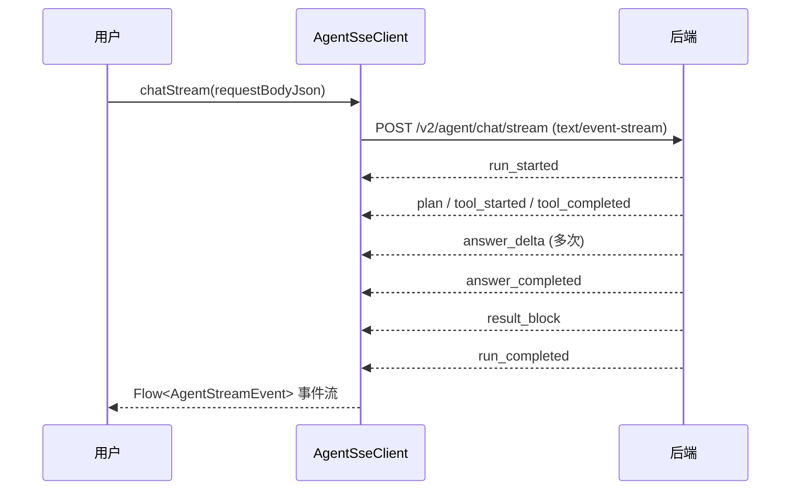

# 流式消息交互设计

## 文档信息

| 字段 | 内容 |
|---|---|
| 文档类型 | 系统设计 |
| 当前状态 | 后端/Android 已完成；iOS/Web 待验证 |
| 适用端 | 多端 |
| 依据源码 | `SseStreamEmitter.java`、Android `AgentSseClient.kt`、`AgentStreamModels.kt`、Web `agent-stream.ts` |
| 依据测试 | `AgentSseClientCancellationTest.kt`、`AgentStreamEventSerializationTest.kt`、`testing/Agent/Agent综合功能与性能测试方案.md` |
| 依据证据 | `testing/.artifacts/2026-08-18-8220-current-baseline/current-8220-baseline.md`（SSE 直连 200、3 chunk、1 DONE） |
| 最后核对 | 2026-08-20 |

## 一、流式消息交互流程

图表目的：展示 Android 流式消费时序。

图中输入：用户消息。
图中处理：`AgentSseClient.chatStream` 通过 OkHttp 读 SSE 流，按行解析 JSON 事件。
图中输出：`Flow<AgentStreamEvent>`。

对应源码：`AgentSseClient.kt`（`chatStream()` 第 80 行、`parseEvent()` 第 211 行、`retryWithBackoff()` 第 180 行）。
对应接口：`POST /v2/agent/chat/stream`。
对应测试：`AgentSseClientCancellationTest.kt`、`AgentStreamEventSerializationTest.kt`。
当前状态：Android 已完成。

## 二、事件解析（Android）

- `AgentStreamEvent` 密封类（`@JsonClassDiscriminator("event_type")`）：RunStarted、SafetyCheckStarted/Passed/Blocked、PlanDelta、ToolStarted、ToolProgress、ToolCompleted、ToolFailed、ToolSkipped、AnswerDelta、AnswerCompleted、ResultBlock、DraftCreated、RunCancelled、RunCompleted、StreamError 等。
- 本地解析错误可恢复；服务端错误为终态事件（`AgentSseClient` 注释）。

## 三、重试与断连

- `retryWithBackoff`：重连退避。
- `retryState`：`(attempt/maxAttempts)`；UI 显示"重连中..."。
- 断网：`queueOfflineMessage()`。
- 已知问题 #1/#12（历史）：收到终端事件后仍可能等待异常 EOF 并误报断连（154 环境证据；当前 8220 待复测）。

## 四、Web 流式

- `streamAgentChat()`：fetch + ReadableStream 分块解析（`agent-stream.ts`）。
- 事件类型与后端一致。

## 五、iOS 流式

- 未发现 SSE 流式消费实现证据——待验证。

## 对应实现

- Android 代码：`core/network/AgentSseClient.kt`、`core/model/v2/agent/stream/AgentStreamModels.kt`、`AgentChatViewModel.handleStreamEvent()`
- 后端代码：`SseStreamEmitter.java`、`V2AgentAiService.chatStream()`
- iOS 代码：待验证
- Web 代码：`shared/api/agent-stream.ts`
- Agent 代码：`SseStreamEmitter`

## 对应接口

- 接口路径：`POST /v2/agent/chat/stream`
- 请求模型：`AgentChatRequest`
- 响应模型：SSE 事件流
- SSE 事件：全量事件清单（见 `SSE流式服务设计.md`）

## 对应测试

- 单元测试：`AgentSseClientCancellationTest.kt`、`AgentStreamEventSerializationTest.kt`
- 功能测试：`testing/Agent/Agent综合功能与性能测试方案.md`（流式对话）
- 证据：`testing/.artifacts/2026-08-03-*/sse-performance-20260803/`

## 当前限制

- 未完成内容：iOS 流式消费；Web 流式行为验证
- Blocked 内容：8220 无会话数据
- Deferred 内容：无
- historical-only 内容：154 环境流式证据
