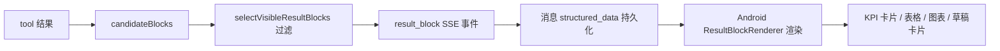

# 结果块交互设计

## 文档信息

| 字段 | 内容 |
|---|---|
| 文档类型 | 系统设计 |
| 当前状态 | Android 已完成；iOS/Web 待验证 |
| 适用端 | 多端 |
| 依据源码 | 后端 `V2AgentAiService.selectVisibleResultBlocks()`、`V2AgentDtos.ResultBlockDto`；Android `ResultBlockRenderer.kt`、`AgentResultBlockModels.kt`；iOS `AgentChatView.resultBlockView()`；Web `AgentPage.vue` |
| 依据测试 | `ResultBlockRendererContractTest.kt`、`AgentStoredResultBlockParseTest.kt` |
| 依据证据 | `testing/.artifacts/2026-08-18-8220-current-baseline/current-8220-baseline.md`（结果块按消息 part 顺序渲染） |
| 最后核对 | 2026-08-20 |

## 一、结果块展示流程

图表目的：展示结果块从工具结果到渲染的链路。

图中输入：工具结果。
图中处理：可见性过滤 → SSE → 持久化 → 渲染。
图中输出：KPI/表格/图表/草稿卡片。

对应源码：`V2AgentAiService.selectVisibleResultBlocks()`、`ResultBlockRenderer.kt`。
对应接口：SSE `result_block`。
对应测试：`ResultBlockRendererContractTest.kt`、`AgentStoredResultBlockParseTest.kt`。
当前状态：Android 已完成。

## 二、结果块类型与渲染

| 块类型 | 说明 | Android | iOS | Web |
|---|---|---|---|---|
| kpi_grid | KPI 卡片组 | `ResultBlockRenderer` | `resultBlockView`（kpis） | 待验证 |
| table / rank_list | 表格/排行 | `ResultBlockRenderer` | headers/rows | `tableHeaders`/`tableRows` |
| line_chart / bar_chart 等 | 图表 | 图表组件 | 待验证 | 待验证 |
| draft / draft_card | 草稿卡片 | 草稿卡片 | `AgentDraftCardBlock` | 草稿块 |
| timeline | 时间线 | 待验证 | 待验证 | 待验证 |

## 三、交互行为

- 结果块按消息 part 顺序展示（8220 基线确认 Android）。
- 图表块仅在请求可视化且 `hasMeaningfulChartData` 通过时显示（后端过滤，`V2AgentAiService` 第 896 行）。
- 草稿块（draft_card）始终可见并可操作（确认/取消/删除）。

## 四、持久化

- 服务端：消息 `structured_data`（V16）保存块 JSON。
- Android：`AgentStoredResultBlockParseTest` 验证存储解析。
- 历史恢复：消息加载后按 part 顺序渲染结果块。

## 对应实现

- Android 代码：`feature/agent/result/ResultBlockRenderer.kt`、`core/model/v2/agent/result/AgentResultBlockModels.kt`
- iOS 代码：`Features/Agent/AgentChatView.swift`（resultBlockView / resultBlockCompactView）
- Web 代码：`pages/agent/AgentPage.vue`（resultBlocks）
- 后端代码：`V2AgentDtos.ResultBlockDto`、`V2AgentAiService`
- Agent 代码：`ResultVisualizationTool.java`

## 对应接口

- 接口路径：Agent 链路
- 请求模型：无
- 响应模型：`AgentChatResponse.blocks`、`AgentMessageResponse.structuredData`
- SSE 事件：`result_block`

## 对应测试

- 单元测试：`ResultBlockRendererContractTest.kt`、`AgentStoredResultBlockParseTest.kt`
- 功能测试：`testing/Agent/功能/TEST_PLAN.md`（result-block）
- 证据：`docs/05_测试与验收/验收证据/ai-agent/20260609-*/18-result-block-evidence.md`

## 当前限制

- 未完成内容：iOS 图表块渲染验证
- Blocked 内容：8220 无 Agent 数据
- Deferred 内容：图片结果展示
- historical-only 内容：154 环境结果块证据
