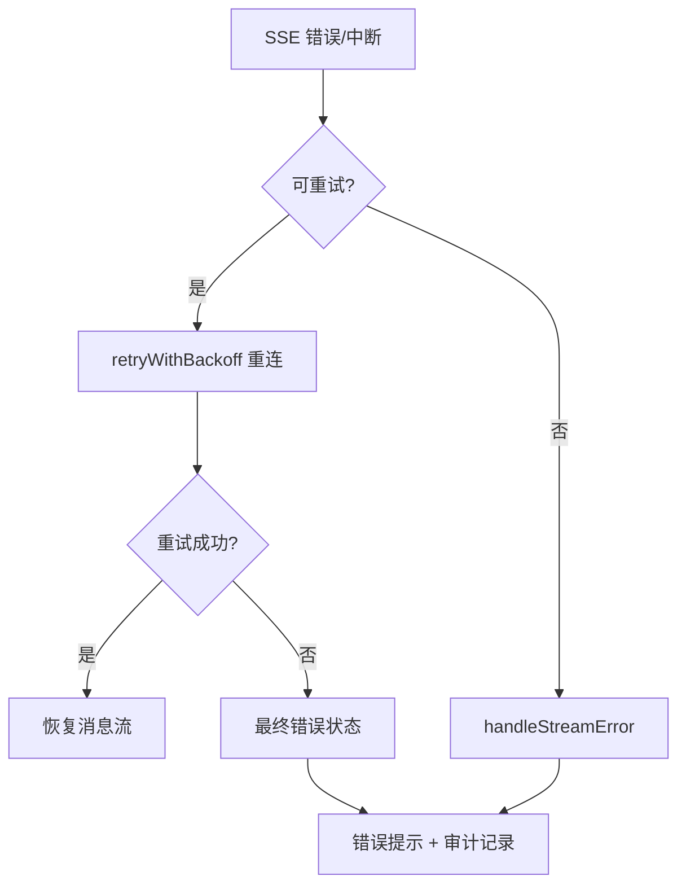

# 错误与空状态交互设计

## 文档信息

| 字段 | 内容 |
|---|---|
| 文档类型 | 系统设计 |
| 当前状态 | Android 部分完成；iOS/Web 待验证 |
| 适用端 | 多端 |
| 依据源码 | Android `AgentChatViewModel.handleStreamError()`、`AgentSseClient`、`AgentWorkbenchScreen.kt`（空态）；iOS `EmptyStateView.swift`、`LoadingStateView.swift`；Web `PageEmptyState.vue`、`PageStatusBanner.vue` |
| 依据测试 | `AgentChatNetworkGateTest.kt`、`testing/Agent/Agent综合功能与性能测试方案.md` |
| 依据证据 | `testing/.artifacts/2026-08-18-8220-current-baseline/current-8220-baseline.md` |
| 最后核对 | 2026-08-20 |

## 一、错误状态清单

| 场景 | 服务端行为 | Android 行为 | 状态 |
|---|---|---|---|
| 安全检查拦截 | `run_completed` + mode=blocked + llm_status=not_requested + plan_source=safety | 展示 blocked 消息（历史问题：曾误报网络断连，#11 已记录） | 后端已完成；Android 待复测 |
| LLM 失败 | `error` 事件（STREAM_ERROR 等）+ audit failed | `handleStreamError` → 错误提示 + 重试状态 | 后端已完成 |
| 工具失败 | `tool_failed`（TOOL_QUERY_FAILED） | 工具过程显示失败 | 后端已完成 |
| 网络断连 | - | `retryState` + "AI 流式连接中断"提示（历史问题 #1/#12） | Android 重试逻辑存在 |
| 取消 | `run_cancelled` | 取消消息 + 终态 | 后端已完成 |

## 二、错误传播图

图表目的：展示错误恢复链路（Android）。

图中输入：SSE 错误/中断。
图中处理：重试判定 → 退避重连 → 终态。
图中输出：错误状态。

对应源码：`AgentSseClient.retryWithBackoff()`、`AgentChatViewModel.handleStreamError()`（922 行）。
对应测试：`AgentChatNetworkGateTest.kt`、`AgentSseClientCancellationTest.kt`。
当前状态：Android 已完成（本地）。

## 三、空状态

| 空状态 | Android | iOS | Web |
|---|---|---|---|
| 工作台空态 | `clean_entry_ready`（`AgentWorkbenchResponse`） | `EmptyStateView` | `PageEmptyState.vue` |
| 消息空态 | 对话页空态 | 待验证 | 待验证 |
| 会话空态 | 会话列表空态 | 待验证 | 待验证 |

## 四、已知错误问题

| 问题 | 现象 | 状态 |
|---|---|---|
| #1/#12 | 收到终端事件后仍等待异常 EOF，误报流式中断 | 154 历史证据；当前待复测 |
| #11 | blocked 完成被 Android 误报为网络断连 | 154 历史证据 |
| #7 | 极早取消 SSE 收尾 STREAM_ERROR | 待修复 |
| #19 | IME 打开顶部栏重叠 | 待修复 |

## 对应实现

- Android 代码：`AgentChatViewModel.handleStreamError()`、`AgentSseClient`、`AgentWorkbenchScreen.kt`
- iOS 代码：`Core/Design/Components/EmptyStateView.swift`、`LoadingStateView.swift`
- Web 代码：`shared/ui/PageEmptyState.vue`、`PageStatusBanner.vue`
- 后端代码：`V2AgentAiService`（blocked/failed/error 路径）
- Agent 代码：`SafetyGuard`、`AnswerSynthesizer`

## 对应接口

- 接口路径：`/v2/agent/chat/stream`、`/v2/agent/runs/{runId}/cancel`
- 请求模型：无
- 响应模型：`AgentChatResponse`（blocked/failed 字段）
- SSE 事件：`error`、`run_completed`（blocked）、`run_cancelled`、`tool_failed`

## 对应测试

- 单元测试：`AgentChatNetworkGateTest.kt`、`AgentSseClientCancellationTest.kt`
- 功能测试：`testing/Agent/Agent综合功能与性能测试方案.md`
- 审计：`testing/Agent/Agent执行台账.csv`

## 当前限制

- 未完成内容：iOS / Web 错误空态验证
- Blocked 内容：8220 无会话数据
- Deferred 内容：无
- historical-only 内容：154 环境错误证据
