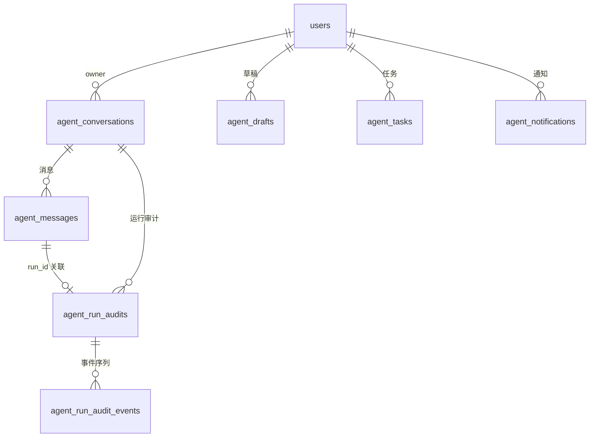

# Agent 数据模型

## 文档信息

| 字段 | 内容 |
|---|---|
| 文档类型 | 系统设计 |
| 当前状态 | 已完成 |
| 适用端 | 后端 / Agent |
| 依据源码 | `resources/db/migration/V13__media_and_agent_expansion.sql`、`V15__agent_run_audits.sql`、`V16__agent_message_structured_data_text.sql`、`V17__agent_run_audit_loss_metrics.sql`、`V29__agent_message_run_id.sql`、`domain/entity/Agent*Entity.java` |
| 依据测试 | `V2AgentConversationServiceTest.java`、`V2AgentAiServiceTest.java`、`AgentDraftConfirmServiceTest.java` |
| 依据证据 | `testing/.artifacts/2026-08-18-8220-current-baseline/current-8220-baseline.md` |
| 最后核对 | 2026-08-20 |

## 一、表结构（迁移证据）

### agent_conversations（V13）

```sql
CREATE TABLE IF NOT EXISTS agent_conversations (...);   -- V13 第 36 行
CREATE INDEX idx_agent_conversations_owner_updated ON agent_conversations(owner_user_id, updated_at DESC, id DESC);
```

### agent_messages（V13 + V16 + V29）

- V13 建表，`CREATE INDEX idx_agent_messages_owner_conversation_created ON agent_messages(owner_user_id, conversation_id, created_at ASC, id ASC)`。
- V16：`ALTER TABLE agent_messages ADD structured_data text`（消息结构化数据文本列）。
- V29：`ADD COLUMN run_id VARCHAR(64)` + 索引（`idx_agent_messages_owner_conversation_run`）。

### agent_drafts（V13）

`CREATE INDEX idx_agent_drafts_owner_updated ON agent_drafts(owner_user_id, updated_at DESC, id DESC)`。

### agent_run_audits / agent_run_audit_events（V15 + V17）

- V15 建表：`idx_agent_run_audits_owner_started`、`idx_agent_run_audits_owner_status`、`idx_agent_run_audit_events_run_seq`。
- V17：审计丢损指标（auditWriteDroppedCount / auditWriteFailedCount / auditLossy）。

### agent_tasks / agent_notifications（V4）

任务与通知表。

## 二、Agent ER 图



图表目的：展示 Agent 域实体关系。

图中输入：V4/V13/V15/V16/V17/V29 迁移。
图中处理：conversation 为根，message 携带 run_id 关联 audit。
图中输出：ER 关系。

对应源码：`domain/entity/AgentConversationEntity.java`、`AgentMessageEntity.java`、`AgentDraftEntity.java`、`AgentRunAuditEntity.java`、`AgentRunAuditEventEntity.java`、`AgentTaskEntity.java`、`AgentNotificationEntity.java`。
对应接口：`/v2/agent/*`。
对应测试：`V2AgentConversationServiceTest.java`、`V2AgentAiServiceTest.java`。
当前状态：已完成。

## 三、关键设计

1. **owner 隔离**：所有 Agent 表按 owner_user_id（V13/V15 索引）。
2. **消息结构化数据**：`agent_messages.structured_data`（text，V16）存消息 part/块；Android `AgentStoredResultBlockParseTest` 验证解析。
3. **run 关联**：`agent_messages.run_id`（V29）将消息与运行审计关联。
4. **审计事件**：`agent_run_audit_events` 按 `(run_id, seq)` 排序（V15 索引），`V2AgentAiService.getRunAudit` 读取。
5. **审计丢损**：V17 记录审计写失败/丢弃计数与 lossy 标志。

## 对应实现

- 后端代码：`domain/entity/Agent*Entity.java`、`infrastructure/repository/Agent*Repository.java`
- Android 代码：`core/database/`（Agent DAO）、`data/agent/`
- iOS 代码：`Core/Models/AgentModels.swift`
- Web 代码：`entities/agent/`
- Agent 代码：`application/service/v2/agent/`

## 对应接口

- 接口路径：`/v2/agent/conversations/*`、`/v2/agent/messages`、`/v2/agent/drafts`、`/v2/agent/runs/{runId}/audit`
- 请求模型：`V2AgentDtos.java`
- 响应模型：同上
- SSE 事件：所有 Agent 事件

## 对应测试

- 单元测试：`V2AgentConversationServiceTest.java`、`V2AgentAiServiceTest.java`
- 序列化测试：`AgentChatResponseSerializationTest.kt`、`AgentStreamEventSerializationTest.kt`（Android）
- 数据/功能测试：`testing/Agent/数据/TEST_PLAN.md`、`testing/Agent/功能/TEST_PLAN.md`

## 当前限制

- 未完成内容：无
- Blocked 内容：8220 Agent 数据全空（conversations=0、messages=0、audits=0、drafts=0）
- Deferred 内容：无
- historical-only 内容：154 环境 Agent 数据（conversations=18、messages=29 等）
