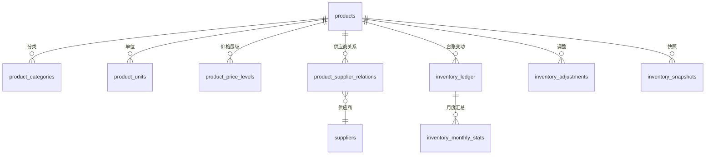

# 商品与库存数据模型

## 文档信息

| 字段 | 内容 |
|---|---|
| 文档类型 | 系统设计 |
| 当前状态 | 已完成 |
| 适用端 | 后端 |
| 依据源码 | `resources/db/migration/V1__init.sql`、`V8__product_and_partner_expansion.sql`、`V9__product_price_levels_and_supplier_relations.sql`、`V10__finance_and_inventory_foundation.sql`、`V21__inventory_ledger_source_index.sql`、`domain/entity/product/` |
| 依据测试 | `V2ProductControllerTest.java`、`V2InventoryServiceTest.java` |
| 依据证据 | `testing/.artifacts/2026-08-18-8220-current-baseline/current-8220-baseline.md` |
| 最后核对 | 2026-08-20 |

## 一、表结构

| 表 | 迁移 | 说明 |
|---|---|---|
| products | V1 | 商品主表 |
| product_categories | V8 | 商品分类 |
| product_units | V8 | 商品单位 |
| product_price_levels | V9 | 价格层级 |
| product_supplier_relations | V9 | 商品-供应商关系 |
| inventory_adjustments | V1 | 库存调整 |
| inventory_ledger | V10 | 库存台账（V21 来源索引） |
| inventory_snapshots | V10 | 库存快照 |
| inventory_monthly_stats | V10 | 月度统计 |

## 二、商品-库存 ER 图

图表目的：展示商品与库存实体关系。

图中输入：V1/V8/V9/V10 迁移。
图中处理：按 products 主键关联。
图中输出：ER 关系。

对应源码：`domain/entity/product/ProductEntity.java`、`ProductCategoryEntity.java`、`ProductUnitEntity.java`、`ProductPriceLevelEntity.java`、`ProductSupplierRelationEntity.java`。
对应接口：`/v2/products/*`、`/v2/inventory/*`。
对应测试：`V2ProductControllerTest.java`、`V2InventoryServiceTest.java`。
当前状态：已完成。

## 三、库存台账设计要点

- 台账记录每次入库/出库/调整的库存变动（V10）。
- 来源索引：`V21__inventory_ledger_source_index.sql`（按来源查询优化）。
- owner-scoped 索引：`V24__owner_scoped_query_indexes.sql`。

## 对应实现

- 后端代码：`domain/entity/product/`、`infrastructure/repository/product/`、`application/service/v2/V2InventoryService.java`
- Android 代码：`core/database/`（Product 相关 DAO、InventoryLedgerV2Dao 等）
- iOS 代码：`Core/Models/ProductModels.swift`、`InventoryModels.swift`
- Web 代码：`entities/product/`、`entities/inventory/`

## 对应接口

- 接口路径：`/v2/products/*`、`/v2/inventory/*`
- 请求模型：`V2ProductDtos.java`、`V2InventoryDtos.java`
- 响应模型：同上
- SSE 事件：Agent 工具事件

## 对应测试

- 单元测试：`V2ProductControllerTest.java`、`V2InventoryServiceTest.java`
- 功能测试：`testing/后端/功能测试/TEST_PLAN.md`

## 当前限制

- 未完成内容：无
- Blocked 内容：8220 无商品库存数据
- Deferred 内容：无
- historical-only 内容：154 环境数据
