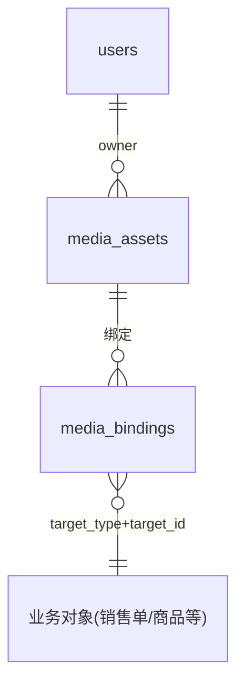

# 媒体数据模型

## 文档信息

| 字段 | 内容 |
|---|---|
| 文档类型 | 系统设计 |
| 当前状态 | 已完成 |
| 适用端 | 后端 |
| 依据源码 | `resources/db/migration/V13__media_and_agent_expansion.sql`、`domain/entity/MediaAssetEntity.java`、`MediaBindingEntity.java`、`infrastructure/storage/MediaStorageService.java`、`LocalMediaStorageService.java`、`application/service/v2/AgentImageService.java` |
| 依据测试 | `V2MediaServiceTest.java`、`V2AgentMediaControllerTest.java`、`AgentImageServiceTest.java`、`testing/Agent/数据/TEST_PLAN.md` |
| 依据证据 | `testing/.artifacts/2026-08-18-8220-current-baseline/current-8220-baseline.md`（media_assets 为空） |
| 最后核对 | 2026-08-20 |

## 一、表结构（迁移证据）

### media_assets（V13）

```sql
CREATE TABLE IF NOT EXISTS media_assets (...);   -- V13 第 1 行
CREATE INDEX idx_media_assets_owner_created ON media_assets(owner_user_id, created_at DESC);
```

### media_bindings（V13）

```sql
CREATE TABLE IF NOT EXISTS media_bindings (...);   -- V13 第 22 行
CREATE INDEX idx_media_bindings_owner_target ON media_bindings(owner_user_id, target_type, target_id, sort_order, id);
```

## 二、媒体 ER 图



图表目的：展示媒体资产与业务对象绑定的关系。

图中输入：V13 迁移。
图中处理：media_bindings 用 target_type + target_id 多态绑定。
图中输出：ER 关系。

对应源码：`domain/entity/MediaAssetEntity.java`、`MediaBindingEntity.java`、`infrastructure/storage/MediaStorageService.java`。
对应接口：`/v2/media/*`。
对应测试：`V2MediaServiceTest.java`、`V2AgentMediaControllerTest.java`。
当前状态：已完成（媒体上传/绑定）；8220 media_assets 为空。

## 三、存储设计

- `MediaStorageService`（接口）+ `LocalMediaStorageService`（本地实现）。
- 本地路径配置：`media.storage.local.base-path=${MEDIA_STORAGE_PATH:./data/media}`（application.yml）。
- 上传限制：multipart `max-file-size: 10MB`、`max-request-size: 10MB`。
- 生图参考图：`AgentImageService` 按 `owner_user_id` 读取 `media_assets`，只接受 `image/*`，通过 `MediaStorageService` 读取字节后发送给 Provider；store 参数不能扩大 owner 范围。
- 生图结果：当前 Service 返回 `image_url`，没有证据表明结果已写入 `media_assets`；文档不得把 Provider URL/b64_json 写成媒体资产落库。若后续要持久化，必须另行定义 owner、绑定和清理规则。

## 对应实现

- 后端代码：`domain/entity/MediaAssetEntity.java`、`MediaBindingEntity.java`、`application/service/v2/V2MediaService.java`、`infrastructure/storage/`
- Android 代码：`data/agent/media/MediaV2Repository.kt`
- iOS 代码：`Features/Settings/MediaAssetsView.swift`
- Web 代码：`entities/media/`

## 对应接口

- 接口路径：`/v2/media/*`
- 请求模型：`V2MediaDtos.java`
- 响应模型：同上
- SSE 事件：无

## 对应测试

- 单元测试：`V2MediaServiceTest.java`、`V2AgentMediaControllerTest.java`
- 功能测试：`testing/后端/功能测试/TEST_PLAN.md`

## 当前限制

- 未完成内容：无
- Blocked 内容：8220 media_assets 为空
- Deferred 内容：图片输入给 Agent（多模态）
- historical-only 内容：154 环境媒体证据
