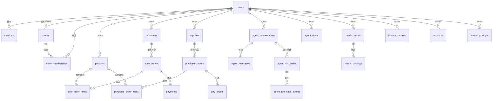

# 数据库总览

## 文档信息

| 字段 | 内容 |
|---|---|
| 文档类型 | 系统设计 |
| 当前状态 | 已完成 |
| 适用端 | 后端 |
| 依据源码 | `Code/backend/src/main/resources/db/migration/`（V1-V40）、`domain/entity/` |
| 依据测试 | `ZhihuijiBackendApplicationTests.java` |
| 依据证据 | `testing/.artifacts/2026-08-18-8220-current-baseline/current-8220-baseline.md`（V1-V29 基线）与 `testing/admin/20260830-production-deployment.md`（PostgreSQL 15、Flyway V40） |
| 最后核对 | 2026-08-30 |

## 一、数据库实体关系图（ER 总览）

图表目的：展示主要实体关系（基于 Flyway V1-V40 建表与 owner 字段）。

图中输入：迁移 SQL 中表结构与外键。
图中处理：按 owner_user_id 关联用户，按外键关联单据明细。
图中输出：ER 关系。

对应源码：`resources/db/migration/`、`domain/entity/`。
对应测试：`ZhihuijiBackendApplicationTests.java`（Flyway 校验）。
当前状态：已完成。

## 二、数据库设计要点

1. **owner 隔离**：所有业务表带 `owner_user_id`（V7 基础 + V24 索引），`stores`/`store_memberships` 在 V19 引入。
2. **外键**：V6 `add_foreign_keys`、V14 `b07_cascade_and_constraints` 补充外键与级联约束。
3. **索引**：V5/V21/V22/V23/V24 系列索引（库存台账来源、导入任务 worker、销售明细查询、owner 查询）。
4. **Agent 扩展**：V13（media+agent）、V15（run audits）、V16（消息结构化数据 text 列）、V17（审计丢损指标）、V29（消息 run_id）、V32-V34（上下文检查点、长期记忆、草稿内容）。
5. **管理员后台**：V35-V40（账号/范围、运行范围、审计配置、导出保留、版本字段和草稿确认证据）。
6. **同步**：V26/V27/V28（sync_operation_log、change_log scope、tombstone store key）。

## 三、迁移版本清单（V1-V40）

| 版本 | 主题 |
|---|---|
| V1 | 初始化：users/sessions/products/customers/sale_orders/sale_order_items/payments/purchase_orders/purchase_order_items/inventory_adjustments/sync_cursors |
| V2 | suppliers/pay_orders |
| V3 | finance_records |
| V4 | agent_tasks/agent_notifications |
| V5 | 索引 |
| V6 | 外键 |
| V7 | owner_scope_foundation |
| V8 | product_categories/product_units/partner_groups/partner_contacts |
| V9 | product_price_levels/product_supplier_relations |
| V10 | accounts/account_transfers/bill_fund_links/cash_change_records/inventory_ledger/inventory_snapshots/inventory_monthly_stats |
| V11 | bill_domain_enhancement |
| V12 | sync_and_import_owner_upgrade |
| V13 | media_assets/media_bindings/agent_conversations/agent_messages/agent_drafts |
| V14 | b07_cascade_and_constraints |
| V15 | agent_run_audits/agent_run_audit_events |
| V16 | agent_message structured_data text |
| V17 | agent_run_audit_loss_metrics |
| V18 | purchase_returns |
| V19 | stores/store_memberships |
| V20 | purchase_order_settlement_warehouse |
| V21 | inventory_ledger_source_index |
| V22 | import_jobs_worker_indexes |
| V23 | sale_order_item_query_indexes |
| V24 | owner_scoped_query_indexes |
| V25 | poster_credits（user_credits/credit_transactions/poster_generations） |
| V26 | sync_operation_log |
| V27 | sync_change_log_scope |
| V28 | sync_tombstone_store_key |
| V29 | agent_message_run_id |
| V30 | pay_order_idempotency |
| V31 | pay_order_idempotency_payload_hash |
| V32 | agent_context_checkpoints |
| V33 | agent_memories |
| V34 | agent_draft_content_json_text |
| V35 | administrator_identity_and_scope |
| V36 | agent_run_actor_store_scope |
| V37 | admin_audit_config_exports_retention |
| V38 | admin_mutation_versions |
| V39 | admin_export_scope_snapshots |
| V40 | agent_draft_confirmation_evidence |

## 对应实现

- 后端代码：`resources/db/migration/`、`domain/entity/`、`infrastructure/repository/`
- Android 代码：`core/database/`（Room 本地镜像）
- iOS 代码：`Core/Models/`（无本地库证据）
- Web 代码：无本地库

## 对应接口

- 接口路径：所有业务接口
- 请求模型：无
- 响应模型：无
- SSE 事件：无

## 对应测试

- 单元测试：`ZhihuijiBackendApplicationTests.java`
- 迁移验证：`testing/.artifacts/2026-08-01-server-agent-eval/wave0-isolated-migration-rerun-20260801T023947+0800/`
- 功能测试：`testing/后端/功能测试/TEST_PLAN.md`

## 当前限制

- 未完成内容：无
- Blocked 内容：8220 业务主表为空
- Deferred 内容：无
- historical-only 内容：154 数据库副本
