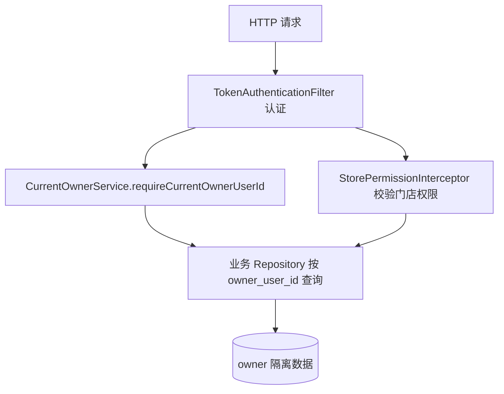

# 数据隔离与 owner 设计

## 文档信息

| 字段 | 内容 |
|---|---|
| 文档类型 | 系统设计 |
| 当前状态 | 已完成 |
| 适用端 | 后端 |
| 依据源码 | `resources/db/migration/V7__owner_scope_foundation.sql`、`V24__owner_scoped_query_indexes.sql`、`application/service/CurrentOwnerService.java`、`infrastructure/security/StorePermissionInterceptor.java`、`SseStreamEmitter.queryWindowFor()` |
| 依据测试 | `CurrentOwnerServiceTest.java`、`V2SyncImportControllerTest.java`、`V2StoreControllerPermissionTest.java`、`StoreAccessPolicyTest.java` |
| 依据证据 | `testing/.artifacts/2026-08-18-8220-current-baseline/current-8220-baseline.md` |
| 最后核对 | 2026-08-20 |

## 一、隔离模型



图表目的：展示 owner 隔离的执行链路。

图中输入：HTTP 请求。
图中处理：认证 → owner 解析 → 权限校验 → owner-scoped 查询。
图中输出：仅当前 owner 的数据。

对应源码：`CurrentOwnerService.java`、`StorePermissionInterceptor.java`、`V7`/`V24` 迁移。
对应接口：所有业务接口。
对应测试：`CurrentOwnerServiceTest.java`、`V2StoreControllerPermissionTest.java`。
当前状态：已完成。

## 二、owner 隔离层次

| 层次 | 机制 | 证据 |
|---|---|---|
| 数据库 | 业务表带 owner_user_id；V7 迁移建立 owner 基础；V24 建 owner 查询索引 | `V7__owner_scope_foundation.sql`、`V24__owner_scoped_query_indexes.sql` |
| 应用 | `CurrentOwnerService.requireCurrentOwnerUserId()` 从认证上下文取 owner | `CurrentOwnerService.java` |
| 查询 | Repository 方法携带 owner 参数过滤 | 如 `findByRunIdAndOwnerUserId`、`findAllWithMessagesByOwnerUserIdOrderByUpdatedAtDescIdDesc` |
| Agent 工具 | 工具查询窗口 `query_window.owner_scope=current_owner` | `SseStreamEmitter.queryWindowFor()` |
| 权限 | 门店权限注解 + `StoreAccessPolicy` 角色矩阵 | `RequireStorePermission`、`StoreAccessPolicy.java` |

## 三、Agent 工具 owner 窗口

`SseStreamEmitter.queryWindowFor()` 源码：

```java
public static Map<String, Object> queryWindowFor(Map<String, Object> toolInput) {
    Map<String, Object> window = new LinkedHashMap<>();
    window.put("owner_scope", "current_owner");
    ...
}
```

所有 Agent 只读工具的执行窗口固定为 `current_owner`，工具审计的 `evidence.scope` 同样为 `current_owner`（`ToolAudit.evidenceSummary()`）。

## 四、隔离审计

- `testing/后端/功能测试/TEST_PLAN.md` 含 owner 隔离场景。
- `V2SyncImportControllerTest.java` 覆盖同步/导入的 owner 升级（V12 迁移 `sync_and_import_owner_upgrade`）。
- 数据隔离审计文档：`07_问题审计/数据隔离审计.md`。

## 对应实现

- 后端代码：`application/service/CurrentOwnerService.java`、`infrastructure/security/`、`resources/db/migration/V7/V24`
- Android 代码：`core/datastore/`（本地会话）、`data/auth/AuthRepository.kt`
- iOS 代码：`Core/Auth/PermissionPolicy.swift`
- Web 代码：`app/stores/session.ts`
- Agent 代码：`SseStreamEmitter.queryWindowFor()`、所有只读工具

## 对应接口

- 接口路径：所有业务接口
- 请求模型：无
- 响应模型：无
- SSE 事件：工具事件的 `query_window` / `evidence`

## 对应测试

- 单元测试：`CurrentOwnerServiceTest.java`、`V2StoreControllerPermissionTest.java`
- 功能测试：`testing/后端/功能测试/TEST_PLAN.md`
- 审计：`testing/后端/审计/`

## 当前限制

- 未完成内容：无
- Blocked 内容：8220 无多 owner 数据，交叉隔离运行验证 Blocked
- Deferred 内容：无
- historical-only 内容：154 环境隔离行为
