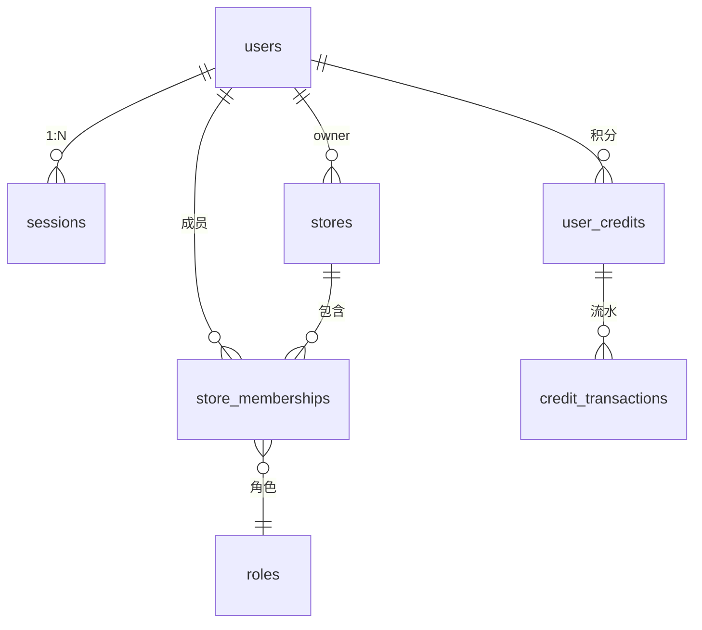

# 用户与门店数据模型

## 文档信息

| 字段 | 内容 |
|---|---|
| 文档类型 | 系统设计 |
| 当前状态 | 已完成 |
| 适用端 | 后端 |
| 依据源码 | `resources/db/migration/V1__init.sql`、`V7__owner_scope_foundation.sql`、`V19__store_memberships.sql`、`domain/entity/UserEntity.java`、`UserCreditEntity.java` |
| 依据测试 | `AuthServiceTest.java`、`V2StoreServiceTest.java`、`StoreAccessPolicyTest.java` |
| 依据证据 | `testing/.artifacts/2026-08-18-8220-current-baseline/current-8220-baseline.md` |
| 最后核对 | 2026-08-20 |

## 一、表结构（迁移证据）

### users（V1）

users 表含用户身份字段与 owner 语义；当前 8220 基线 users=1。

### sessions（V1）

登录会话表；当前 8220 基线 sessions=0。

### stores（V19）

```sql
CREATE TABLE IF NOT EXISTS stores (...);   -- V19__store_memberships.sql 第 1 行
CREATE INDEX IF NOT EXISTS idx_stores_owner_user_id ON stores(owner_user_id);
```

### store_memberships（V19）

```sql
CREATE TABLE IF NOT EXISTS store_memberships (...);  -- V19 第 13 行
CREATE INDEX ... idx_store_memberships_owner_user_id ...;
CREATE INDEX ... idx_store_memberships_store_id ...;
```

### user_credits / credit_transactions（V25）

积分与积分流水（海报积分）。

## 二、用户-门店-成员关系图



图表目的：展示用户、session、门店、成员与积分的实体关系。

图中输入：V1/V7/V19/V25 迁移表结构。
图中处理：owner 维度关联。
图中输出：ER 关系。

对应源码：`domain/entity/UserEntity.java`、`UserCreditEntity.java`、`StoreEntity.java`、`StoreMembershipEntity.java`。
对应接口：`/v2/auth/*`、`/v2/stores/*`。
对应测试：`AuthServiceTest.java`、`V2StoreServiceTest.java`。
当前状态：已完成。

## 三、owner 隔离字段

- 所有业务表携带 `owner_user_id`（V7 迁移）。
- `CurrentOwnerService.requireCurrentOwnerUserId()` 从认证上下文取 owner。
- 查询索引：`V24__owner_scoped_query_indexes.sql`。

## 对应实现

- 后端代码：`domain/entity/UserEntity.java`、`UserCreditEntity.java`、`StoreEntity.java`、`StoreMembershipEntity.java`、`infrastructure/repository/`
- Android 代码：`core/database/`（用户与门店 DAO）
- iOS 代码：`Core/Models/StoreModels.swift`、`Core/Auth/`
- Web 代码：`entities/auth/roles.ts`

## 对应接口

- 接口路径：`/v2/auth/*`、`/v2/stores/*`
- 请求模型：`V2AuthDtos.java`、store DTO
- 响应模型：同上
- SSE 事件：无

## 对应测试

- 单元测试：`AuthServiceTest.java`、`V2StoreServiceTest.java`、`V2StoreControllerPermissionTest.java`
- 功能测试：`testing/后端/功能测试/TEST_PLAN.md`

## 当前限制

- 未完成内容：无
- Blocked 内容：8220 stores=0、sessions=0
- Deferred 内容：会员体系
- historical-only 内容：154 环境 users=5/sessions=5/stores=1/store_memberships=1
