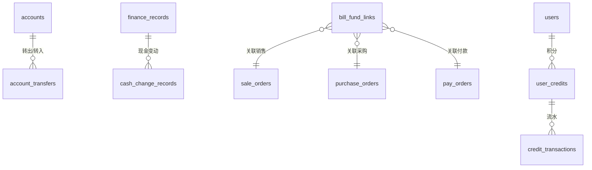

# 财务与报表数据模型

## 文档信息

| 字段 | 内容 |
|---|---|
| 文档类型 | 系统设计 |
| 当前状态 | 已完成 |
| 适用端 | 后端 |
| 依据源码 | `resources/db/migration/V3__finance_records.sql`、`V10__finance_and_inventory_foundation.sql`、`V25__poster_credits.sql` |
| 依据测试 | `ReportServiceTest.java`、`V2AccountServiceTest.java`、`V2AccountTransferServiceTest.java`、`V2CashChangeRecordServiceTest.java`、`V2BillFundLinkServiceTest.java` |
| 依据证据 | `testing/.artifacts/2026-08-18-8220-current-baseline/current-8220-baseline.md` |
| 最后核对 | 2026-08-20 |

## 一、表结构

| 表 | 迁移 |
|---|---|
| finance_records | V3 |
| accounts / account_transfers | V10 |
| bill_fund_links | V10 |
| cash_change_records | V10 |
| payments | V1 |
| pay_orders | V2 |
| user_credits / credit_transactions / poster_generations | V25 |

## 二、财务 ER 图

图表目的：展示财务域实体关系。

图中输入：V1/V2/V3/V10/V25 迁移。
图中处理：单据-资金关联。
图中输出：ER 关系。

对应源码：`domain/entity/`（AccountEntity、FinanceRecordEntity 等）。
对应接口：`/v2/accounts/*`、`/v2/finance-records/*`、`/v2/bill-fund-links/*` 等。
对应测试：`V2AccountServiceTest.java`、`V2BillFundLinkServiceTest.java`。
当前状态：已完成。

## 三、报表数据来源

报表由 `ReportService` / `V2ReportController` 聚合以下数据：

- 销售：sale_orders / sale_order_items / payments
- 采购：purchase_orders / pay_orders
- 库存：inventory_ledger / inventory_snapshots / inventory_monthly_stats
- 资金：finance_records / accounts / account_transfers
- 应收应付：customers / suppliers 关联单据

## 对应实现

- 后端代码：`domain/entity/`（财务实体）、`infrastructure/repository/`（财务 Repository）
- Android 代码：`core/database/`（Finance DAO）、`data/finance/`
- iOS 代码：`Core/Models/FinanceModels.swift`
- Web 代码：`entities/finance/`

## 对应接口

- 接口路径：`/v2/reports/*`、`/v2/finance-records/*`、`/v2/accounts/*`、`/v2/account-transfers/*`、`/v2/cash-change-records/*`、`/v2/bill-fund-links/*`
- 请求模型：`V2FinanceDtos.java`
- 响应模型：同上
- SSE 事件：Agent 报表工具事件

## 对应测试

- 单元测试：`ReportServiceTest.java`、`V2AccountServiceTest.java`、`V2CashChangeRecordServiceTest.java`、`V2BillFundLinkServiceTest.java`
- 功能测试：`testing/后端/功能测试/TEST_PLAN.md`

## 当前限制

- 未完成内容：无
- Blocked 内容：8220 无财务数据
- Deferred 内容：无
- historical-only 内容：154 环境财务数据
