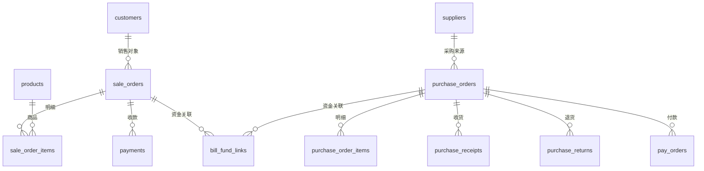

# 销售与采购数据模型

## 文档信息

| 字段 | 内容 |
|---|---|
| 文档类型 | 系统设计 |
| 当前状态 | 已完成 |
| 适用端 | 后端 |
| 依据源码 | `resources/db/migration/V1__init.sql`、`V2__suppliers_and_pay_orders.sql`、`V18__purchase_returns.sql`、`V20__purchase_order_settlement_warehouse.sql`、`V23__sale_order_item_query_indexes.sql` |
| 依据测试 | `V2SaleOrderServiceTest.java`、`V2PurchaseOrderServiceTest.java`、`V2PurchaseReceiptServiceTest.java`、`V2PurchaseReturnServiceTest.java` |
| 依据证据 | `testing/.artifacts/2026-08-18-8220-current-baseline/current-8220-baseline.md` |
| 最后核对 | 2026-08-20 |

## 一、表结构

| 表 | 迁移 |
|---|---|
| sale_orders / sale_order_items | V1 |
| sales_returns | V1（sales 退货相关） |
| payments | V1 |
| purchase_orders / purchase_order_items | V1 |
| purchase_returns / purchase_return_refunds | V18 |
| pay_orders | V2 |
| bill_fund_links | V10 |
| 采购结算与仓库字段 | V20 |
| 销售明细查询索引 | V23 |

## 二、销售与采购 ER 图

图表目的：展示销售与采购单据实体关系。

图中输入：V1/V2/V10/V18/V20 迁移。
图中处理：单据-明细-付款关联。
图中输出：ER 关系。

对应源码：`domain/entity/`（SaleOrder/PurchaseOrder/PayOrder 等实体）。
对应接口：`/v2/sale-orders/*`、`/v2/purchase-orders/*`、`/v2/purchase-receipts/*`、`/v2/purchase-returns/*`、`/v2/pay-orders/*`。
对应测试：`V2SaleOrderServiceTest.java`、`V2PurchaseOrderServiceTest.java` 等。
当前状态：已完成。

## 对应实现

- 后端代码：`domain/entity/`（单据实体）、`infrastructure/repository/`（单据 Repository）
- Android 代码：`core/database/`（Order DAO）、`data/order/`
- iOS 代码：`Core/Models/SalesModels.swift`、`PurchaseModels.swift`
- Web 代码：`entities/order/`

## 对应接口

- 接口路径：`/v2/sale-orders/*`、`/v2/sales-returns/*`、`/v2/purchase-orders/*`、`/v2/purchase-receipts/*`、`/v2/purchase-returns/*`、`/v2/pay-orders/*`
- 请求模型：`V2SaleOrderDtos.java`、`V2PurchaseOrderDtos.java`、`V2PurchaseReceiptDtos.java`、`V2PurchaseReturnDtos.java`、`V2PayOrderDtos.java`
- 响应模型：同上
- SSE 事件：Agent 工具事件

## 对应测试

- 单元测试：`V2SaleOrderServiceTest.java`、`V2SalesReturnServiceTest.java`、`V2PurchaseOrderServiceTest.java`、`V2PurchaseReceiptServiceTest.java`、`V2PurchaseReturnServiceTest.java`
- 功能测试：`testing/后端/功能测试/TEST_PLAN.md`

## 当前限制

- 未完成内容：无
- Blocked 内容：8220 无单据数据
- Deferred 内容：无
- historical-only 内容：154 环境单据数据
